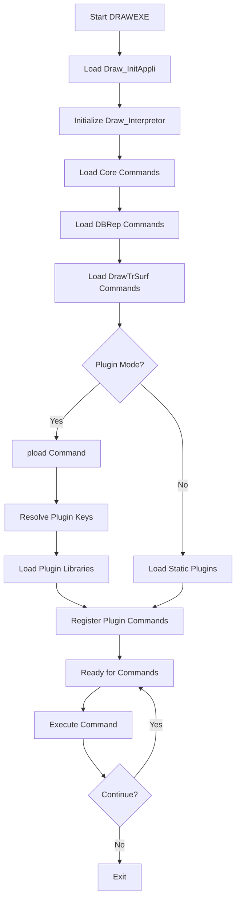
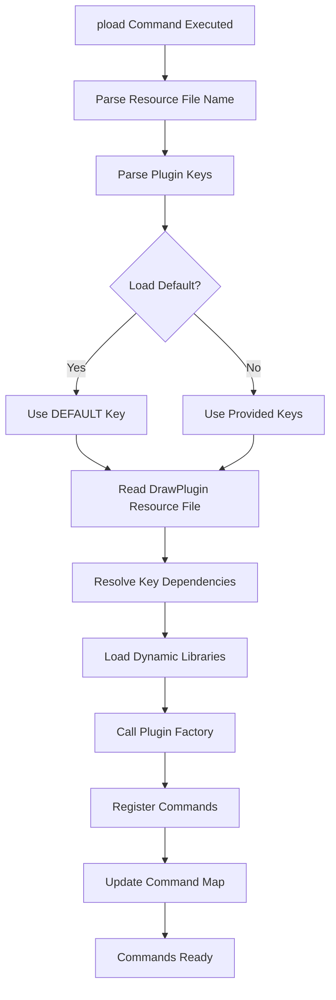

# DRAWTEST Architecture Framework

This document provides a comprehensive overview of the Open CASCADE Technology (OCCT) DRAW Test Harness architecture, including its hierarchy, components, class diagrams, and flowcharts.

## Table of Contents

1. [Overview](#overview)
2. [Core Architecture](#core-architecture)
3. [Class Diagrams](#class-diagrams)
4. [Flowcharts](#flowcharts)
5. [Component Hierarchy](#component-hierarchy)
6. [Plugin System](#plugin-system)
7. [Command System](#command-system)
8. [Test Modules](#test-modules)

## Overview

The DRAW Test Harness is a command interpreter and graphical system based on TCL used to test and demonstrate Open CASCADE Technology modeling libraries. It provides a flexible and easy-to-use means of testing OCCT components through an interactive command-line interface.

### Key Features:
- TCL-based command interpreter
- 3D graphical viewer
- Basic set of commands for scripts, variables, and graphics
- Geometry and topology command sets
- Extensible plugin system
- Support for custom commands and objects via C++

## Core Architecture

The DRAW Test Harness follows a plugin-based architecture where different functional modules can be dynamically loaded at runtime. The core components form the foundation of the system.

### Main Components:
- **Draw** (Core interpreter and variable management)
- **BRepTest** (Topological operations testing)
- **ViewerTest** (Visualization and viewer testing)
- **QABugs** (Quality assurance bug testing)
- **BOPTest** (Boolean operations testing)

## Class Diagrams

### 1. Core DRAW Architecture

```mermaid
classDiagram
    class Draw_Interpretor {
        +Init()
        +Add(commandName, helpString, function, group)
        +Eval(script)
        +Result()
        +Interp()
    }
    
    class Draw {
        +GetInterpretor() Draw_Interpretor&
        +Set(varName, value)
        +Get(varName) Handle(Draw_Drawable3D)
        +Atof(expression) Standard_Real
        +ParseReal(expression, value) bool
        +Load(Draw_Interpretor&, key, resourceFile, defaultsDir, userDefaultsDir, verbose)
        +Commands(Draw_Interpretor& I)
        +BasicCommands(Draw_Interpretor& I)
        +MessageCommands(Draw_Interpretor& I)
        +VariableCommands(Draw_Interpretor& I)
        +GraphicCommands(Draw_Interpretor& I)
        +PloadCommands(Draw_Interpretor& I)
        +UnitCommands(Draw_Interpretor& I)
    }
    
    class Draw_Appli {
        +Draw_Appli(HINSTANCE hInst, HINSTANCE hPrev, int nCmdShow, int argc, wchar_t** argv, FDraw_InitAppli Draw_InitAppli)
    }
    
    class Draw_Drawable3D {
        <<abstract>>
        +DrawOn(Draw_Display& dis)
    }
    
    Draw ||--|| Draw_Interpretor : "Uses"
    Draw_Interpretor ||--|| Draw_Drawable3D : "Manages"
    Draw_Appli ||--|| Draw_Interpretor : "Initializes"
```

### 2. Plugin Architecture

```mermaid
classDiagram
    class Draw_Interpretor {
        +CallBackData* addCallback
        +CommandFunction callback
    }
    
    class Draw_Interpretor$CallBackData {
        <<abstract>>
        +Draw_Interpretor* myDI
        +Invoke(Draw_Interpretor&, int, const char**)
    }
    
    class Draw_Interpretor$CallBackDataFunc {
        +CommandFunction myFunc
        +Invoke()
    }
    
    class Draw_Interpretor$CallBackDataMethod$theObjHandle {
        +theObjHandle myObjPtr
        +methodType myMethod
        +Invoke()
    }
    
    class PluginInterface {
        <<interface>>
        +Factory(Draw_Interpretor& theDI)
    }
    
    class BRepTest {
        +AllCommands(Draw_Interpretor& DI)
        +BasicCommands(Draw_Interpretor& DI)
        +CurveCommands(Draw_Interpretor& DI)
        +FilletCommands(Draw_Interpretor& DI)
        +SurfaceCommands(Draw_Interpretor& DI)
    }
    
    class ViewerTest {
        +Factory(Draw_Interpretor& theDI)
        +Commands(Draw_Interpretor& theCommands)
        +ViewerCommands(Draw_Interpretor& theCommands)
        +RelationCommands(Draw_Interpretor& theCommands)
    }
    
    Draw_Interpretor ||--|| Draw_Interpretor$CallBackData : "Uses"
    Draw_Interpretor$CallBackData <|-- Draw_Interpretor$CallBackDataFunc : "Extends"
    Draw_Interpretor$CallBackData <|-- Draw_Interpretor$CallBackDataMethod$theObjHandle : "Extends"
    PluginInterface <|.. BRepTest : "Implements"
    PluginInterface <|.. ViewerTest : "Implements"
    BRepTest ||--|| Draw_Interpretor : "Registers Commands"
    ViewerTest ||--|| Draw_Interpretor : "Registers Commands"
```

### 3. Test Module Architecture

```mermaid
classDiagram
    class QABugs {
        +Commands(Draw_Interpretor& DI)
        +Commands_1(Draw_Interpretor& DI)
        +Commands_2(Draw_Interpretor& DI)
        +Commands_3(Draw_Interpretor& DI)
        +Commands_5(Draw_Interpretor& DI)
        +Commands_6(Draw_Interpretor& DI)
        +Commands_7(Draw_Interpretor& DI)
        +Commands_8(Draw_Interpretor& DI)
        +Commands_9(Draw_Interpretor& DI)
        +Commands_10(Draw_Interpretor& DI)
        +Commands_11(Draw_Interpretor& DI)
        +Commands_12(Draw_Interpretor& DI)
        +Commands_13(Draw_Interpretor& DI)
        +Commands_14(Draw_Interpretor& DI)
        +Commands_15(Draw_Interpretor& DI)
        +Commands_16(Draw_Interpretor& DI)
        +Commands_17(Draw_Interpretor& DI)
        +Commands_18(Draw_Interpretor& DI)
        +Commands_19(Draw_Interpretor& DI)
        +Commands_20(Draw_Interpretor& DI)
        +Commands_BVH(Draw_Interpretor& DI)
    }
    
    class QADraw {
        +CommonCommands(Draw_Interpretor& theCommands)
        +TutorialCommands(Draw_Interpretor& theCommands)
        +Factory(Draw_Interpretor& theCommands)
    }
    
    class BOPTest {
        +AllCommands(Draw_Interpretor& aDI)
        +BOPCommands(Draw_Interpretor& aDI)
        +CheckCommands(Draw_Interpretor& aDI)
        +TolerCommands(Draw_Interpretor& aDI)
        +Factory(Draw_Interpretor& aDI)
    }
    
    class DRAWEXE {
        +Draw_InitAppli(Draw_Interpretor& theDI)
    }
    
    DRAWEXE ||--|| Draw : "Initializes"
    QABugs ||--|| Draw_Interpretor : "Registers Commands"
    QADraw ||--|| Draw_Interpretor : "Registers Commands"
    BOPTest ||--|| Draw_Interpretor : "Registers Commands"
```

## Flowcharts

### 1. DRAW Execution Flow



### 2. Command Registration Flow

```mermaid
flowchart TD
    A[Plugin Factory Called] --> B[Create Command Functions]
    B --> C[Define Command Name]
    C --> D[Define Help String]
    D --> E[Define Callback Function]
    E --> F[Define Command Group]
    F --> G[Draw_Interpretor.Add()]
    G --> H[Store Callback in Map]
    H --> I[Command Available in DRAW]
```

### 3. Plugin Loading Flow



## Component Hierarchy

### 1. Root Components
- `Draw` - Core Draw system
- `DRAWEXE` - Main executable entry point
- `Draw_Interpretor` - TCL interpreter wrapper

### 2. Major Test Modules
- `BRepTest` - Topology testing module
  - Basic commands
  - Curve commands
  - Surface commands
  - Topology operations
  - Fillet/chamfer commands
  - GProp commands
  - Check commands

- `ViewerTest` - Visualization testing module
  - Viewer commands
  - Object commands
  - Relation commands
  - OpenGl commands

- `BOPTest` - Boolean operations testing
  - BOP commands
  - Check commands
  - Toler commands
  - API commands

- `QABugs` - Quality assurance testing
  - Commands_1 to Commands_20
  - Commands_BVH
  - Bug-specific tests

- `QADraw` - QA Draw-specific commands

### 3. Supporting Components
- `DBRep` - Data bridge for BRep
- `DrawTrSurf` - Draw tools for surfaces
- `DrawDim` - Draw dimensioning tools

## Plugin System

The DRAW Test Harness uses a flexible plugin system that allows modules to be loaded dynamically:

### Plugin Resource File (DrawPlugin)
```
DEFAULT            : MODELING
MODELING           : TOPTEST
VISUALIZATION      : AISV
OCAFKERNEL         : DCAF
DATAEXCHANGEKERNEL : XSDRAW, DE
OCAF               : VISUALIZATION, OCAFKERNEL
DATAEXCHANGE       : XDE, VISUALIZATION
TOPTEST            : TKTopTest
DCAF               : TKDCAF
AISV               : TKViewerTest
```

### Plugin Architecture
- Each plugin defines a `Factory` method
- The `DPLUGIN` macro creates the plugin entry point
- Plugin libraries are loaded dynamically based on resource file configuration
- Commands are registered with the Draw interpreter

## Command System

### Command Registration Process
- Commands are registered using `Draw_Interpretor.Add()`
- Each command has a name, help string, callback function, and group
- Callback functions follow the signature `Standard_Integer (Draw_Interpretor&, Standard_Integer, const char**)`
- Commands can be added from C++ functions or class methods

### Command Categories
- **Core Commands**: Basic Draw functionality
- **Geometric Commands**: Curve and surface operations
- **Topological Commands**: BRep shape operations
- **Graphic Commands**: Visualization operations
- **QA Commands**: Quality assurance tests

## Test Modules

### BRepTest
Comprehensive testing for BRep (Boundary Representation) functionality:
- Basic shape creation and manipulation
- Curve and surface operations
- Topological operations (Boolean ops, fillets, chamfers)
- Property calculations
- Shape checking

### ViewerTest
Visualization and viewer functionality testing:
- 3D viewer operations
- Interactive object management
- Display modes and rendering
- OpenGl specific tests

### BOPTest
Boolean operations testing:
- Boolean operations (fuse, common, cut)
- Algorithm parameters and options
- Error checking and validation
- Performance testing

### QABugs
Quality assurance and bug regression testing:
- Isolated bug tests
- Regression test cases
- Performance validation
- Special case handling

### QADraw
Draw-specific quality assurance:
- Draw command validation
- Script testing
- Integration tests

## Additional Resources

- `DrawPlugin` resource file for plugin configuration
- TCL script files for initialization (`InitEnvironment.tcl`, `StandardCommands.tcl`)
- Draw command documentation in the user guides
- Test scripts in the `tests` directory

---

*This framework document is designed to help understand and navigate the DRAW Test Harness architecture in Open CASCADE Technology.*