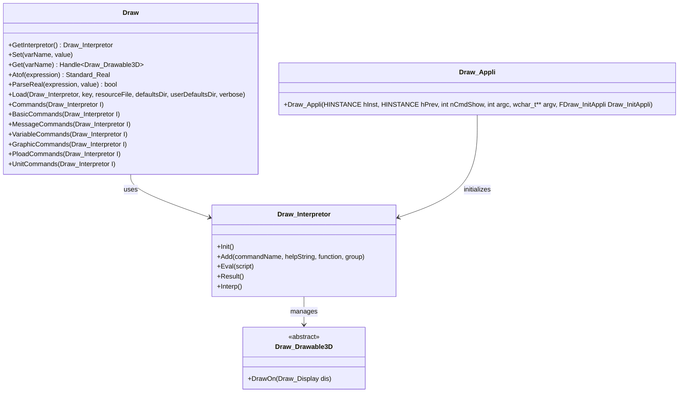
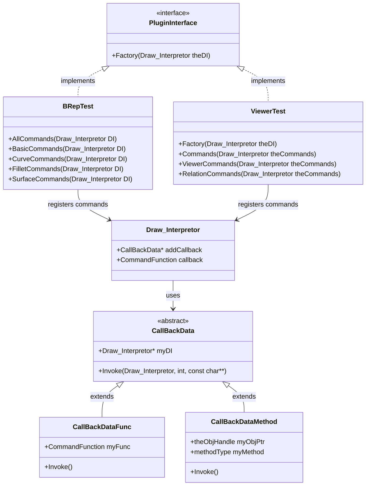
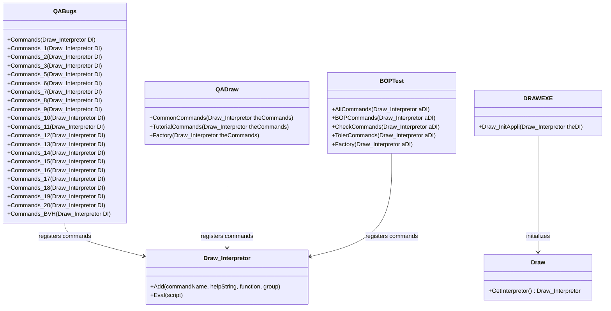
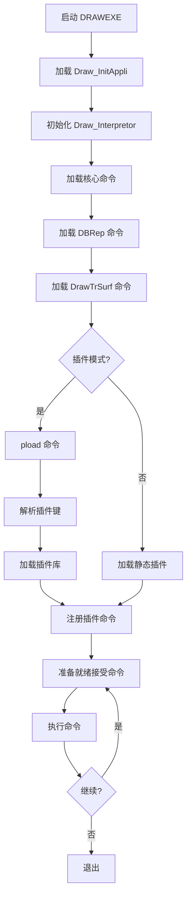
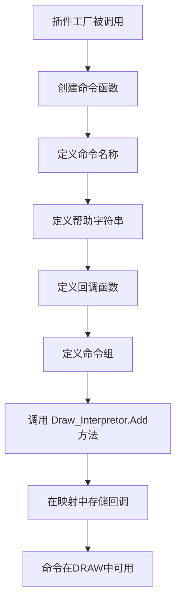
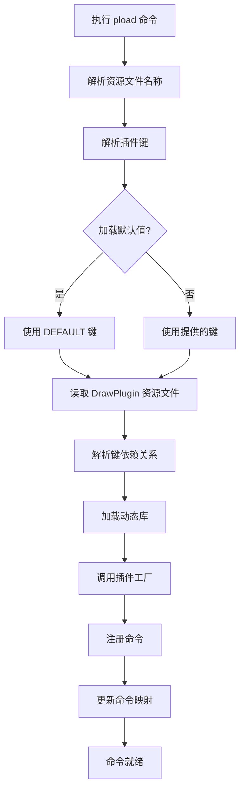

# DRAWTEST 架构框架

本文档提供了 Open CASCADE Technology (OCCT) DRAW 测试工具架构的全面概述，包括其层次结构、组件、类图和流程图。

## 目录

1. [概述](#概述)
2. [核心架构](#核心架构)
3. [类图](#类图)
4. [流程图](#流程图)
5. [组件层次](#组件层次)
6. [插件系统](#插件系统)
7. [命令系统](#命令系统)
8. [测试模块](#测试模块)

## 概述

DRAW 测试工具是一个基于 TCL 的命令解释器和图形系统，用于测试和演示 Open CASCADE Technology 建模库。它提供了一个灵活易用的手段来测试 OCCT 组件，通过交互式命令行界面进行操作。

### 主要特点：
- 基于 TCL 的命令解释器
- 3D 图形查看器
- 用于脚本、变量和图形的基本命令集
- 几何和拓扑命令集
- 可扩展的插件系统
- 通过 C++ 支持自定义命令和对象

## 核心架构

DRAW 测试工具遵循基于插件的架构，不同的功能模块可以在运行时动态加载。核心组件构成了系统的基石。

### 主要组件：
- **Draw** (核心解释器和变量管理)
- **BRepTest** (拓扑操作测试)
- **ViewerTest** (可视化和查看器测试)
- **QABugs** (质量保证错误测试)
- **BOPTest** (布尔操作测试)

## 类图

### 1. 核心 DRAW 架构



### 2. 插件架构



### 3. 测试模块架构



## 流程图

### 1. DRAW 执行流程



### 2. 命令注册流程



### 3. 插件加载流程



## 组件层次

### 1. 根组件
- `Draw` - 核心 Draw 系统
- `DRAWEXE` - 主可执行文件入口点
- `Draw_Interpretor` - TCL 解释器包装器

### 2. 主要测试模块
- `BRepTest` - 拓扑测试模块
  - 基本命令
  - 曲线命令
  - 曲面命令
  - 拓扑操作
  - 倒角命令
  - 属性命令

- `ViewerTest` - 可视化测试模块
  - 查看器命令
  - 对象命令
  - 关系命令
  - OpenGl 命令

- `BOPTest` - 布尔操作测试
  - BOP 命令
  - 检查命令
  - 公差命令
  - API 命令

- `QABugs` - 质量保证测试
  - Commands_1 到 Commands_20
  - Commands_BVH
  - 特定错误测试

- `QADraw` - QA Draw 特定命令

### 3. 支持组件
- `DBRep` - BRep 的数据桥接
- `DrawTrSurf` - 曲面的 Draw 工具
- `DrawDim` - Draw 标注工具

## 插件系统

DRAW 测试工具使用灵活的插件系统，允许模块动态加载：

### 插件资源文件 (DrawPlugin)
```
DEFAULT            : MODELING
MODELING           : TOPTEST
VISUALIZATION      : AISV
OCAFKERNEL         : DCAF
DATAEXCHANGEKERNEL : XSDRAW, DE
OCAF               : VISUALIZATION, OCAFKERNEL
DATAEXCHANGE       : XDE, VISUALIZATION
TOPTEST            : TKTopTest
DCAF               : TKDCAF
AISV               : TKViewerTest
```

### 插件架构
- 每个插件定义一个 `Factory` 方法
- `DPLUGIN` 宏创建插件入口点
- 插件库根据资源文件配置动态加载
- 命令在 Draw 解释器中注册

## 命令系统

### 命令注册过程
- 命令使用 `Draw_Interpretor.Add()` 注册
- 每个命令都有名称、帮助字符串、回调函数和组
- 回调函数遵循签名 `Standard_Integer (Draw_Interpretor&, Standard_Integer, const char**)`
- 命令可以从 C++ 函数或类方法添加

### 命令类别
- **核心命令**: 基本 Draw 功能
- **几何命令**: 曲线和曲面操作
- **拓扑命令**: BRep 形状操作
- **图形命令**: 可视化操作
- **QA 命令**: 质量保证测试

## 测试模块

### BRepTest
BRep（边界表示）功能的综合测试：
- 基本形状创建和操作
- 曲线和曲面操作
- 拓扑操作（布尔运算、倒圆角、倒角）
- 属性计算
- 形状检查

### ViewerTest
可视化和查看器功能测试：
- 3D 查看器操作
- 交互对象管理
- 显示模式和渲染
- OpenGl 特定测试

### BOPTest
布尔操作测试：
- 布尔操作（融合、求交、求差）
- 算法参数和选项
- 错误检查和验证
- 性能测试

### QABugs
质量保证和错误回归测试：
- 孤立错误测试
- 回归测试用例
- 性能验证
- 特殊情况处理

### QADraw
Draw 特定质量保证：
- Draw 命令验证
- 脚本测试
- 集成测试

## 附加资源

- `DrawPlugin` 资源文件用于插件配置
- 用于初始化的 TCL 脚本文件（`InitEnvironment.tcl`, `StandardCommands.tcl`）
- 用户指南中的 Draw 命令文档
- `tests` 目录中的测试脚本

---

*此框架文档旨在帮助理解和浏览 Open CASCADE Technology 中的 DRAW 测试工具架构。*