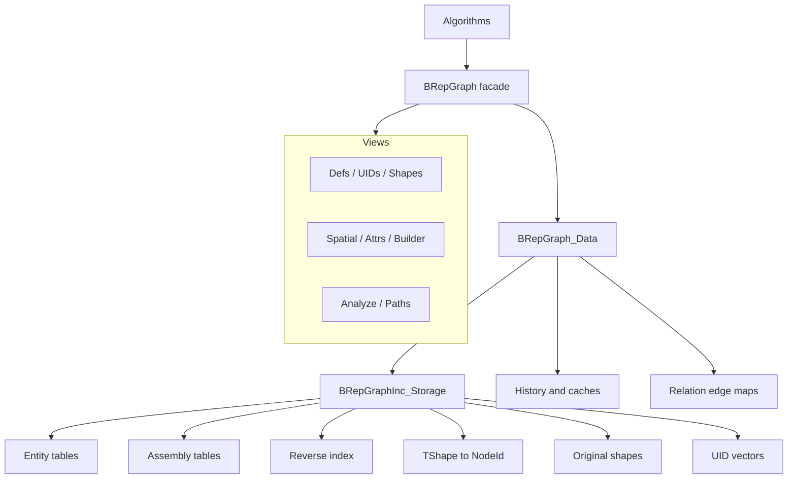
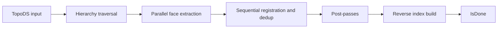
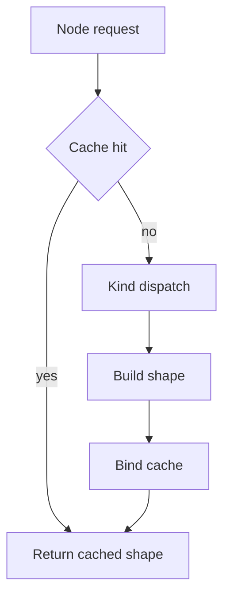
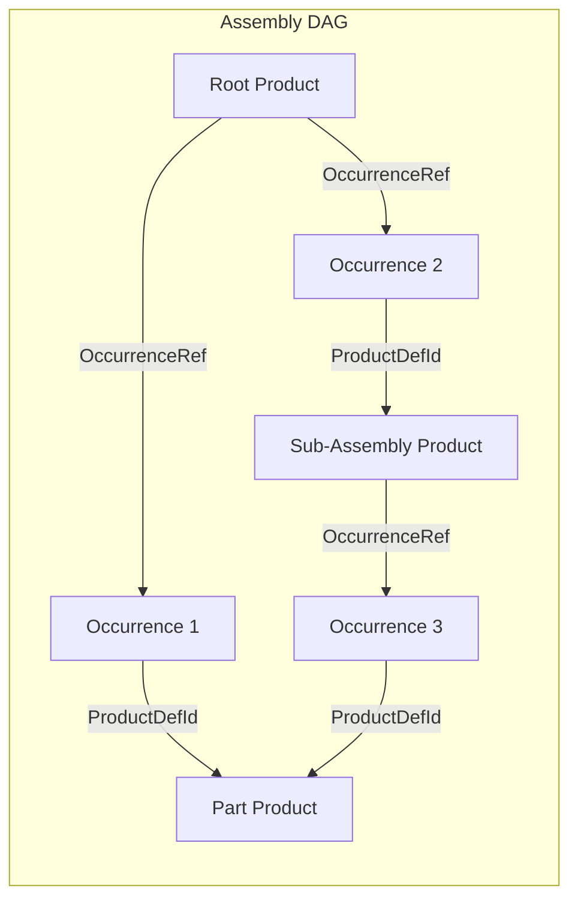

# BRepGraph

BRepGraph is a facade API over an incidence-table topology backend for TopoDS/BRep shapes.

## Why It Exists

BRepGraph provides a stable algorithm-facing API for:

- adjacency and sharing queries,
- controlled topology mutation,
- shape reconstruction,
- assembly structure (products, occurrences, placement),
- history and UID tracking,
- cached analysis helpers.

The goal is to make workflows like sewing, healing, compact, and deduplicate easier to implement and optimize.

## Current Model (March 2026)

The runtime model is incidence-first:

- Source of truth: BRepGraphInc_Storage
- Topology defs in BRepGraph are aliases to incidence entities
- Orientation/location context is stored on incidence refs
- No separate runtime Usage storage layer

See backend details in `src/ModelingData/TKBRep/BRepGraphInc/ReadMe.md`.

## Architecture



## Views Reference

All queries and mutations go through lightweight view objects obtained from a `BRepGraph` instance.

| View | Accessor | Purpose |
|------|----------|---------|
| **DefsView** | `Defs()` | Const topology/assembly definition access, entity counts, RootProducts |
| **UIDsView** | `UIDs()` | UID allocation, lookup, validity checking |
| **ShapesView** | `Shapes()` | TopoDS reconstruction, FindNode/HasNode reverse lookup |
| **SpatialView** | `Spatial()` | Adjacency queries (SharedEdges, AdjacentFaces, SameDomainFaces), GlobalPlacement |
| **AttrsView** | `Attrs()` | Layer registration, lookup, unregistration |
| **BuilderView** | `Builder()` | Mutations: AddProduct, AddOccurrence, RemoveNode, RemoveSubgraph |
| **AnalyzeView** | `Analyze()` | Diagnostics: FreeEdges, MissingPCurves, ToleranceConflicts, Decompose |
| **PathView** | `Paths()` | Path-based traversal: GlobalLocation, GlobalOrientation, PathsTo, NodeLocations, CommonAncestor |

## Main Data Concepts

- **NodeId** (Kind + Index): lightweight typed address into per-kind node vectors
- **UID** (Kind + Counter): generation-aware persistent identity surviving compaction/reorder
- **RepId** (Kind + Index): separate geometry/mesh addressing decoupled from topology nodes
- **Topology entities**: Vertex, Edge, CoEdge, Wire, Face, Shell, Solid, Compound, CompSolid
- **Assembly entities**: Product (part or assembly), Occurrence (placed instance)
- **Context refs**: VertexRef, CoEdgeRef, WireRef, FaceRef, ShellRef, SolidRef, ChildRef, OccurrenceRef
- **Reverse indices**: edge→wire, edge→face, edge→coedge, vertex→edge, wire→face, face→shell, shell→solid, product→occurrences

## Core Pipelines

### Build



After topology population, `Build()` auto-creates a single root Product whose `ShapeRootId` points to the top-level topology node. This makes every BRepGraph intrinsically assembly-aware.

### Reconstruct



Use cache-enabled reconstruction paths for multi-face/shell/solid rebuilds.

## Assembly Model

Products and Occurrences are first-class node kinds alongside topology.

### Node Kinds

```
Kind::Product    = 10   // Reusable shape definition (part or assembly)
Kind::Occurrence = 11   // Placed instance of a product within a parent product
```

Helpers: `BRepGraph_NodeId::IsTopologyKind()`, `IsAssemblyKind()`, `Product(i)`, `Occurrence(i)`.

### Data Model



- **ProductEntity**: `ShapeRootId` (topology root for parts; invalid for assemblies), `RootOrientation`, `RootLocation`, `OccurrenceRefs` (child occurrences)
- **OccurrenceEntity**: `ProductDefId` (referenced product), `ParentProductDefId` (parent assembly), `ParentOccurrenceDefId` (parent occurrence for tree-structured placement chains), `Placement` (TopLoc_Location)

### Placement Composition

`SpatialView::GlobalPlacement(occId)` walks `ParentOccurrenceDefId` from leaf to root, composing `Placement` transforms. DAG-safe: shared products placed at multiple locations have distinct occurrence paths.

### API Distribution

| View | Methods |
|------|---------|
| **DefsView** | `NbProducts`, `NbOccurrences`, `Product(i)`, `Occurrence(i)`, `RootProducts`, `IsAssembly`, `IsPart`, `NbComponents`, `Component` |
| **BuilderView** | `AddProduct`, `AddAssemblyProduct`, `AddOccurrence` (with optional parent occurrence), `RemoveSubgraph` (cascades to child occurrences) |
| **MutView** | `ProductDef(i)`, `OccurrenceDef(i)` (RAII guards) |
| **SpatialView** | `GlobalPlacement(occIdx)` |
| **Iterator** | `BRepGraph_Iterator<ProductDef>`, `BRepGraph_Iterator<OccurrenceDef>` |

### Single-Shape Graph

`Build(aBox)` creates one Product with `ShapeRootId = Solid(0)`, zero occurrences. Algorithms always see a uniform model.

## Traversal

BRepGraph provides a context-preserving traversal system for walking the hierarchy from any root down to entities of a target kind, producing full occurrence paths with composed locations and orientations.

### TopologyPath

`BRepGraph_TopologyPath` uniquely identifies one occurrence of an entity by encoding the root and a sequence of ref-index steps through the incidence hierarchy. The step model is uniform: assembly occurrences, compound containers, and topology entities are all just steps.

### Explorer

`BRepGraph_Explorer` visits each **occurrence** of an entity kind (not definitions). If Edge[5] is reachable through Face[0] and Face[1], it is visited twice with different paths:

```cpp
for (BRepGraph_Explorer anExp(aGraph, BRepGraph_NodeId::Solid(0),
                               BRepGraph_NodeId::Kind::Edge);
     anExp.More(); anExp.Next())
{
  BRepGraph_NodeId anEdge = anExp.Current();
  TopLoc_Location  aLoc   = anExp.Location();
}
```

Can also start from a Product to descend through assembly occurrences into topology.

### PathView

`PathView` (via `Paths()`) resolves topology paths:

- `GlobalLocation(path)` / `GlobalOrientation(path)` — composed transforms
- `PathsTo(node)` — all paths from any root to a given entity (reverse lookup)
- `NodeLocations(node)` — all occurrence entries with paths, locations, orientations
- `CommonAncestor(path1, path2)` — longest common prefix
- `FilterByInclude` / `FilterByExclude` — path set filtering
- `IsAncestorOf`, `AllNodesOnPath`, `DepthOfKind`

### SubGraph

`BRepGraph_SubGraph` is a non-owning view over a connected component, produced by `Analyze().Decompose()`. Stores per-kind typed definition id sets for parallel processing.

## Geometry Access (BRepGraph_Tool)

`BRepGraph_Tool` is the centralized geometry access API for BRepGraph, analogous to `BRep_Tool` for TopoDS. Nested helper classes provide typed, safe access:

| Helper | Key Methods |
|--------|-------------|
| **Vertex** | `Pnt`, `Tolerance`, `Parameter` (on edge), `Parameters` (on surface) |
| **Edge** | `Tolerance`, `Degenerated`, `SameParameter`, `SameRange`, `Range`, `StartVertex`, `EndVertex`, `Curve`, `Polygon`, `Continuity` |
| **CoEdge** | `PCurveGeometry`, `PCurvePolygon`, `PCurveIsHandle` |
| **Face** | `Surface`, `Tolerance`, `NaturalRestriction`, `Wires`, `BndLib`, `UVBounds`, `CurveOnPlane`, `EvalD0` |
| **Wire** | `Edges` (traversal order via WireExplorer) |

## Extensibility: Layers vs UserAttributes

### Layers (`BRepGraph_Layer`)

Graph-wide named metadata collections with full lifecycle management. Registered via `RegisterLayer()`.

- **Purpose**: persistent domain metadata (colors, materials, names, layer groups)
- **Storage**: internal maps keyed by NodeId, owned by the layer
- **Lifecycle**: `OnNodeRemoved(old, replacement)` migrates data; `OnCompact(remapMap)` remaps; `OnNodeModified`/`OnNodesModified` for mutation tracking
- **Survives mutations**: yes
- **Example**: `BRepGraph_NameLayer` (per-node string names)

### UserAttributes (`BRepGraph_UserAttribute`)

Per-node cached computations in `BaseEntity.Cache`. Lazily evaluated, auto-invalidated when mutated.

- **Purpose**: ephemeral computed caches (bounding boxes, UV bounds, FClass2d results)
- **Lifecycle**: auto-invalidated by `markModified()`; recomputed on next `Get()`
- **Survives mutations**: no
- **Example**: `BRepGraph_TypedAttribute<Bnd_Box>` for cached bounding boxes

### When to Use Which

- Data that must persist and migrate across graph mutations → **Layer**
- Computed values that can be recomputed from entity state → **UserAttribute**

## Mutation and History

Primary mutation entry points are exposed via MutView and scoped RAII guards (`BRepGraph_MutRef`).

Common operations: SplitEdge, ReplaceEdgeInWire, AddPCurveToEdge, relation-edge add/remove.

History records lineage for downstream attribute transfer and diagnostics. Supports allocator propagation via `SetAllocator()`.

## Memory Model

BRepGraph uses a single `NCollection_IncAllocator` (bump-pointer allocator) for all internal containers:

- All DataMaps in `BRepGraph_Data`
- All `BRepGraphInc_Storage` entity tables and UID vectors
- All `BRepGraphInc_ReverseIndex` inner vectors
- `BRepGraph_History` containers and inner vectors

Benefits: O(1) allocation (bump-pointer), O(1) destruction (bulk page release). The allocator can be provided externally via `BRepGraph::SetAllocator()`.

## Threading Model

- Const query paths are designed for concurrent read access.
- Shape cache is protected by shared mutex.
- Build supports internal parallel extraction.
- Mutation must be externally serialized.
- `BeginDeferredInvalidation()` / `EndDeferredInvalidation()` enables batch mutation without mutex contention.

## Build Options

`Build()` accepts optional `BRepGraphInc_Populate::Options`:

- `ExtractRegularities` (default true): edge continuity across face pairs.
- `ExtractVertexPointReps` (default true): vertex parameter representations on curves/surfaces.

## Debug Validation

`BRepGraphInc_ReverseIndex::Validate()` checks all reverse index maps against forward entity refs. Called automatically via `Standard_ASSERT_VOID` after SplitEdge and ReplaceEdgeInWire in debug builds.

`BRepGraph_Mutator::CommitMutation()` validates reverse index + active entity counts. Called at end of Sewing, Compact, Deduplicate.

## Practical Guidance

1. Treat BRepGraph as API boundary and BRepGraphInc as implementation backend.
2. Keep reverse index updates consistent with forward ref changes.
3. Prefer incremental updates in mutators over full rebuilds.
4. Use profiling before adding micro-optimizations.

## File Map

| Category | Files |
|----------|-------|
| **Core** | `BRepGraph.hxx/.cxx`, `BRepGraph_Data.hxx`, `BRepGraph_NodeId.hxx`, `BRepGraph_UID.hxx`, `BRepGraph_RepId.hxx`, `BRepGraph_TopoNode.hxx` |
| **Views** | `BRepGraph_DefsView.hxx/.cxx`, `BRepGraph_UIDsView.hxx/.cxx`, `BRepGraph_ShapesView.hxx/.cxx`, `BRepGraph_SpatialView.hxx/.cxx`, `BRepGraph_AttrsView.hxx/.cxx`, `BRepGraph_BuilderView.hxx/.cxx`, `BRepGraph_AnalyzeView.hxx`, `BRepGraph_PathView.hxx/.cxx` |
| **Traversal** | `BRepGraph_Explorer.hxx/.cxx`, `BRepGraph_TopologyPath.hxx`, `BRepGraph_SubGraph.hxx`, `BRepGraph_PCurveContext.hxx` |
| **Geometry** | `BRepGraph_Tool.hxx/.cxx` |
| **Mutation** | `BRepGraph_Mutator.hxx/.cxx`, `BRepGraph_MutRef.hxx`, `BRepGraph_MutationGuard.hxx` |
| **Layers** | `BRepGraph_Layer.hxx/.cxx`, `BRepGraph_NameLayer.hxx/.cxx`, `BRepGraph_AttrRegistry.hxx` |
| **Attributes** | `BRepGraph_UserAttribute.hxx`, `BRepGraph_TypedAttribute.hxx`, `BRepGraph_NodeCache.hxx` |
| **Analysis** | `BRepGraph_Analyze.hxx/.cxx` |
| **History** | `BRepGraph_History.hxx/.cxx`, `BRepGraph_HistoryRecord.hxx` |
| **Iteration** | `BRepGraph_Iterator.hxx` |
| **Build** | `BRepGraph_Builder.hxx/.cxx` |

## Documentation Map

- API facade and views: `src/ModelingData/TKBRep/BRepGraph/`
- Backend storage and pipelines: `src/ModelingData/TKBRep/BRepGraphInc/`
- Algorithms: `src/ModelingAlgorithms/TKTopAlgo/BRepGraphAlgo/`
- Validation: `src/ModelingAlgorithms/TKTopAlgo/BRepGraphCheck/`
