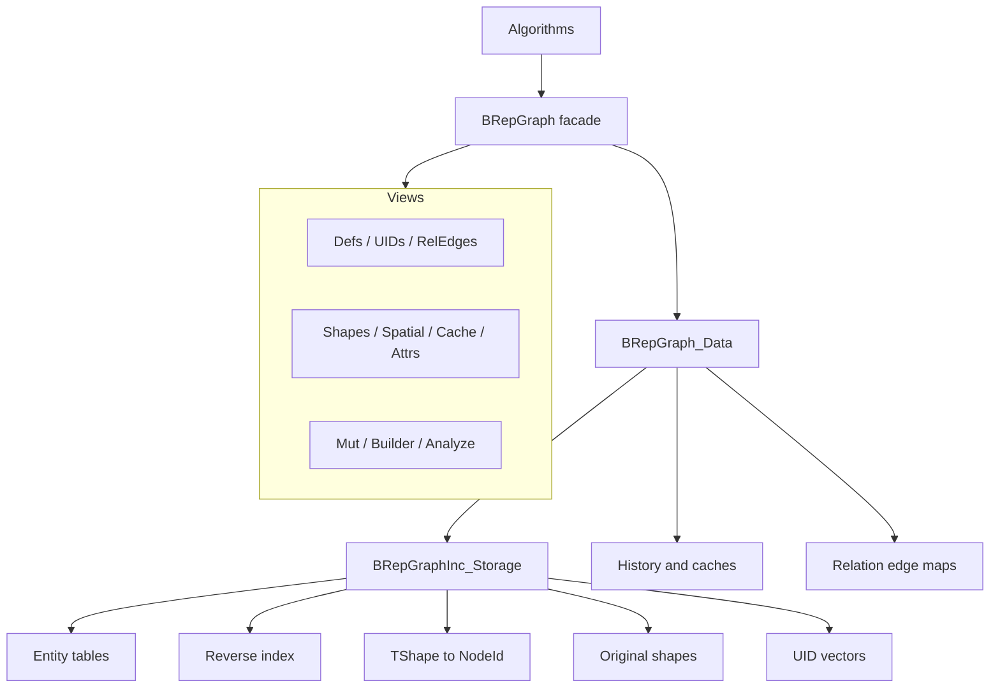
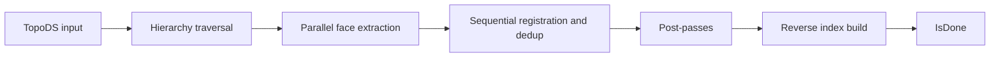
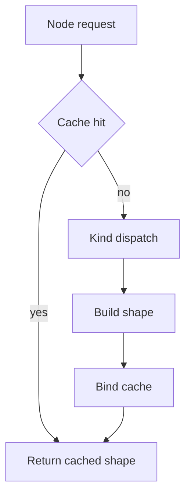

# BRepGraph

BRepGraph is a facade API over an incidence-table topology backend for TopoDS/BRep shapes.

## Current Model (March 2026)

The runtime model is incidence-first:

- Source of truth: BRepGraphInc_Storage
- Topology defs in BRepGraph are aliases to incidence entities
- Orientation/location context is stored on incidence refs
- No separate runtime Usage storage layer

See backend details in src/ModelingData/TKBRep/BRepGraphInc/README.md.

## Why It Exists

BRepGraph provides a stable algorithm-facing API for:

- adjacency and sharing queries,
- controlled topology mutation,
- shape reconstruction,
- history and UID tracking,
- cached analysis helpers.

The goal is to make workflows like sewing, healing, compact, and deduplicate easier to implement and optimize.

## Architecture

## Main Data Concepts

- Node identity: BRepGraph_NodeId (kind + index)
- Stable IDs: BRepGraph_UID (generation-aware)
- Entities: Vertex, Edge, Wire, Face, Shell, Solid, Compound, CompSolid
- Context refs: EdgeRef, WireRef, FaceRef, ShellRef, ChildRef, SolidRef
- Reverse indices: edge->wire, edge->face, vertex->edge, wire->face, face->shell, shell->solid

## Core Pipelines

### Build

### Reconstruct

Use cache-enabled reconstruction paths for multi-face/shell/solid rebuilds.

## Mutation and History

Primary mutation entry points are exposed via MutView and helper mutator logic.

Common operations:

- SplitEdge
- ReplaceEdgeInWire
- AddPCurveToEdge
- relation-edge add/remove

History records lineage for downstream attribute transfer and diagnostics.

## Threading Model

- Const query paths are designed for concurrent read access.
- Shape cache is protected by shared mutex.
- Build supports internal parallel extraction.
- Mutation must be externally serialized.

## Build Options

`Build()` accepts optional `BRepGraphInc_Populate::Options` to control post-passes:

- `ExtractRegularities` (default true): edge continuity across face pairs.
- `ExtractVertexPointReps` (default true): vertex parameter representations on curves/surfaces.

Algorithms that do not need regularities or point reps can skip them for faster population.

## Debug Validation

`BRepGraphInc_ReverseIndex::Validate()` checks all reverse index maps against forward entity refs. Called automatically via `Standard_ASSERT_VOID` after `SplitEdge` and `ReplaceEdgeInWire` in debug builds.

`Append()` now allocates UIDs incrementally (only for new entities), preserving existing UIDs.

## Practical Guidance

1. Treat BRepGraph as API boundary and BRepGraphInc as implementation backend.
2. Keep reverse index updates consistent with forward ref changes.
3. Prefer incremental updates in mutators over full rebuilds.
4. Use profiling before adding micro-optimizations.

## Documentation Map

- API facade and views: src/ModelingData/TKBRep/BRepGraph/
- Backend storage and pipelines: src/ModelingData/TKBRep/BRepGraphInc/
- Backend deep dive: src/ModelingData/TKBRep/BRepGraphInc/README.md
