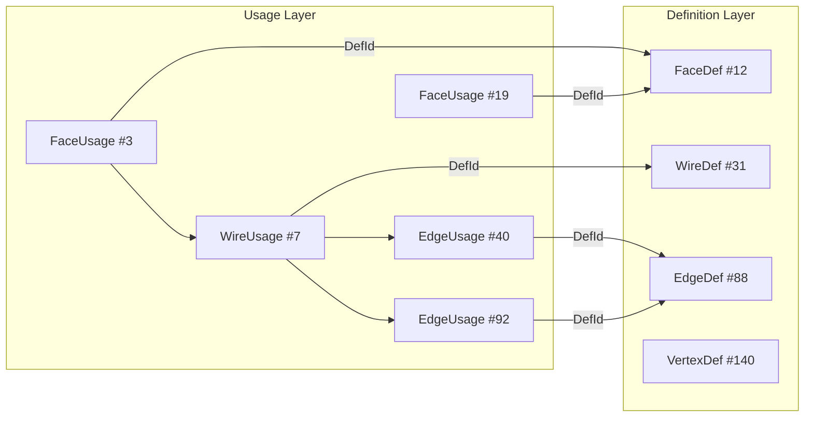
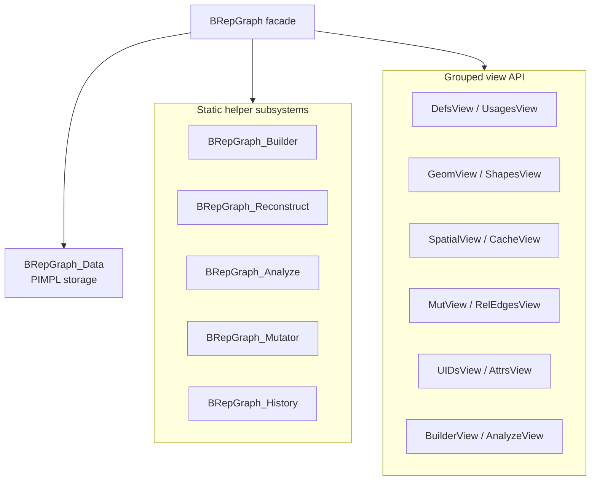
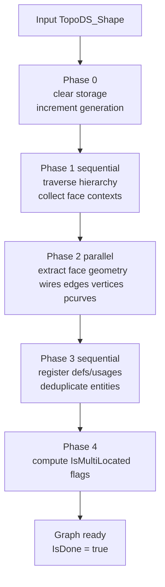
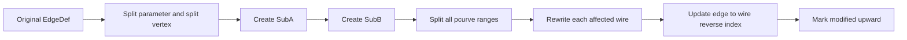
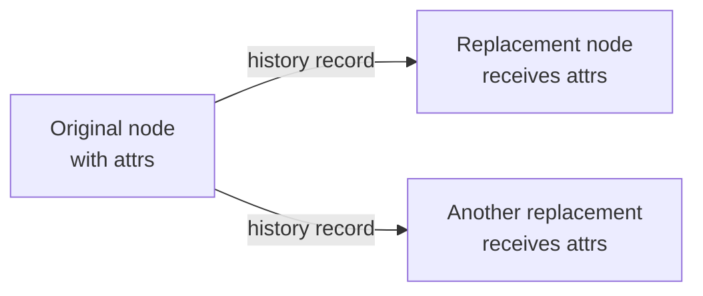

# BRepGraph

BRepGraph is a topology-geometry graph layer over `TopoDS`/BRep data.
It converts boundary-representation shapes into a queryable model with two explicit layers:

- Definitions: one per unique topological entity.
- Usages: one per occurrence of that entity in a containment tree.

This split makes sharing, reconstruction, analysis, and controlled mutation easier to implement and reason about.

## Why BRepGraph Exists

Classical `TopoDS` traversal is powerful but task-oriented code often needs repeated ad-hoc walks for:

- adjacency and sharing queries,
- component decomposition,
- mutation with traceability,
- incremental checks (missing pcurves, free edges, tolerance conflicts),
- shape reconstruction from edited topology.

BRepGraph centralizes this into explicit data structures and grouped views.

## Core Mental Model

A single edge definition can appear many times in the shape hierarchy. BRepGraph stores:

- one `EdgeDef` with intrinsic properties (curve link, tolerances, pcurve bindings, endpoints),
- many `EdgeUsage` entries with context (orientation, local/global location, parent usage).

This pattern is applied to all topological kinds (`Solid`, `Shell`, `Face`, `Wire`, `Edge`, `Vertex`, `Compound`, `CompSolid`).



## Architecture

### High-Level Structure



### Key Design Patterns Used

- Facade: `BRepGraph` is the single entry point.
- PIMPL: internal state lives in `BRepGraph_Data`.
- Builder: extraction/build logic is isolated in `BRepGraph_Builder`.
- Reconstructor: reverse mapping graph -> `TopoDS_Shape` in `BRepGraph_Reconstruct`.
- Analyzer suite: read-only diagnostics in `BRepGraph_Analyze`.
- Mutator: write-path operations in `BRepGraph_Mutator`.
- Command-like history capture: `ApplyModification()` + `BRepGraph_History` records operation lineage.
- Flyweight-like sharing: surfaces/curves are deduplicated by handle identity registries.
- View-object API: grouped zero-cost wrappers to keep the facade compact.

## Data Model

### Topology Identifiers

- `BRepGraph_NodeId`: typed definition identifier (`Kind` + index).
- `BRepGraph_UsageId`: typed usage identifier (`Kind` + index).
- `BRepGraph_UID`: optional persistent identifier with generation counter.

### Topology Definitions and Usages

`BRepGraph_TopoNode.hxx` defines:

- Base definition fields: `Id`, `Cache`, `IsModified`, `IsRemoved`, `Usages`.
- Kind-specific definition fields:
  - `FaceDef`: `SurfNodeId`, `Tolerance`, `NaturalRestriction`.
  - `WireDef`: ordered edge entries + closure flag.
  - `EdgeDef`: 3D curve link, pcurve entries, endpoints, param range, quality flags.
  - `VertexDef`: point and tolerance.
- Base usage fields: `UsageId`, `DefId`, local/global locations, orientation, parent usage.

### Geometry Nodes

`BRepGraph_GeomNode.hxx` stores:

- `Surf`: `Geom_Surface` handle, optional triangulation, reverse users list, multi-location flag.
- `Curve`: `Geom_Curve` handle, reverse users list, multi-location flag.
- `PCurve`: contextual `Geom2d_Curve` with edge/face context and param range.

### Internal Storage Layout

`BRepGraph_Data` keeps separate vectors per kind:

- definition vectors,
- usage vectors,
- geometry vectors,
- dedup maps (`surface* -> idx`, `curve* -> idx`, `TShape* -> NodeId`),
- optional UID maps (`NodeId <-> UID`),
- edge-to-wire reverse index (`edgeDefIdx -> [wireDefIdx...]`),
- history subsystem,
- original/current reconstructed shape maps,
- relation-edge maps (`myOutRelEdges`, `myInRelEdges`).

## Build Logic

`BRepGraph::Build()` delegates to `BRepGraph_Builder::Perform()`.

### Build Pipeline



### What Happens in Each Phase

1. Phase 0
- Clears all vectors/maps.
- Increments generation for UID tracking.
- Marks graph as not done.

2. Phase 1 (sequential hierarchy traversal)
- Walks compounds/compsolids/solids/shells.
- Creates container and shell/solid definition+usage structures.
- Collects `FaceLocalData` contexts for later extraction.

3. Phase 2 (parallel face extraction)
- Extracts face surface, triangulation, tolerance, natural restriction.
- Extracts wires in oriented face context.
- Extracts edge properties: curve, params, tolerance, degenerate/same flags.
- Extracts vertices and pcurves.
- For seam cases, tries to extract second reversed pcurve.

4. Phase 3 (sequential registration)
- Deduplicates face/wire/edge/vertex definitions by `TopoDS_TShape*`.
- Deduplicates geometry nodes by curve/surface handle pointer.
- Always creates usages (even for reused defs).
- Builds edge-to-wire reverse index for adjacency and free-edge analysis.

5. Phase 4
- Sets `IsMultiLocated` on surfaces and curves when users have distinct global locations.

### Append Mode

`BRepGraph_Builder::Append()` supports incremental face-level extension.
Current behavior is intentionally flattened:

- it traverses down to faces,
- reuses dedup maps,
- does not create additional solid/shell/compound container defs for appended input.

This is useful for workflows like incremental sewing or face-level accumulation.

## Reconstruction Logic

`BRepGraph_Reconstruct` builds `TopoDS` entities from definitions/usages.

### Kind-Based Reconstruction

- Vertex: `BRep_Builder::MakeVertex` from point+tolerance.
- Edge:
  - degenerate edge creation when needed,
  - 3D curve attachment if available,
  - parameter range and same flags restored,
  - endpoint vertices attached.
- Wire:
  - rebuild from ordered edge entries,
  - apply stored orientation-in-wire,
  - restore closure flag.
- Face:
  - create on stored surface and location context,
  - rebuild outer and inner wires,
  - attach matching pcurve(s) for this face context,
  - support seam edge dual-pcurve update path,
  - restore `NaturalRestriction` and orientation.
- Shell/Solid/Compound/CompSolid:
  - recursively rebuild children from usage-driven containment.

### Cache-Assisted Reconstruction

`FaceWithCache()` accepts a shared edge/vertex shape cache.
This avoids redundant edge recreation across multi-face reconstruction and helps preserve consistency.

## Analysis Logic

`BRepGraph_Analyze` provides static diagnostics and decomposition.

### Implemented Analyses

- `FreeEdges()`
  - skips degenerate edges,
  - counts distinct owning faces via edge-to-wire reverse index,
  - returns edges used by exactly one face.

- `MissingPCurves()`
  - scans face usages and their wire/edge definitions,
  - reports `(EdgeDefId, FaceDefId)` pairs without pcurve binding.

- `ToleranceConflicts(threshold)`
  - for each shared 3D curve, compares tolerances of all edge defs using that curve,
  - returns edge defs where spread exceeds threshold.

- `DegenerateWires()`
  - flags wires with fewer than two edges,
  - flags non-closed wires used as outer face boundary.

- `Decompose()`
  - returns non-owning `BRepGraph_SubGraph` components,
  - partition roots prefer solid usages; fallback to shell usages; then to faces.

- `RelationClusters(nodes, kind)`
  - computes connected components over a provided node subset,
  - connectivity is defined by relation edges of the requested kind,
  - useful for algorithm-level partitioning (for example, sewing candidate groups).

- `AreEdgesCompatibleSampled(...)`
  - reusable sampled geometric compatibility check for edge pairs,
  - supports direct and cached variants (cached sample points/projector),
  - intended for pair-matching workflows in sewing and other graph-based algorithms.

- `EdgeEndpointPairScore(edgeA, edgeB)`
  - computes endpoint correspondence score used for pair ranking,
  - lower score means better endpoint alignment.

- `ParallelForEachFace()` / `ParallelForEachEdge()`
  - utility parallel iteration over a subgraph index set.

## Mutation and History

Mutable operations are exposed via `MutView` and helper mutator logic.

### Primary Mutation Operations

- direct mutable access to definitions (`EdgeDef`, `WireDef`, `FaceDef`, ...),
- `AddPCurveToEdge()`,
- `ReplaceEdgeInWire()`,
- `SplitEdge()`.

### Edge Split Workflow



`SplitEdge()` performs:

- cloning and partitioning of edge definition properties,
- pcurve split for each face context,
- wire ordered-edge replacement with orientation-aware insertion,
- reverse-index updates,
- modified-state propagation.

### History Model

`ApplyModification(target, modifier, opLabel)`:

1. executes modifier callback,
2. receives replacement node ids,
3. records mapping in `BRepGraph_History`,
4. invalidates caches on affected subgraph.

History stores an append-only sequence of operation records plus bidirectional lineage maps:

- derived -> original,
- original -> derived[] (transitive queries supported).

### Topology-Level Affected Tracking

`BRepGraphAlgo_Deduplicate::Result` includes `AffectedFaceDefs` and `AffectedEdgeDefs` vectors listing which topology definitions had their geometry links rewritten. This enables downstream consumers to know which faces/edges were affected by dedup without inspecting history records (which only record geometry-level events).

## Relation Edges vs Built-in Topology Links

`BRepGraph_RelEdge` defines semantic edge kinds (`Contains`, `OuterWire`, `InnerWire`, `RealizedBy`, `ParameterizedBy`, `SameDomain`, `DerivedFrom`, `UserDefined`).

Current implementation detail:

- `myOutRelEdges` / `myInRelEdges` are generic relation-edge stores,
- they are manipulated through `MutView::AddRelEdge()` / `RemoveRelEdges()`,
- core build/analysis paths mainly rely on typed defs/usages and dedicated reverse indices.

So relation edges are an extension-friendly side-channel, not the only source of truth for topology traversal.

## Threading and Safety Model

From public contract and implementation:

- const query methods are designed for concurrent use,
- current-shape cache is protected with a shared mutex,
- UID counter uses atomic increment,
- build supports internal face-level parallel extraction,
- mutation operations are not concurrent-safe by themselves and should be externally serialized.

## API Navigation by Task

| Task | Preferred Entry |
| --- | --- |
| count/access topological definitions | `DefsView` |
| navigate occurrences and parent context | `UsagesView` |
| surface/curve/pcurve queries | `GeomView` |
| adjacency and transforms | `SpatialView` |
| boundary edge counting by face ownership | `RelEdgesView::FaceCountForEdge` |
| cached bbox/centroid | `CacheView` |
| shape recovery from graph | `ShapesView` / `BRepGraph_Reconstruct` |
| mutation | `MutView` + `BRepGraph_Mutator` |
| diagnostics | `AnalyzeView` / `BRepGraph_Analyze` |
| relation clustering on subset | `BRepGraph_Analyze::RelationClusters` |
| reusable edge compatibility / pair score | `BRepGraph_Analyze::AreEdgesCompatibleSampled`, `BRepGraph_Analyze::EdgeEndpointPairScore` |
| structural validation | `BRepGraphAlgo_Validate::Perform` |
| topology/geometry checking | `BRepGraphCheck_Analyzer` |
| lineage tracking | `History()` / `BRepGraph_History` |
| stable ids across one generation | `UIDsView` |
| user metadata attachment | `AttrsView` |
| reverse shape-to-node lookup | `ShapesView::FindNode` / `HasNode` |
| enumerate node attributes | `AttrsView::AttributeKeys` |
| propagate attrs through history | `BRepGraphAlgo_AttrTransfer::Perform` |

## Shape-to-Node Reverse Lookup

`ShapesView` provides reverse lookup from `TopoDS_Shape` to `BRepGraph_NodeId`:

- `FindNode(theShape)`: returns the definition `NodeId` for a shape that was part of the `Build()` input, using `TShape` pointer comparison (`IsSame()` semantics). Returns invalid `NodeId` if the shape is unknown.
- `HasNode(theShape)`: returns `true` if the shape has a corresponding definition node.

These work for both original shapes from `Build()` and reconstructed post-operation shapes. When `Shape()` reconstructs a modified node, it automatically registers the new TShape in the reverse lookup map so that `FindNode()` resolves it back.

```cpp
BRepGraph aGraph;
aGraph.Build(myShape);

// Works for original shapes:
BRepGraph_NodeId aNodeId = aGraph.Shapes().FindNode(originalFace);

// After a graph-modifying operation:
BRepGraphAlgo_Deduplicate::Perform(aGraph);

// Reconstruct and look up the new shape:
TopoDS_Shape aNewFace = aGraph.Shapes().Shape(aNodeId);
BRepGraph_NodeId aFound = aGraph.Shapes().FindNode(aNewFace); // == aNodeId
```

This enables bidirectional tracking: original shape → NodeId → operation → reconstructed shape → NodeId, without needing attributes or dummy markers.

## User Attributes and Transfer

### Attribute System

User attributes live on **topology** definition nodes (`FaceDef`, `EdgeDef`, `WireDef`, etc.) via `BRepGraph_NodeCache`. Geometry nodes (`Surf`, `Curve`, `PCurve`) do not carry user attributes.

Key operations:

| Operation | API |
| --- | --- |
| Attach attribute | `AttrsView::Set(nodeId, key, attrPtr)` |
| Read attribute | `AttrsView::Get(nodeId, key)` |
| Remove attribute | `AttrsView::Remove(nodeId, key)` |
| Enumerate keys on a node | `AttrsView::AttributeKeys(nodeId)` |
| Allocate attribute key | `BRepGraph_UserAttribute::AllocateKey()` or `AllocateKey(guid)` |

### History-Based Attribute Transfer

After graph-modifying operations (sewing, edge merge, split), the history log records which original nodes became which replacement nodes. `BRepGraphAlgo_AttrTransfer` propagates user attributes through these history chains.



**Algorithm:**

1. Walk history records in chronological order.
2. For each mapping entry (original → replacements):
   - Skip geometry-level records (surfaces/curves have no attributes).
   - Skip deletion records (empty replacements).
   - Copy all user attributes from original to each replacement.
3. `OverwriteExisting` option controls whether existing attrs on targets are replaced.

**When transfer is needed:**

- Sewing merges edge A into edge B → edge B should inherit edge A's attributes.
- Split creates new edges from an old one → new edges should inherit the original's attributes.

**When transfer is NOT needed:**

- Dedup only changes internal geometry links (face/edge identities are preserved) → attributes stay in place automatically.

### End-to-End Example

```cpp
// 1. Build graph and assign attributes.
BRepGraph aGraph;
aGraph.Build(originalShape);

BRepGraph_NodeId aFaceNode = aGraph.Shapes().FindNode(myFace);
int COLOR_KEY = BRepGraph_UserAttribute::AllocateKey();
auto aColorAttr = std::make_shared<BRepGraph_TypedAttribute<int>>(42);
aGraph.Attrs().Set(aFaceNode, COLOR_KEY, aColorAttr);

// 2. Run a graph-modifying operation.
BRepGraphAlgo_Sewing aSewer(1.0e-04);
// ... add faces, perform ...

// 3. Transfer attributes through history.
BRepGraphAlgo_AttrTransfer::Perform(aGraph);

// 4. Merged/split nodes now carry the original attributes.
```

## Practical Query Recipes

### Find Boundary Edges

1. Build graph.
2. Call `BRepGraph_Analyze::FreeEdges()`.
3. Reconstruct edges via `ShapesView` if geometric output is needed.

### Find Edges Missing Face Parameterization

1. Build graph.
2. Call `BRepGraph_Analyze::MissingPCurves()`.
3. For each returned pair, inspect edge/face defs and optionally add pcurve through `MutView::AddPCurveToEdge()`.

### Rebuild a Face with Correct Wire and Pcurve Context

1. Choose `FaceDef` node id.
2. Call `BRepGraph_Reconstruct::Node()` or `FaceWithCache()`.
3. Use shared cache when reconstructing many faces from one shell/solid.

## Caveats and Current Constraints

- UID allocation is opt-in (`SetUIDEnabled(true)` before build if needed).
- Node ids are generation-local; rebuild clears storage and increments generation.
- Deduplication is pointer-based (`TopoDS_TShape*`, `Geom_* handle.get()` identity).
- Seam edges may hold two pcurves for one face context (orientation-sensitive).
- `Append()` intentionally flattens to face-level registration.
- `IsRemoved` supports soft delete semantics; storage slots may still exist.
- Relation-edge maps are not automatically a full mirror of topology links.

## File Guide

Core files in this package:

- `BRepGraph.hxx` / `BRepGraph.cxx`: facade, core helpers, build entry, mutation entry.
- `BRepGraph_Data.hxx`: all internal storage.
- `BRepGraph_TopoNode.hxx`: topology schema.
- `BRepGraph_GeomNode.hxx`: geometry schema.
- `BRepGraph_Builder.hxx` / `.cxx`: extraction pipeline.
- `BRepGraph_Reconstruct.hxx` / `.cxx`: reconstruction.
- `BRepGraph_Analyze.hxx` / `.cxx`: diagnostics and decomposition.
- `BRepGraph_Mutator.hxx` / `.cxx`: edge/wire rewrite logic.
- `BRepGraph_History.hxx` / `.cxx`: lineage and records.
- `BRepGraph_*View.hxx` / `.cxx`: grouped API accessors.
- `BRepGraph_TypedAttribute.hxx`: templated user attribute with lazy compute.
- `BRepGraph_AttrRegistry.hxx`: GUID-to-int key registry for attribute kinds.

Algorithm files (in `BRepGraphAlgo` package):

- `BRepGraphAlgo_AttrTransfer.hxx` / `.cxx`: history-based attribute propagation.
- `BRepGraphAlgo_BndLib.hxx` / `.cxx`: bounding box computation on graph nodes.
- `BRepGraphAlgo_Compact.hxx` / `.cxx`: storage compaction (removes soft-deleted nodes).
- `BRepGraphAlgo_Copy.hxx` / `.cxx`: graph-based shape copy.
- `BRepGraphAlgo_Deduplicate.hxx` / `.cxx`: deep geometry deduplication.
- `BRepGraphAlgo_FClass2d.hxx` / `.cxx`: 2D face classification on graph nodes.
- `BRepGraphAlgo_Sewing.hxx` / `.cxx`: edge sewing on disconnected faces.
- `BRepGraphAlgo_Transform.hxx` / `.cxx`: graph-based shape transformation.
- `BRepGraphAlgo_Validate.hxx` / `.cxx`: structural validation of graph invariants.

Validation/check files (in `BRepGraphCheck` package):

- `BRepGraphCheck_Analyzer.hxx` / `.cxx`: comprehensive topology/geometry checker.
- `BRepGraphCheck_Issue.hxx`: issue type enumeration.
- `BRepGraphCheck_Report.hxx`: check result container.

## Suggested Reading Order

1. `BRepGraph.hxx` (public contract).
2. `BRepGraph_TopoNode.hxx` and `BRepGraph_Data.hxx` (data model).
3. `BRepGraph_Builder.cxx` (how graph gets populated).
4. `BRepGraph_Reconstruct.cxx` (how graph maps back to shape).
5. `BRepGraph_Analyze.cxx` and `BRepGraph_Mutator.cxx` (practical algorithms).
6. `BRepGraph_UserAttribute.hxx` and `BRepGraph_TypedAttribute.hxx` (attribute system).
7. `BRepGraphAlgo_AttrTransfer.hxx` (attribute propagation through history).
8. View headers for day-to-day API usage.
