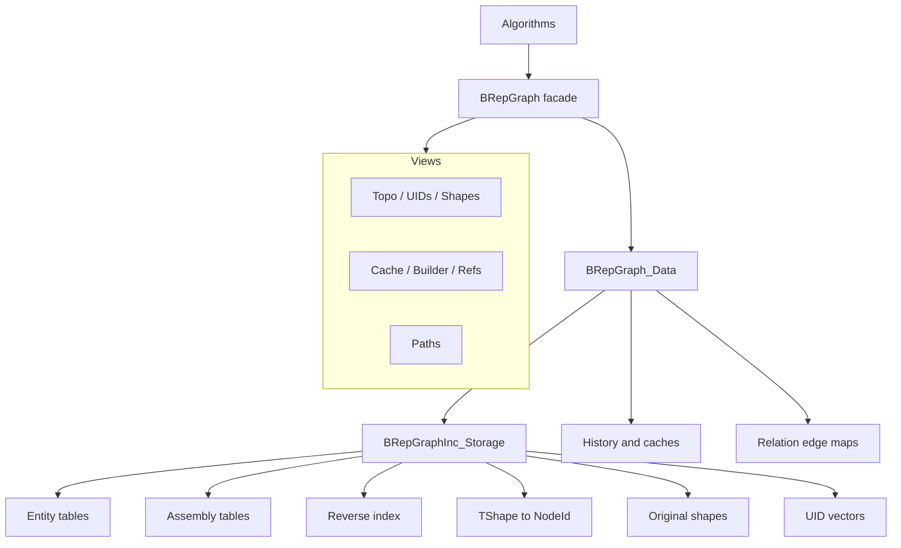
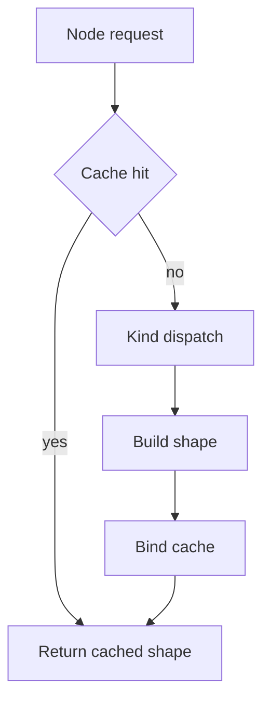
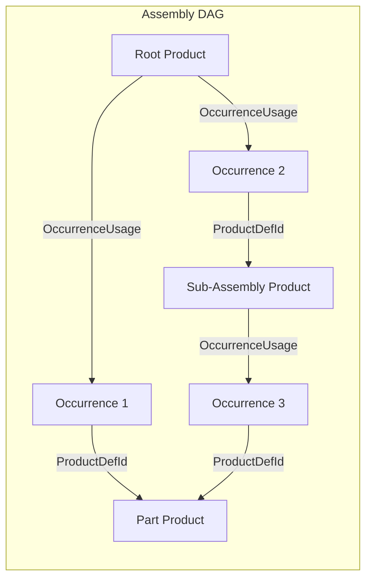

# BRepGraph

BRepGraph is a facade API over an incidence-table topology backend for TopoDS/BRep shapes.

## Why It Exists

BRepGraph provides a stable algorithm-facing API for:

- adjacency and sharing queries,
- controlled topology mutation,
- shape reconstruction,
- assembly structure (products, occurrences, placement),
- history and UID tracking,
- cached analysis helpers.

The goal is to make workflows like sewing, healing, compact, and deduplicate easier to implement and optimize.

## Current Model (March 2026)

The runtime model is incidence-first:

- Source of truth: BRepGraphInc_Storage
- Topology defs in BRepGraph are aliases to incidence entities
- Orientation/location context is stored on incidence refs
- No separate runtime Usage storage layer

See backend details in `src/ModelingData/TKBRep/BRepGraphInc/README.md`.

## Architecture



## Views Reference

All queries and mutations go through lightweight view objects obtained from a `BRepGraph` instance.

| View | Accessor | Purpose |
|------|----------|---------|
| **TopoView** | `Topo()` | Const topology definition access, entity counts, adjacency queries (SharedEdges, AdjacentFaces, SameDomainFaces) |
| **UIDsView** | `UIDs()` | UID allocation, lookup, validity checking |
| **ShapesView** | `Shapes()` | TopoDS reconstruction, FindNode/HasNode reverse lookup |
| **CacheView** | `Cache()` | Transient cache access (Set/Get/Remove per-node cached values) |
| **BuilderView** | `Builder()` | Mutations: AddProduct, AddOccurrence, RemoveNode, RemoveSubgraph, MutGuard accessors |
| **RefsView** | `Refs()` | Reference entry access, RefUID lookup, VersionStamp for refs |
| **PathView** | `Paths()` | Assembly queries (NbProducts, RootProducts, IsAssembly, IsPart), path traversal (GlobalLocation, GlobalOrientation, PathsTo, NodeLocations, CommonAncestor) |

### Non-View Helpers

| Class | Purpose |
|-------|---------|
| **BRepGraph_Analyze** | Static diagnostic functions: `FreeEdges`, `MissingPCurves`, `ToleranceConflicts`, `Decompose` |

### Direct Subsystem Accessors

| Accessor | Purpose |
|----------|---------|
| `History()` | Mutation history subsystem (lineage records) |
| `TransientCache()` | Transient algorithm cache (BndBox, UVBounds) — NOT a Layer |
| `LayerRegistry()` | Access the GUID-keyed runtime registry of registered layers |
| `RegisterLayer()` | Register a `BRepGraph_Layer` plugin explicitly |
| `FindLayer(guid)` / `FindLayer<T>()` | Lookup a registered layer by GUID or layer type |
| `UnregisterLayer(guid)` | Remove a registered layer by GUID |

## Main Data Concepts

- **NodeId** (Kind + Index): lightweight typed address into per-kind node vectors
- **UID** (Kind + Counter): generation-aware persistent identity surviving compaction/reorder
- **RefId** (Kind + Index): lightweight typed address into per-kind reference entry vectors
- **RefUID** (Kind + Counter): generation-aware persistent reference identity
- **RepId** (Kind + Index): separate geometry/mesh addressing decoupled from topology nodes
- **Topology entities**: Vertex, Edge, CoEdge, Wire, Face, Shell, Solid, Compound, CompSolid
- **Assembly entities**: Product (part or assembly), Occurrence (placed instance)
- **Context refs**: VertexUsage, CoEdgeUsage, WireUsage, FaceUsage, ShellUsage, SolidUsage, ChildUsage, OccurrenceUsage
- **Reverse indices**: edge→wire, edge→face, edge→coedge, vertex→edge, wire→face, face→shell, shell→solid, product→occurrences

## Reference Identity (RefId)

Reference entries are the typed edges of the incidence graph. Each ref kind has its own id space, entry table, and UID counter.

### Ref Kinds

8 ref kinds: Shell, Face, Wire, CoEdge, Vertex, Solid, Child, Occurrence. Type-safe wrappers: `BRepGraph_ShellRefId`, `BRepGraph_FaceRefId`, `BRepGraph_WireRefId`, `BRepGraph_CoEdgeRefId`, `BRepGraph_VertexRefId`, `BRepGraph_SolidRefId`, `BRepGraph_ChildRefId`, `BRepGraph_OccurrenceRefId`.

### BaseRef and Ref

`BaseRef` is the common header for all reference entries: `RefId` + `ParentId` + `OwnGen` + `IsRemoved`. Concrete ref entry types (e.g. `ShellRef`, `FaceRef`) extend BaseRef with `DefId` + `Orientation` + `LocalLocation`.

### RefUID

`BRepGraph_RefUID` (Kind + Counter) provides persistent identity for reference entries. Counter-based and generation-aware, surviving compaction and reorder. Analogous to `BRepGraph_UID` for entities.

### VersionStamp Support

`BRepGraph_VersionStamp` supports the ref domain: `StampOf(refId)` and `IsStale(stamp)` enable cache invalidation for ref-dependent computations.

### Mutation Guards

`BRepGraph_MutGuard<T>` is a unified RAII guard for safe mutation of both topology definitions (BaseDef hierarchy) and reference entries (BaseRef hierarchy).

### RefsView API

`RefsView` (via `Refs()`) provides:

- Ref counts: `NbShellRefs`, `NbFaceRefs`, `NbWireRefs`, etc.
- Ref entry access: `Shell(id)`, `Face(id)`, etc.
- UID operations: `UIDOf(refId)`, `RefIdFrom(uid)`
- Parent-to-ref vectors: `ShellRefIdsOf(solidId)`, `FaceRefIdsOf(shellId)`, etc.

Face outer-wire convenience is available from `TopoView`:
- `Topo().OuterWireOfFace(faceId)`

## Core Pipelines

### Build


After topology population, `Build()` auto-creates a single root Product whose `ShapeRootId` points to the top-level topology node. This makes every BRepGraph intrinsically assembly-aware.

### Reconstruct



Use cache-enabled reconstruction paths for multi-face/shell/solid rebuilds.

## Assembly Model

Products and Occurrences are first-class node kinds alongside topology.

### Node Kinds

```
Kind::Product    = 10   // Reusable shape definition (part or assembly)
Kind::Occurrence = 11   // Placed instance of a product within a parent product
```

Helpers: `BRepGraph_NodeId::IsTopologyKind()`, `IsAssemblyKind()`, `Product(i)`, `Occurrence(i)`.

### Data Model



- **ProductDef**: `ShapeRootId` (topology root for parts; invalid for assemblies), `RootOrientation`, `RootLocation`, `OccurrenceRefIds` (child occurrences)
- **OccurrenceDef**: `ProductDefId` (referenced product), `ParentProductDefId` (parent assembly), `ParentOccurrenceDefId` (parent occurrence for tree-structured placement chains), `Placement` (TopLoc_Location)

### Placement Composition

`Paths().OccurrenceLocation(occId)` walks `ParentOccurrenceDefId` from leaf to root, composing `Placement` transforms. DAG-safe: shared products placed at multiple locations have distinct occurrence paths.

### API Distribution

| View | Methods |
|------|---------|
| **PathView** | `NbProducts`, `NbOccurrences`, `Product(i)`, `Occurrence(i)`, `RootProducts`, `IsAssembly`, `IsPart`, `NbComponents`, `Component`, `OccurrenceLocation(occId)` |
| **BuilderView** | `AddProduct`, `AddAssemblyProduct`, `AddOccurrence` (with optional parent occurrence), `RemoveSubgraph` (cascades to child occurrences), `MutProduct(i)`, `MutOccurrence(i)` (RAII guards) |
| **Iterator** | `BRepGraph_Iterator<ProductDef>`, `BRepGraph_Iterator<OccurrenceDef>` |

### Single-Shape Graph

`Build(aBox)` creates one Product with `ShapeRootId = Solid(0)`, zero occurrences. Algorithms always see a uniform model.

## Traversal

BRepGraph provides a context-preserving traversal system for walking the hierarchy from any root down to entities of a target kind, producing full occurrence paths with composed locations and orientations.

### TopologyPath

`BRepGraph_TopologyPath` uniquely identifies one occurrence of an entity by encoding the root and a sequence of ref-index steps through the incidence hierarchy. The step model is uniform: assembly occurrences, compound containers, and topology entities are all just steps.

### Explorer

`BRepGraph_Explorer` visits each **occurrence** of an entity kind (not definitions). If Edge[5] is reachable through Face[0] and Face[1], it is visited twice with different paths:

```cpp
for (BRepGraph_Explorer anExp(aGraph, BRepGraph_NodeId::Solid(0),
                               BRepGraph_NodeId::Kind::Edge);
     anExp.More(); anExp.Next())
{
  BRepGraph_NodeId anEdge = anExp.Current();
  TopLoc_Location  aLoc   = anExp.Location();
}
```

Can also start from a Product to descend through assembly occurrences into topology.

### PathView

`PathView` (via `Paths()`) resolves topology paths:

- `GlobalLocation(path)` / `GlobalOrientation(path)` — composed transforms
- `PathsTo(node)` — all paths from any root to a given entity (reverse lookup)
- `NodeLocations(node)` — all occurrence entries with paths, locations, orientations
- `CommonAncestor(path1, path2)` — longest common prefix
- `FilterByInclude` / `FilterByExclude` — path set filtering
- `IsAncestorOf`, `AllNodesOnPath`, `DepthOfKind`

### SubGraph

`BRepGraph_SubGraph` is a non-owning view over a connected component, produced by `BRepGraph_Analyze::Decompose()`. Stores per-kind typed definition id sets for parallel processing.

## Geometry Access (BRepGraph_Tool)

`BRepGraph_Tool` is the centralized geometry access API for BRepGraph, analogous to `BRep_Tool` for TopoDS. Nested helper classes provide typed, safe access:

| Helper | Key Methods |
|--------|-------------|
| **Vertex** | `Pnt`, `Tolerance`, `Parameter` (on edge), `Parameters` (on surface) |
| **Edge** | `Tolerance`, `Degenerated`, `SameParameter`, `SameRange`, `Range`, `StartVertex`, `EndVertex`, `Curve`, `Polygon`, `Continuity` |
| **CoEdge** | `PCurveGeometry`, `PCurvePolygon`, `PCurveIsHandle` |
| **Face** | `Surface`, `Tolerance`, `NaturalRestriction`, `Wires`, `BndLib`, `UVBounds`, `CurveOnPlane`, `EvalD0` |
| **Wire** | `Edges` (traversal order via WireExplorer) |

## Extensibility: Layers vs TransientCache

`UserAttribute` naming is reserved for the future persistent metadata subsystem.

### Layers (`BRepGraph_Layer`)

Graph-wide metadata plugins with full lifecycle management. Graphs start with zero layers by default;
layers are added explicitly via `RegisterLayer()` or `LayerRegistry().RegisterLayer()`.

- **Purpose**: persistent domain metadata (colors, materials, names, layer groups)
- **Identity**: `Standard_GUID`, not display name
- **Name**: display-only metadata returned by `BRepGraph_Layer::Name()`
- **Storage**: internal maps keyed by NodeId, owned by the layer
- **Lifecycle**: `OnNodeRemoved(old, replacement)` migrates data; `OnCompact(remapMap)` remaps; `OnNodeModified`/`OnNodesModified` for mutation tracking
- **Survives mutations**: yes
- **Examples**: `BRepGraph_NameLayer`, `BRepGraph_ParamLayer`, `BRepGraph_RegularityLayer`

Typical workflow:

```cpp
BRepGraph aGraph;
aGraph.RegisterLayer(new BRepGraph_ParamLayer());
aGraph.RegisterLayer(new BRepGraph_RegularityLayer());

const occ::handle<BRepGraph_ParamLayer> aParamLayer =
  aGraph.FindLayer<BRepGraph_ParamLayer>();
```

### TransientCache (`BRepGraph_TransientCache`)

Centralized per-node cache for algorithm-computed attributes. Dense graph-local storage keyed by
registered cache-kind descriptors with O(1) slot access. NOT a Layer — cleared on Build() and Compact().

- **Purpose**: ephemeral computed caches (bounding boxes, UV bounds, FClass2d results)
- **Identity**: cache families are described by `BRepGraph_CacheKind` with stable `Standard_GUID` identity
- **Storage**: dense `NCollection_Vector<CacheKindSlot>` per cache kind, then per node kind, then per entity index
- **Granularity**: one cached value per `(node, cache kind)`
- **Freshness**: SubtreeGen-validated. Each slot stores `StoredSubtreeGen`; on read, if it differs from the entity's current `SubtreeGen`, the attribute is marked dirty and recomputed lazily.
- **Thread safety**: `shared_mutex` (concurrent reads from `OSD_Parallel::For`, exclusive writes)
- **Survives mutations**: yes (stale entries detected by SubtreeGen mismatch)
- **Examples**: `BRepGraphAlgo_BndLib::CacheKind()`, `BRepGraphAlgo_UVBounds::CacheKind()`

### When to Use Which

- Data that must persist and migrate across graph mutations → **Layer**
- Computed values that can be recomputed from entity state → **TransientCache** (via `CacheView` / `Cache()`)

### Persistence Boundary

- Persist the graph model: topology / assembly defs, refs, reps, UID / RefUID vectors, direct mutation freshness (`OwnGen`), and explicitly persistent layer data.
- Do **not** persist runtime acceleration state: `TransientCache`, reconstructed shape cache, reverse indices, lazy UID lookup maps, or deferred-mutation bookkeeping.
- Use `UID` / `RefUID` as persistence anchors and `NodeId` / `RefId` as runtime addresses.
- Keep occurrence-context metadata resolution out of the core storage model; add it later through `PathView` helpers or layer-side resolvers once DE layers exist.

## Mutation Tracking and Change Propagation

### Split-Generation Model

Every entity (`BaseDef`) carries two generation counters:

| Counter | Incremented when | Used for |
|---------|-----------------|----------|
| **OwnGen** | Entity's own definition fields change (tolerance, point, flags) | VersionStamp persistent identity; PLM staleness detection |
| **SubtreeGen** | Entity's own data OR any descendant's data changes | TransientCache freshness; shape cache validation |

`BaseRef` and `BaseRep` carry only `OwnGen` (no subtree).

### Propagation

When an entity is directly mutated via `MutGuard`:
1. `++OwnGen; ++SubtreeGen` on the mutated entity
2. `propagateSubtreeGen()` walks upward via reverse indices (Edge→Wire→Face→Shell→Solid)
3. Each parent gets `++SubtreeGen` only (NOT OwnGen — parent's own data didn't change)
4. Diamond guard (`LastPropWave`) prevents exponential blowup on shared parents

Propagation is **mutex-free** — no locks, no shape cache clears, no layer dispatch. Cost: ~4 cycles per parent.

### Deferred Mode

`BRepGraph_DeferredScope` wraps batch mutations (sewing, parallel algorithms):
- During scope: `markModified()` appends to deferred list, no propagation
- At scope exit: BFS upward propagation of SubtreeGen, batch layer dispatch

### Shape Cache

Reconstructed shapes are cached in `BRepGraph_Data::myCurrentShapes` as `CachedShape{Shape, StoredSubtreeGen}`. Validated lazily on read — if `StoredSubtreeGen != entity.SubtreeGen`, the shape is stale and reconstructed.

### Persistent Identity (VersionStamp)

`BRepGraph_VersionStamp` = (UID, OwnGen, Generation). `IsStale()` compares `OwnGen` — detects only direct entity changes. Parent stamps are NOT stale when children change (correct for PLM semantics).

### History

Primary mutation entry points are exposed via `Builder()` and scoped RAII guards (`BRepGraph_MutGuard`).

Common operations: SplitEdge, ReplaceEdgeInWire, AddPCurveToEdge, relation-edge add/remove.

History records lineage for downstream attribute transfer and diagnostics. Supports allocator propagation via `SetAllocator()`.

## Memory Model

BRepGraph uses a single `NCollection_IncAllocator` (bump-pointer allocator) for all internal containers:

- All DataMaps in `BRepGraph_Data`
- All `BRepGraphInc_Storage` entity tables and UID vectors
- All `BRepGraphInc_ReverseIndex` inner vectors
- `BRepGraph_History` containers and inner vectors

Benefits: O(1) allocation (bump-pointer), O(1) destruction (bulk page release). The allocator can be provided externally via `BRepGraph::SetAllocator()`.

## Threading Model

- Const query paths are designed for concurrent read access.
- Shape cache is protected by shared mutex.
- Build supports internal parallel extraction.
- Mutation must be externally serialized.
- `BeginDeferredInvalidation()` / `EndDeferredInvalidation()` enables batch mutation without mutex contention.

## Build Options

`Build()` accepts optional `BRepGraphInc_Populate::Options`:

- `ExtractRegularities` (default true): edge continuity across face pairs.
- `ExtractVertexPointReps` (default true): vertex parameter representations on curves/surfaces.

## Debug Validation

`BRepGraphInc_ReverseIndex::Validate()` checks all reverse index maps against forward entity refs. Called automatically via `Standard_ASSERT_VOID` after SplitEdge and ReplaceEdgeInWire in debug builds.

`Builder().CommitMutation()` validates reverse index + active entity counts. Called at end of Sewing, Compact, Deduplicate.

## Practical Guidance

1. Treat BRepGraph as API boundary and BRepGraphInc as implementation backend.
2. Keep `BRepGraphInc_*` types out of stable public headers when a facade/value type is enough.
3. Keep reverse index updates consistent with forward ref changes.
4. Prefer incremental updates in mutators over full rebuilds.
5. Use profiling before adding micro-optimizations.

## File Map

| Category | Files |
|----------|-------|
| **Core** | `BRepGraph.hxx/.cxx`, `BRepGraph_Data.hxx`, `BRepGraph_NodeId.hxx`, `BRepGraph_UID.hxx`, `BRepGraph_RefId.hxx`, `BRepGraph_RefUID.hxx`, `BRepGraph_RepId.hxx` |
| **Views** | `BRepGraph_TopoView.hxx/.cxx`, `BRepGraph_UIDsView.hxx/.cxx`, `BRepGraph_RefsView.hxx/.cxx`, `BRepGraph_ShapesView.hxx/.cxx`, `BRepGraph_CacheView.hxx/.cxx`, `BRepGraph_BuilderView.hxx/.cxx`, `BRepGraph_PathView.hxx/.cxx` |
| **Refs** | `BRepGraph_VersionStamp.hxx/.cxx` |
| **Traversal** | `BRepGraph_Explorer.hxx/.cxx`, `BRepGraph_TopologyPath.hxx`, `BRepGraph_SubGraph.hxx`, `BRepGraph_PCurveContext.hxx` |
| **Geometry** | `BRepGraph_Tool.hxx/.cxx` |
| **Mutation** | `BRepGraph_MutGuard.hxx`, `BRepGraph_DeferredScope.hxx` |
| **Layers** | `BRepGraph_Layer.hxx/.cxx`, `BRepGraph_NameLayer.hxx/.cxx` |
| **Transient Cache** | `BRepGraph_TransientCache.hxx/.cxx` |
| **Analysis** | `BRepGraph_Analyze.hxx/.cxx` |
| **History** | `BRepGraph_History.hxx/.cxx`, `BRepGraph_HistoryRecord.hxx` |
| **Iteration** | `BRepGraph_Iterator.hxx` |
| **Build** | `BRepGraph_Builder.hxx/.cxx` |

## Documentation Map

- API facade and views: `src/ModelingData/TKBRep/BRepGraph/`
- Backend storage and pipelines: `src/ModelingData/TKBRep/BRepGraphInc/`
- Algorithms: `src/ModelingAlgorithms/TKTopAlgo/BRepGraphAlgo/`
- Validation: `src/ModelingAlgorithms/TKTopAlgo/BRepGraphCheck/`
