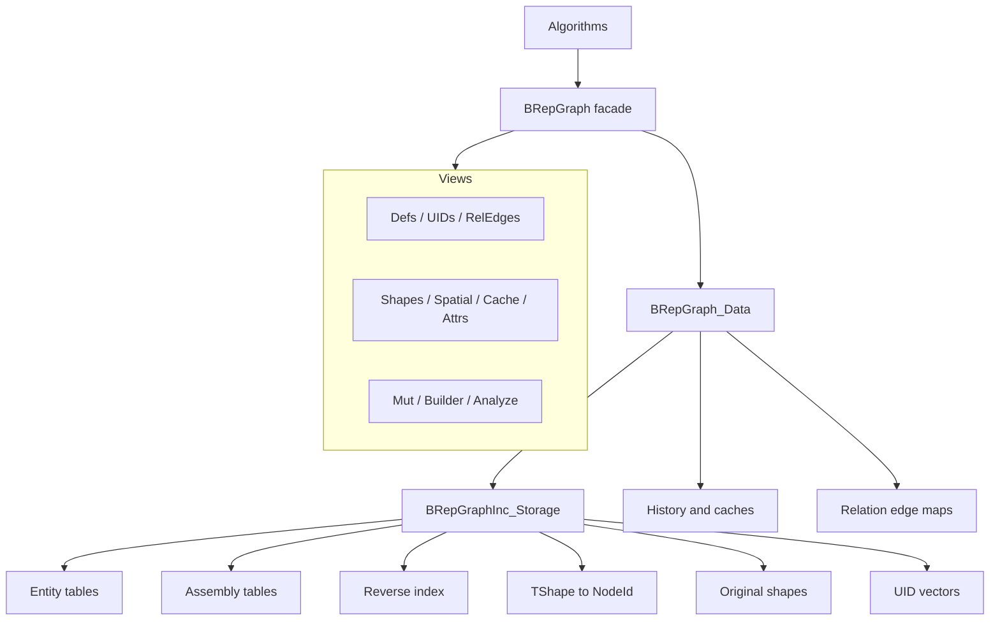
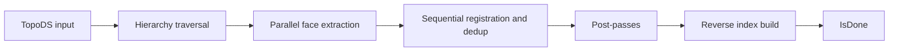
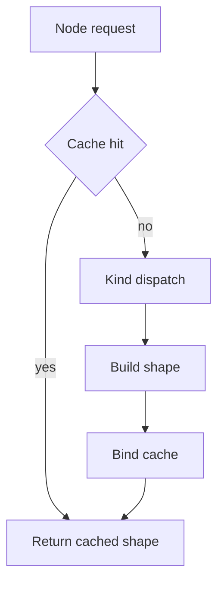
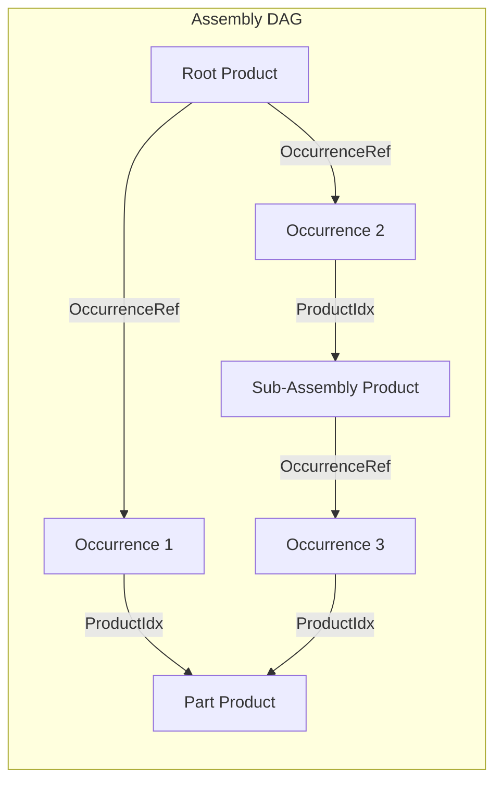

# BRepGraph

BRepGraph is a facade API over an incidence-table topology backend for TopoDS/BRep shapes.

## Current Model (March 2026)

The runtime model is incidence-first:

- Source of truth: BRepGraphInc_Storage
- Topology defs in BRepGraph are aliases to incidence entities
- Orientation/location context is stored on incidence refs
- No separate runtime Usage storage layer

See backend details in src/ModelingData/TKBRep/BRepGraphInc/README.md.

## Why It Exists

BRepGraph provides a stable algorithm-facing API for:

- adjacency and sharing queries,
- controlled topology mutation,
- shape reconstruction,
- assembly structure (products, occurrences, placement),
- history and UID tracking,
- cached analysis helpers.

The goal is to make workflows like sewing, healing, compact, and deduplicate easier to implement and optimize.

## Architecture



## Main Data Concepts

- Node identity: BRepGraph_NodeId (kind + index)
- Stable IDs: BRepGraph_UID (generation-aware)
- Topology entities: Vertex, Edge, Wire, Face, Shell, Solid, Compound, CompSolid
- Assembly entities: Product (part or assembly), Occurrence (placed instance)
- Context refs: EdgeRef, WireRef, FaceRef, ShellRef, ChildRef, SolidRef, OccurrenceRef
- Reverse indices: edge->wire, edge->face, vertex->edge, wire->face, face->shell, shell->solid, product->occurrences

## Core Pipelines

### Build



### Build (Auto Root Product)

After topology population, `Build()` auto-creates a single root Product whose `ShapeRootId` points to the top-level topology node. This makes every BRepGraph intrinsically assembly-aware — no "is this an assembly?" branching needed.

### Reconstruct



Use cache-enabled reconstruction paths for multi-face/shell/solid rebuilds.

## Assembly Model

BRepGraph has intrinsic assembly support. Products and Occurrences are first-class node kinds alongside topology.

### Node Kinds

```
Kind::Product    = 10   // Reusable shape definition (part or assembly)
Kind::Occurrence = 11   // Placed instance of a product within a parent product
```

Helpers: `BRepGraph_NodeId::IsTopologyKind()`, `IsAssemblyKind()`, `Product(i)`, `Occurrence(i)`.

### Data Model



- **ProductEntity**: `ShapeRootId` (topology root for parts; invalid for assemblies), `OccurrenceRefs` (child occurrences)
- **OccurrenceEntity**: `ProductIdx` (referenced product), `ParentProductIdx` (parent assembly), `ParentOccurrenceIdx` (parent occurrence for tree-structured placement chains), `Placement` (TopLoc_Location)

### Placement Composition

`SpatialView::GlobalPlacement(occIdx)` walks `ParentOccurrenceIdx` from leaf to root, composing `Placement` transforms. This is DAG-safe: shared products placed at multiple locations have distinct occurrence paths, each yielding the correct global placement.

### API Distribution

Assembly functionality is distributed across existing views:

| View | Methods |
|------|---------|
| **DefsView** | `NbProducts`, `NbOccurrences`, `Product(i)`, `Occurrence(i)`, `RootProducts`, `IsAssembly`, `IsPart`, `NbComponents`, `Component` |
| **BuilderView** | `AddProduct`, `AddAssemblyProduct`, `AddOccurrence` (with optional parent occurrence), `RemoveSubgraph` (cascades to child occurrences) |
| **MutView** | `ProductDef(i)`, `OccurrenceDef(i)` (RAII guards) |
| **SpatialView** | `GlobalPlacement(occIdx)` |
| **Iterator** | `BRepGraph_Iterator<ProductDef>`, `BRepGraph_Iterator<OccurrenceDef>` |

### Auto Root Product

`Build(shape)` always creates one root Product. For a single solid, the root product's `ShapeRootId` points to `Solid(0)`. For a compound, it points to `Compound(0)`. This means `Defs().NbProducts() >= 1` after any successful build.

## Extensibility: Layers vs UserAttributes

BRepGraph provides two distinct extensibility mechanisms:

### Layers (`BRepGraph_Layer`)

Graph-wide named metadata collections with full lifecycle management. Registered on BRepGraph via `RegisterLayer()` and automatically notified on structural changes.

- **Purpose**: persistent domain metadata (colors, materials, names, layer groups)
- **Storage**: internal maps keyed by NodeId, owned by the layer
- **Lifecycle**: `OnNodeRemoved(old, replacement)` migrates data during sewing/deduplicate; `OnCompact(remapMap)` remaps after compaction; `OnNodeModified`/`OnNodesModified` for mutation tracking
- **Survives mutations**: yes — data migrates automatically
- **Example**: `BRepGraph_NameLayer` (per-node string names)

### UserAttributes (`BRepGraph_UserAttribute`)

Per-node cached computations embedded in each entity's `NodeCache`. Lazily evaluated and automatically invalidated when the node is modified.

- **Purpose**: ephemeral computed caches (bounding boxes, UV bounds, FClass2d results)
- **Storage**: `shared_ptr` in `BaseEntity.Cache` (map keyed by int)
- **Lifecycle**: `Invalidate()` marks dirty; recomputed on next `Get()`; auto-invalidated by `markModified()`
- **Survives mutations**: no — invalidated, then recomputed on demand
- **Example**: `BRepGraph_TypedAttribute<Bnd_Box>` for cached bounding boxes

### When to use which

- Data that must persist and migrate across graph mutations → **Layer**
- Computed values that can be recomputed from entity state → **UserAttribute**
- A Layer can internally use UserAttributes for caching its own computed results

## Mutation and History

Primary mutation entry points are exposed via MutView and helper mutator logic.

Common operations:

- SplitEdge
- ReplaceEdgeInWire
- AddPCurveToEdge
- relation-edge add/remove

History records lineage for downstream attribute transfer and diagnostics.

`BRepGraph_History` supports allocator propagation via `SetAllocator()`. Must be called before any `Record()` or `RecordBatch()` operations. When set, all internal containers (`myRecords`, `myDerivedToOriginal`, `myOriginalToDerived`) and their inner vectors use the graph's IncAllocator for O(1) allocation and bulk-free destruction.

## Memory Model

BRepGraph uses a single `NCollection_IncAllocator` (bump-pointer allocator) for all internal containers:

- All DataMaps in `BRepGraph_Data` (`myOutRelEdges`, `myInRelEdges`, `myNodeLocations`, `myCurrentShapes`)
- All `BRepGraphInc_Storage` entity tables and UID vectors
- All `BRepGraphInc_ReverseIndex` inner vectors (via `preSize` allocator parameter)
- `BRepGraph_History` containers and inner vectors (via `SetAllocator`)

Benefits:
- Allocation is O(1) bump-pointer (no malloc overhead)
- Destruction is O(1) bulk page release (no per-node free)
- The allocator can be provided externally via `BRepGraph::SetAllocator()` or `BRepGraph_Data(theAlloc)`

## Threading Model

- Const query paths are designed for concurrent read access.
- Shape cache is protected by shared mutex.
- Build supports internal parallel extraction.
- Mutation must be externally serialized.

## Build Options

`Build()` accepts optional `BRepGraphInc_Populate::Options` to control post-passes:

- `ExtractRegularities` (default true): edge continuity across face pairs.
- `ExtractVertexPointReps` (default true): vertex parameter representations on curves/surfaces.

Algorithms that do not need regularities or point reps can skip them for faster population.

## Debug Validation

`BRepGraphInc_ReverseIndex::Validate()` checks all reverse index maps against forward entity refs. Called automatically via `Standard_ASSERT_VOID` after `SplitEdge` and `ReplaceEdgeInWire` in debug builds.

`Append()` now allocates UIDs incrementally (only for new entities), preserving existing UIDs.

## Practical Guidance

1. Treat BRepGraph as API boundary and BRepGraphInc as implementation backend.
2. Keep reverse index updates consistent with forward ref changes.
3. Prefer incremental updates in mutators over full rebuilds.
4. Use profiling before adding micro-optimizations.

## Documentation Map

- API facade and views: src/ModelingData/TKBRep/BRepGraph/
- Backend storage and pipelines: src/ModelingData/TKBRep/BRepGraphInc/
- Backend deep dive: src/ModelingData/TKBRep/BRepGraphInc/README.md
