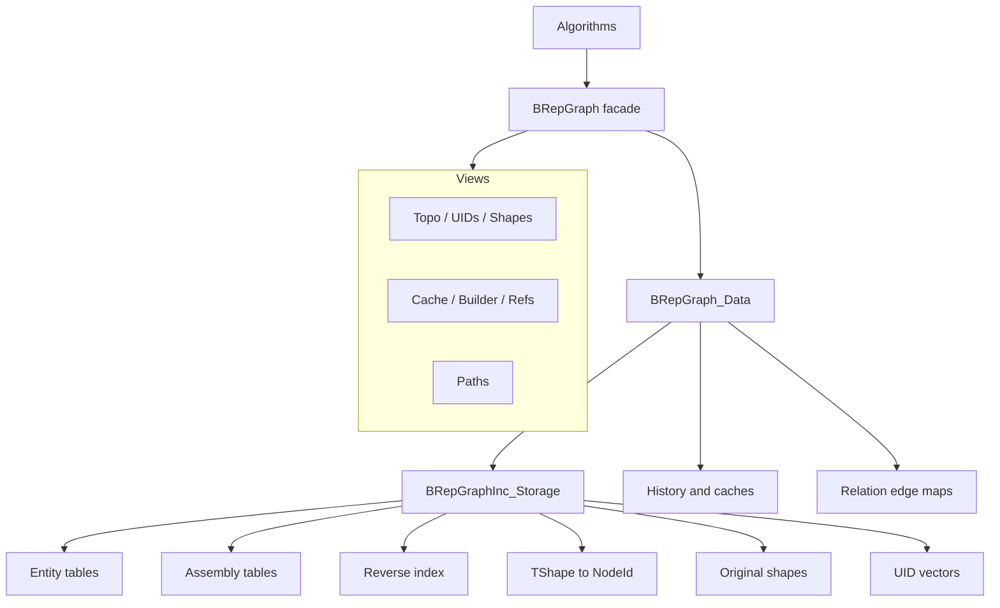
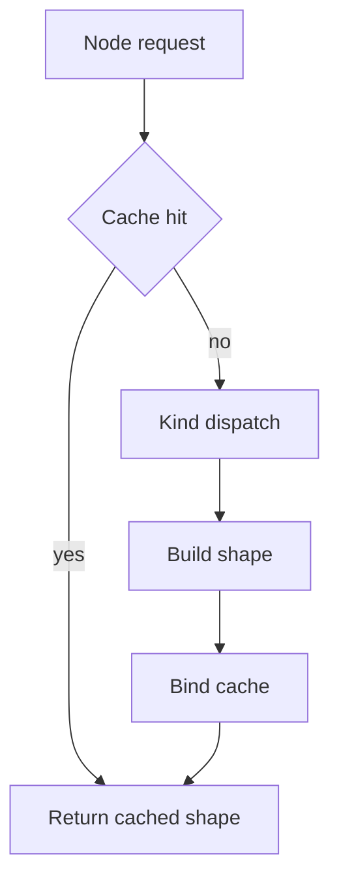
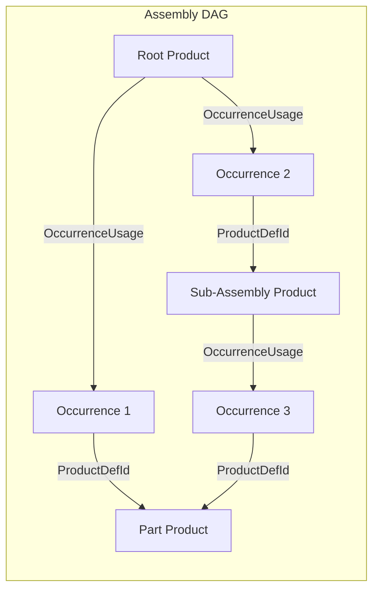

# BRepGraph

BRepGraph is a facade API over an incidence-table topology backend for TopoDS/BRep shapes.

## Why It Exists

BRepGraph provides a stable algorithm-facing API for:

- adjacency and sharing queries,
- controlled topology mutation,
- shape reconstruction,
- assembly structure (products, occurrences, placement),
- history and UID tracking,
- cached analysis helpers.

The goal is to make workflows like sewing, healing, compact, and deduplicate easier to implement and optimize.

## Recent API Changes (April 2026)

- **Mutation API unified**: `BRepGraph::Access()` has been merged into `BRepGraph::Editor()`.
  All `MutEdge(...)`, `MutFace(...)`, `MutVertexRef(...)`, etc. RAII guards now live on
  `EditorView` alongside structural `Add*()` / `Remove*()` / nested `Ops` classes.
  Old callers that wrote `theGraph.Access().MutEdge(id)` should now write
  `theGraph.Editor().MutEdge(id)`.
- **Geometry helpers on `BRepGraph_Tool::CoEdge`**: `Orientation`, `IsReversed`, `EdgeOf`,
  `FaceOf`, `SeamPair`, `IsSeam`. Prefer these over direct `BRepGraphInc::CoEdgeDef` field
  access for encapsulation (single-field reads are also the migration target; perf-critical
  hot loops that read many fields from one struct may keep direct struct access).
- **`BRepGraph_ChildExplorer::Config` struct**: consolidated configuration (mode, target
  kind, avoid kind, emit flag, accumulate-location/orientation, start location/orientation)
  for the downward walker. The new
  `BRepGraph_ChildExplorer(graph, root, Config{…})` constructor is the preferred long-term
  idiom; existing overloads stay in place for compat. Extend `Config` with new fields
  instead of adding new constructor overloads.
- **Concrete layers renamed** for `*Layer*` prefix grouping:
  `BRepGraph_ParamLayer` → `BRepGraph_LayerParam`, `BRepGraph_RegularityLayer` →
  `BRepGraph_LayerRegularity`. Callers must update includes and type names.

## Current Model (April 2026)

The runtime model is incidence-first:

- Source of truth: BRepGraphInc_Storage
- Topology defs in BRepGraph are aliases to incidence entities
- Orientation/location context is stored on incidence refs
- No separate runtime Usage storage layer

See backend details in `src/ModelingData/TKBRep/BRepGraphInc/README.md`.

## Architecture



## Views Reference

All queries and mutations go through lightweight view objects obtained from a `BRepGraph` instance.

| View | Accessor | Purpose |
|------|----------|---------|
| **TopoView** | `Topo()` | Const topology definition access, representation access, adjacency queries, and raw Product/Occurrence definition storage |
| **UIDsView** | `UIDs()` | UID allocation for active entries (`Of`), active-only lookup (`NodeIdFrom`/`RefIdFrom`), and validity checking (`Has`) |
| **ShapesView** | `Shapes()` | Cached `Shape()` access (`null` for invalid/removed nodes), fresh `Reconstruct()` (`null` for invalid/removed nodes), `FindOriginal()/HasOriginal()` non-throw original lookup for active nodes, strict `OriginalOf()` (throws when absent), and FindNode/HasNode reverse lookup for active nodes |
| **CacheView** | `Cache()` | Stable public transient cache access (Set/Get/Has/Remove per-node and per-ref cached values). Supports `CacheKindIter()` for enumerating active cache kinds on a node or ref. Low-level reserve, transfer, and explicit generation-aware access remain on `TransientCache()` / `RefTransientCache()` for algorithm code. |
| **EditorView** | `Editor()` | All mutation: creation (nested `VertexOps`/`EdgeOps`/`WireOps`/`FaceOps`/… `Add(...)` / `Split(...)`), field-level `Mut*()` RAII guards (`MutEdge`, `MutFace`, `MutShell`, `MutProduct`, `MutVertexRef`, `MutSurface`, …), structural removal (RemoveNode, RemoveSubgraph, RemoveRef with orphan pruning), SetCoEdgePCurve, ClearFaceMesh, ClearEdgePolygon3D, AppendFlattenedShape, AppendFullShape, rep creation (CreateTriangulationRep, CreatePolygon3DRep, CreatePolygonOnTriRep), ValidateMutationBoundary. EditorView absorbs the former `AccessView`: there is a single entry point for all mutation. |
| **RefsView** | `Refs()` | Reference entry access, RefUID lookup, VersionStamp for refs |
| **MeshView** | `Mesh()` | Read-only mesh cache queries with cache-first, persistent-fallback priority. For mesh-cache writes use `BRepGraph_Tool::Mesh`. |

`TopoView` also exposes grouped node-oriented helpers for discoverable read queries:

- `Topo().Faces()`, `Edges()`, `Vertices()`, `Wires()`
- `Topo().Shells()`, `Solids()`, `CoEdges()`
- `Topo().Compounds()`, `CompSolids()`
- `Topo().Products()`, `Occurrences()`

Keep `Refs()` as the home for APIs returning `RefId` vectors and reference-entry payloads.

### Non-View Helpers

Use `BRepGraph_ChildExplorer` and `BRepGraph_ParentExplorer` directly for structural diagnostics and connected-component grouping. `BRepGraph_RelatedIterator` provides single-level semantic traversal from any node, yielding immediate neighbours with a `RelationKind` tag (e.g. `AdjacentFace`, `BoundaryEdge`, `IncidentVertex`). `BRepGraph_LayerIterator` iterates over all registered layers in a `BRepGraph_LayerRegistry`. Lightweight one-off analysis helpers are expected to stay local to the consuming algorithm or test.

### Direct Subsystem Accessors

| Accessor | Purpose |
|----------|---------|
| `History()` | Mutation history subsystem (lineage records) |
| `TransientCache()` | Raw transient algorithm cache for low-level algorithms needing reserve, transfer, or explicit generation-aware access; public callers should prefer `Cache()` |
| `RefTransientCache()` | Per-reference transient cache (symmetric to `TransientCache()`, keyed by `RefId`, freshness via `OwnGen`); public callers should prefer `Cache()` |
| `LayerRegistry()` | Access the GUID-keyed runtime registry of registered layers |
| `LayerRegistry().RegisterLayer(layer)` | Register a `BRepGraph_Layer` plugin explicitly |
| `LayerRegistry().FindLayer(guid)` / `LayerRegistry().FindLayer<T>()` | Lookup a registered layer by GUID or layer type |
| `LayerRegistry().UnregisterLayer(guid)` | Remove a registered layer by GUID |

## Main Data Concepts

- **NodeId** (Kind + Index): lightweight typed address into per-kind node vectors
- **UID** (Kind + Counter): generation-aware persistent identity surviving compaction/reorder
- **RefId** (Kind + Index): lightweight typed address into per-kind reference entry vectors
- **RefUID** (Kind + Counter): generation-aware persistent reference identity
- **RepId** (Kind + Index): separate geometry/mesh addressing decoupled from topology nodes
- **Topology entities**: Vertex, Edge, CoEdge, Wire, Face, Shell, Solid, Compound, CompSolid
- **Assembly entities**: Product (part or assembly), Occurrence (placed instance)
- **Context refs**: VertexUsage, CoEdgeUsage, WireUsage, FaceUsage, ShellUsage, SolidUsage, ChildUsage, OccurrenceUsage
- **Reverse indices**: edge→wire, edge→face, edge→coedge, vertex→edge, wire→face, face→shell, shell→solid, product→occurrences

## Reference Identity (RefId)

Reference entries are the typed edges of the incidence graph. Each ref kind has its own id space, entry table, and UID counter.

### Ref Kinds

8 ref kinds: Shell, Face, Wire, CoEdge, Vertex, Solid, Child, Occurrence. Type-safe wrappers: `BRepGraph_ShellRefId`, `BRepGraph_FaceRefId`, `BRepGraph_WireRefId`, `BRepGraph_CoEdgeRefId`, `BRepGraph_VertexRefId`, `BRepGraph_SolidRefId`, `BRepGraph_ChildRefId`, `BRepGraph_OccurrenceRefId`.

### BaseRef and Ref

`BaseRef` is the common header for all reference entries: `RefId` + `ParentId` + `OwnGen` + `IsRemoved`. Concrete ref entry types (e.g. `ShellRef`, `FaceRef`) extend BaseRef with `DefId` + `Orientation` + `LocalLocation`.

### RefUID

`BRepGraph_RefUID` (Kind + Counter) provides persistent identity for reference entries. Counter-based and generation-aware, surviving compaction and reorder. Analogous to `BRepGraph_UID` for entities.

### VersionStamp Support

`BRepGraph_VersionStamp` supports the ref domain: `StampOf(refId)` and `IsStale(stamp)` enable cache invalidation for ref-dependent computations.

### Mutation Guards

`BRepGraph_MutGuard<T>` is a unified RAII guard for safe mutation of both topology definitions (BaseDef hierarchy) and reference entries (BaseRef hierarchy).

### RefsView API

`RefsView` (via `Refs()`) provides:

- Ref counts: `NbShellRefs`, `NbFaceRefs`, `NbWireRefs`, etc.
- Ref entry access: `Shell(id)`, `Face(id)`, etc.
- UID operations: `UIDOf(refId)`, `RefIdFrom(uid)`
- Parent-to-ref vectors: `ShellRefIdsOf(solidId)`, `FaceRefIdsOf(shellId)`, etc.

Face outer-wire convenience is available from grouped `TopoView` helpers:
- `Topo().Faces().OuterWire(faceId)`

## Core Pipelines

### Build


After topology population, `BRepGraph_Builder::Perform()` can auto-create a single root Product wrapping the top-level topology node. This graph-level policy is controlled by `BRepGraph_Builder::BuildOptions::CreateAutoProduct` (default true), because it is implemented by the builder layer rather than the backend population pipeline. When disabled (e.g. XCAF builder manages Products itself), the caller is responsible for creating Products.

### Reconstruct



Use cache-enabled reconstruction paths for multi-face/shell/solid rebuilds.

## Assembly Model

Products and Occurrences are first-class node kinds alongside topology.

### Node Kinds

```
Kind::Product    = 10   // Reusable shape definition (part or assembly)
Kind::Occurrence = 11   // Placed instance of a product within a parent product
```

Helpers: `BRepGraph_NodeId::IsTopologyKind()`, `IsAssemblyKind()`, `Products().Definition(id)`, `Occurrences().Definition(id)`.

### Data Model



- **ProductDef**: `ShapeRootId` (topology root for parts; invalid for assemblies), `RootOrientation`, `RootLocation`, `OccurrenceRefIds` (child occurrences)
- **OccurrenceDef**: `ProductDefId` (referenced product), `ParentProductDefId` (parent assembly), `ParentOccurrenceDefId` (parent occurrence for tree-structured placement chains), `Placement` (TopLoc_Location)

### Placement Composition

`Paths().OccurrenceLocation(occId)` walks `ParentOccurrenceDefId` from leaf to root, composing `Placement` transforms. DAG-safe: shared products placed at multiple locations have distinct occurrence paths.

### API Distribution

| View | Methods |
|------|---------|
| **TopoView** | `NbProducts`, `NbOccurrences`, grouped helpers `Products()` / `Occurrences()` |
| **PathView** | `RootProducts`, `IsAssembly`, `IsPart`, `NbComponents`, `Component`, `OccurrenceLocation(occId)` |
| **EditorView** | `AddProduct`, `AddAssemblyProduct`, `AddOccurrence` (with optional parent occurrence), `RemoveSubgraph` (cascades to child occurrences), `MutProduct(i)`, `MutOccurrence(i)` (RAII guards) |
| **Traversal** | Flat definition traversal via `BRepGraph_ProductIterator` / `BRepGraph_OccurrenceIterator` (or explicit `NbProducts()` / `NbOccurrences()` scans when storage-level access is required) |

### Single-Shape Graph

`BRepGraph_Builder::Perform(aGraph, aBox)` creates one Product with `ShapeRootId = Solid(0)`, zero occurrences. Algorithms always see a uniform model.

## Traversal

BRepGraph provides a context-preserving traversal system for walking the hierarchy from any root down to entities of a target kind, producing full occurrence paths with composed locations and orientations.

### TopologyPath

`BRepGraph_TopologyPath` uniquely identifies one occurrence of an entity by encoding the root and a sequence of ref-index steps through the incidence hierarchy. The step model is uniform: assembly occurrences, compound containers, and topology entities are all just steps.

### Explorer

`BRepGraph_ChildExplorer` visits each **occurrence** of an entity kind (not definitions). If Edge[5] is reachable through Face[0] and Face[1], it is visited twice with different paths:

```cpp
for (BRepGraph_ChildExplorer anExp(aGraph, BRepGraph_SolidId(0),
                               BRepGraph_NodeId::Kind::Edge);
     anExp.More(); anExp.Next())
{
  BRepGraph_NodeId anEdge = anExp.Current();
  TopLoc_Location  aLoc   = anExp.Location();
}
```

Can also start from a Product to descend through assembly occurrences into topology.

### PathView

`PathView` (via `Paths()`) resolves topology paths:

- `RootProductIds()` / `BRepGraph_RootIterator` / `IsAssembly()` / `IsPart()` / `NbComponents()` / `Component()` - graph-root and assembly-aware product traversal
-- `GlobalLocation(path)` / `GlobalOrientation(path)` - composed transforms
- `ForEachPathTo(node, alloc, callback)` / `ForEachPathFromTo(root, leaf, alloc, callback)` - lazy reverse path enumeration without result-vector materialization
- `ForEachNodeLocation(node, alloc, callback)` - lazy occurrence enumeration with path, location, and orientation per branch
-- `PathsTo(node)` - all paths from any root to a given entity (reverse lookup)
-- `NodeLocations(node)` - all occurrence entries with paths, locations, orientations
-- `CommonAncestor(path1, path2)` - longest common prefix
-- `FilterByInclude` / `FilterByExclude` - path set filtering

The vector-returning reverse lookup methods remain as convenience wrappers over the lazy enumeration layer.
- `IsAncestorOf`, `AllNodesOnPath`, `DepthOfKind`

### RelatedIterator

`BRepGraph_RelatedIterator` provides single-level semantic traversal from any node, yielding immediate neighbours with a `RelationKind` tag. Unlike ChildExplorer (which descends to a target kind) or ParentExplorer (which ascends), RelatedIterator stays at one level and returns all semantically related nodes:

```cpp
for (BRepGraph_RelatedIterator anIt(aGraph, BRepGraph_NodeId(aFaceId)); anIt.More(); anIt.Next())
{
  BRepGraph_NodeId aNeighbour = anIt.Current();
  BRepGraph_RelatedIterator::RelationKind aRel = anIt.CurrentRelation();
  // e.g. BoundaryEdge, AdjacentFace, OuterWire
}
```

Relation kinds include: `ChildShell`, `ChildFace`, `FreeChild`, `BoundaryEdge`, `AdjacentFace`, `OuterWire`, `ReferencedByFace`, `IncidentVertex`, `WireCoEdge`, `IncidentEdge`, `ParentEdge`, `OwningFace`, `SeamPair`, `ChildEntity`, `ChildSolid`, `ChildOccurrence`, `ReferencedProduct`, `ParentProduct`, `ParentOccurrence`.

### Connected Components

Disconnected topology is grouped on demand by walking from faces to their solid or shell roots with `BRepGraph_ParentExplorer`, or by descending from known roots with `BRepGraph_ChildExplorer`. There is no longer a packaged `SubGraph` container.

## Geometry Access (BRepGraph_Tool)

`BRepGraph_Tool` is the centralized geometry access API for BRepGraph, analogous to `BRep_Tool` for TopoDS. Nested helper classes provide typed, safe access:

| Helper | Key Methods |
|--------|-------------|
| **Vertex** | `Pnt`, `Tolerance`, `Parameter` (on edge), `Parameters` (on surface) |
| **Edge** | `Tolerance`, `Degenerated`, `SameParameter`, `SameRange`, `Range`, `StartVertex`, `EndVertex`, `Curve`, `Polygon`, `Continuity` |
| **CoEdge** | `PCurveGeometry`, `PCurvePolygon`, `PCurveIsHandle` |
| **Face** | `Surface`, `Tolerance`, `NaturalRestriction`, `Wires`, `BndLib`, `UVBounds`, `CurveOnPlane`, `EvalD0` |
| **Wire** | `Edges` (traversal order via WireExplorer) |

## Extensibility: Layers vs TransientCache

`UserAttribute` naming is reserved for the future persistent metadata subsystem.

### Layers (`BRepGraph_Layer`)

Graph-wide metadata plugins with full lifecycle management. Graphs start with zero layers by default;
layers are added explicitly via `LayerRegistry().RegisterLayer()`.

- **Purpose**: persistent domain metadata (colors, materials, names, layer groups)
- **Identity**: `Standard_GUID`, not display name
- **Name**: display-only metadata returned by `BRepGraph_Layer::Name()`
- **Storage**: internal maps keyed by NodeId, owned by the layer
- **Lifecycle**: `OnNodeRemoved(old, replacement)` migrates data; `OnCompact(remapMap)` remaps; `OnNodeModified`/`OnNodesModified` for node mutation tracking; `OnRefRemoved`/`OnRefModified`/`OnRefsModified` for reference mutation tracking (subscribed via `SubscribedRefKinds()` bitmask)
- **Survives mutations**: yes
- **Examples**: `BRepGraph_ParamLayer`, `BRepGraph_RegularityLayer`

Typical workflow:

```cpp
BRepGraph aGraph;
aGraph.LayerRegistry().RegisterLayer(new BRepGraph_ParamLayer());
aGraph.LayerRegistry().RegisterLayer(new BRepGraph_RegularityLayer());

const occ::handle<BRepGraph_ParamLayer> aParamLayer =
  aGraph.LayerRegistry().FindLayer<BRepGraph_ParamLayer>();
```

### TransientCache (`BRepGraph_TransientCache`) and RefTransientCache (`BRepGraph_RefTransientCache`)

Centralized per-node (TransientCache) and per-reference (RefTransientCache) caches for algorithm-computed attributes. Dense graph-local storage keyed by registered cache-kind descriptors with O(1) slot access. NOT a Layer - cleared on BRepGraph_Builder::Perform() and Compact().

- **Purpose**: ephemeral computed caches (bounding boxes, UV bounds, FClass2d results)
- **Identity**: cache families are described by `BRepGraph_CacheKind` with stable `Standard_GUID` identity
- **Storage**: dense `NCollection_Vector<CacheKindSlot>` per cache kind, then per node kind, then per entity index
- **Granularity**: one cached value per `(node, cache kind)`
- **Freshness**: SubtreeGen-validated for nodes (each slot stores `StoredSubtreeGen`); OwnGen-validated for refs (refs have no subtree). On read, if the stored generation differs from the entity's current generation, the attribute is marked dirty and recomputed lazily.
- **Thread safety**: `shared_mutex` (concurrent reads from `OSD_Parallel::For`, exclusive writes)
- **Survives mutations**: yes (stale entries detected by SubtreeGen mismatch)

### When to Use Which

- Data that must persist and migrate across graph mutations → **Layer**
- Computed values that can be recomputed from entity state → **TransientCache** (prefer `CacheView` / `Cache()` in public code)

### Persistence Boundary

- Persist the graph model: topology / assembly defs, refs, reps, UID / RefUID vectors, direct mutation freshness (`OwnGen`), and explicitly persistent layer data.
- Do **not** persist runtime acceleration state: `TransientCache`, reconstructed shape cache, reverse indices, lazy UID lookup maps, or deferred-mutation bookkeeping.
- Use `UID` / `RefUID` as persistence anchors and `NodeId` / `RefId` as runtime addresses.
- Keep occurrence-context metadata resolution out of the core storage model; add it later through `PathView` helpers or layer-side resolvers once DE layers exist.

## Mutation Tracking and Change Propagation

### Split-Generation Model

Every entity (`BaseDef`) carries two generation counters:

| Counter | Incremented when | Used for |
|---------|-----------------|----------|
| **OwnGen** | Entity's own definition fields change (tolerance, point, flags, edge list, surface, etc.) | VersionStamp persistent identity; PLM staleness detection |
| **SubtreeGen** | Entity's own data OR any descendant's data changes | TransientCache freshness; shape cache validation |

`BaseRef` and `BaseRep` carry only `OwnGen` (no subtree).

### Propagation

When an entity is directly mutated via `MutGuard`:
1. `++OwnGen; ++SubtreeGen` on the mutated entity
2. `propagateSubtreeGen()` walks upward via reverse indices (Edge→Wire→Face→Shell→Solid)
3. Each parent gets `++SubtreeGen` only (NOT OwnGen - parent's own data didn't change)
4. Diamond guard (`LastPropWave`) prevents exponential blowup on shared parents

Propagation is **mutex-free** - no locks, no shape cache clears, no layer dispatch. Cost: ~4 cycles per parent on Apple M1; actual cost depends on hardware and memory state.

### Deferred Mode

`BRepGraph_DeferredScope` wraps batch mutations (sewing, SameParameter, compact loops):
- During scope: `markModified()` appends to deferred list, no propagation
- At scope exit: BFS upward propagation of SubtreeGen, batch layer dispatch
- Deferred mode batches invalidation only; concurrent `Mut*()` calls still require external synchronization
- See `BRepGraph_DeferredScope` for the RAII guard wrapping `BeginDeferredInvalidation()` / `EndDeferredInvalidation()`

### Shape Cache

Reconstructed shapes are cached in `BRepGraph_Data::myCurrentShapes` as `CachedShape{Shape, StoredSubtreeGen}`. Validated lazily on read - if `StoredSubtreeGen != entity.SubtreeGen`, the shape is stale and reconstructed.

### Persistent Identity (VersionStamp)

`BRepGraph_VersionStamp` = (UID, OwnGen, Generation). `IsStale()` compares `OwnGen` - detects only direct entity changes. Parent stamps are NOT stale when children change, matching PLM-style semantics where direct parent edits and child edits are tracked separately.

### History

Primary mutation entry points are exposed via `Editor()` and scoped RAII guards (`BRepGraph_MutGuard`).

Common operations: SplitEdge, ReplaceEdgeInWire, AddPCurveToEdge, relation-edge add/remove.

History records lineage for downstream attribute transfer and diagnostics. Supports allocator propagation via `SetAllocator()`.

## Memory Model

BRepGraph uses a single `NCollection_IncAllocator` (bump-pointer allocator) for all internal containers:

- All DataMaps in `BRepGraph_Data`
- All `BRepGraphInc_Storage` entity tables and UID vectors
- All `BRepGraphInc_ReverseIndex` inner vectors
- `BRepGraph_History` containers and inner vectors

Benefits: O(1) allocation (bump-pointer), O(1) destruction (bulk page release). The allocator can be provided externally via `BRepGraph::SetAllocator()`.

## Threading Model

- Const query paths are designed for concurrent read access.
- Shape cache is protected by shared mutex.
- Build supports internal parallel extraction.
- Mutation must be externally serialized.
- `BeginDeferredInvalidation()` / `EndDeferredInvalidation()` reduces invalidation overhead for batch mutation loops.

## Build Options

`BRepGraph_Builder::Perform(graph, theShape, theParallel)` uses default `BRepGraph_Builder::BuildOptions`.
Use the explicit overload when the caller needs to override extraction passes or graph-level import policy.

`BRepGraph_Builder::BuildOptions`:

- `Populate.ExtractRegularities` (default true): edge continuity across face pairs.
- `Populate.ExtractVertexPointReps` (default true): vertex parameter representations on curves/surfaces.
- `CreateAutoProduct` (default true): auto-create a root Product wrapping the top-level topology node. Set to false when a higher-level builder (e.g. XCAF) manages Products itself.

### Incremental Append

`Editor().AppendFlattenedShape(shape)` appends faces without container nodes. `Editor().AppendFullShape(shape)` preserves the full hierarchy (Solid/Shell/Compound/CompSolid). Both accept `BRepGraphInc_Populate::Options` for backend extraction passes only. `BRepGraph_Builder::AppendFull()` is the lower-level static API.

## Debug Validation

`BRepGraphInc_ReverseIndex::Validate()` checks all reverse index maps against forward entity refs. Called automatically via `Standard_ASSERT_VOID` after SplitEdge and ReplaceEdgeInWire in debug builds.

`Editor().CommitMutation()` validates reverse index + active entity counts. Called at end of Sewing, Compact, Deduplicate.

### Validation Pipeline

`BRepGraph_Validate` checks structural graph invariants, not geometric validity. Use `Mode::Lightweight` only for cheap boundary checks on graphs whose structure is created or mutated exclusively by internal algorithm code with already-tested invariants. For CI, integration tests, and production API boundaries, prefer `Mode::Audit`, which adds cross-reference, reverse-index, UID, and assembly-cycle checks.

If the caller also needs geometric/topological validity of reconstructed shapes, run `BRepGraph_Validate` first for graph integrity, then run the shape-level validation stack separately.

```cpp
const BRepGraph_Validate::Result aResult =
  BRepGraph_Validate::Perform(aGraph, BRepGraph_Validate::Mode::Audit);
if (!aResult.IsValid())
{
  // inspect aResult.Issues before continuing
}
```

## Practical Guidance

1. Treat BRepGraph as API boundary and BRepGraphInc as implementation backend.
2. Treat view APIs (`Topo()`, `Refs()`, `Paths()`) as the stable read boundary; avoid direct access to `BRepGraph_Data` / `myIncStorage` outside designated backend maintenance code.
3. Keep reverse index updates consistent with forward ref changes.
4. Prefer incremental updates in mutators over full rebuilds.
5. Use profiling before adding micro-optimizations.

## File Map

| Category | Files |
|----------|-------|
| **Core** | `BRepGraph.hxx/.cxx`, `BRepGraph_Data.hxx`, `BRepGraph_NodeId.hxx`, `BRepGraph_UID.hxx`, `BRepGraph_RefId.hxx`, `BRepGraph_RefUID.hxx`, `BRepGraph_RepId.hxx` |
| **Views** | `BRepGraph_TopoView.hxx/.cxx`, `BRepGraph_UIDsView.hxx/.cxx`, `BRepGraph_RefsView.hxx/.cxx`, `BRepGraph_ShapesView.hxx/.cxx`, `BRepGraph_CacheView.hxx/.cxx`, `BRepGraph_EditorView.hxx/.cxx`, `BRepGraph_PathView.hxx/.cxx` |
| **Refs** | `BRepGraph_VersionStamp.hxx/.cxx` |
| **Traversal** | `BRepGraph_ChildExplorer.hxx/.cxx`, `BRepGraph_ParentExplorer.hxx/.cxx`, `BRepGraph_RelatedIterator.hxx`, `BRepGraph_TopologyPath.hxx`, `BRepGraph_PCurveContext.hxx` |
| **Geometry** | `BRepGraph_Tool.hxx/.cxx` |
| **Mutation** | `BRepGraph_MutGuard.hxx`, `BRepGraph_DeferredScope.hxx` |
| **Layers** | `BRepGraph_Layer.hxx/.cxx`, `BRepGraph_LayerIterator.hxx`, `BRepGraph_LayerRegistry.hxx/.cxx`, `BRepGraph_ParamLayer.hxx/.cxx`, `BRepGraph_RegularityLayer.hxx/.cxx` |
| **Transient Cache** | `BRepGraph_TransientCache.hxx/.cxx`, `BRepGraph_RefTransientCache.hxx/.cxx`, `BRepGraph_CacheKindIterator.hxx` |
| **History** | `BRepGraph_History.hxx/.cxx`, `BRepGraph_HistoryRecord.hxx` |
| **Build** | `BRepGraph_Builder.hxx/.cxx` |

## Documentation Map

- API facade and views: `src/ModelingData/TKBRep/BRepGraph/`
- Backend storage and pipelines: `src/ModelingData/TKBRep/BRepGraphInc/`
