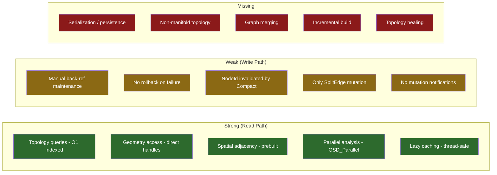
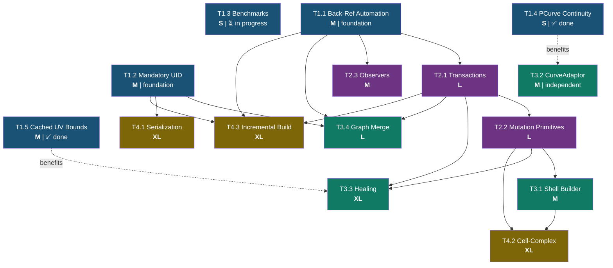
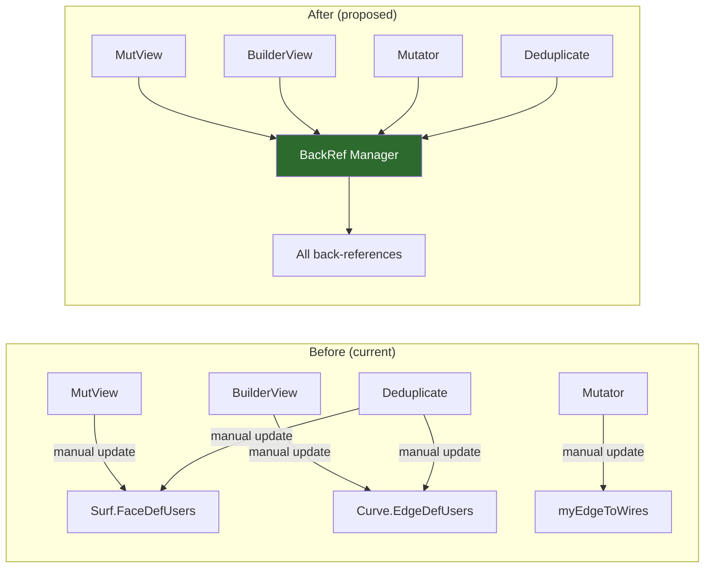
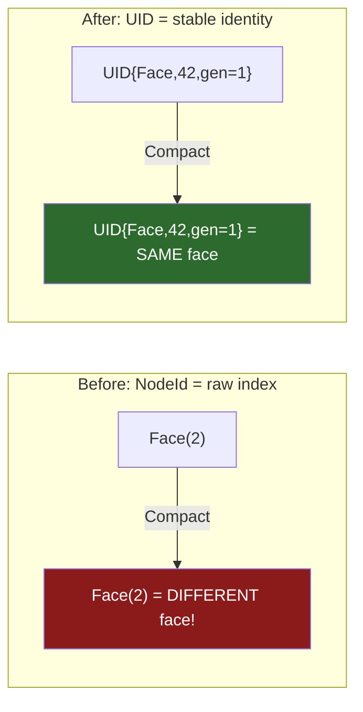
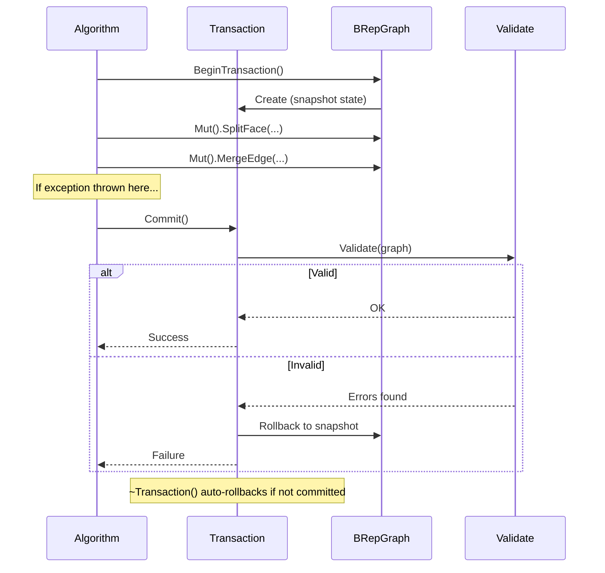
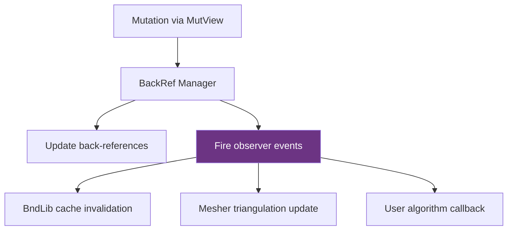
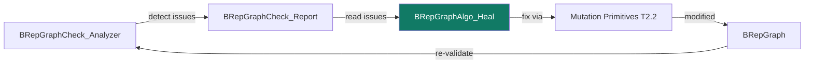
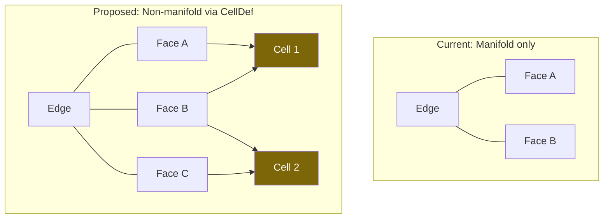
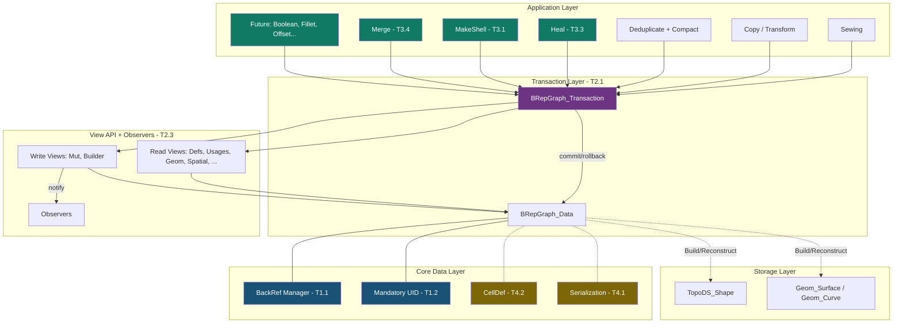

# BRepGraph Architecture Improvement Roadmap

## Context

BRepGraph is a bidirectional topology-geometry graph layered over OCCT's TopoDS/BRep model. It provides efficient read-only queries, parallel analysis, and utility algorithms (sewing, copy, transform, deduplication, validation, compaction). However, it has architectural gaps that limit its use for mutation-heavy workflows (booleans, fillets, local operations). This roadmap defines improvements to make BRepGraph a robust, future-proof foundation for CAD algorithm development.

**Current state (2026-03-17):** 12 view classes, 11 algorithms (BRepGraphAlgo), BRepGraphCheck validation, optional UID system, append-only history, user attribute system with GUID registry. Cached UV bounds (`BRepGraphAlgo_UVBounds`) and bounding boxes (`BRepGraphAlgo_BndLib`) use per-node user attributes. PCurve continuity populated via `BRep_Tool::MaxContinuity`. 225+ passing tests.

---

## Current Architecture

```mermaid
graph TB
    subgraph "Application Layer"
        A1[BRepGraphAlgo_Sewing]
        A2[BRepGraphAlgo_Copy]
        A3[BRepGraphAlgo_Transform]
        A4[BRepGraphAlgo_Deduplicate]
        A5[BRepGraphAlgo_BndLib]
        A6[BRepGraphAlgo_FClass2d]
        A7[BRepGraphAlgo_Validate]
        A8[BRepGraphAlgo_Compact]
        A9[BRepGraphAlgo_AttrTransfer]
        A10[BRepGraphCheck_Analyzer]
        A11[BRepGraphAlgo_UVBounds]
    end

    subgraph "View API Layer"
        V1[DefsView]
        V2[UsagesView]
        V3[GeomView]
        V4[SpatialView]
        V5[RelEdgesView]
        V6[AnalyzeView]
        V7[ShapesView]
        V8[CacheView]
        V9[AttrsView]
        V10[MutView]
        V11[BuilderView]
        V12[Iterator]
    end

    subgraph "Core Data Layer"
        D1[BRepGraph_Data - PIMPL]
        D2[Def Vectors - Solid/Shell/Face/Wire/Edge/Vertex]
        D3[Usage Vectors - per occurrence]
        D4[Geom Vectors - Surf/Curve/PCurve]
        D5[Reverse Indices - myEdgeToWires, myTShapeToDefId]
        D6[History - append-only log]
        D7[UID System - opt-in]
        D8[Attribute Registry - GUID-based]
    end

    subgraph "Storage Layer"
        S1[TopoDS_Shape / BRep_TFace / BRep_TEdge]
        S2[Geom_Surface / Geom_Curve / Geom2d_Curve]
    end

    A1 & A2 & A3 & A4 & A5 & A6 & A7 & A8 & A9 & A10 & A11 --> V1 & V2 & V3 & V4 & V5 & V6 & V7 & V8 & V9 & V10 & V11 & V12
    V1 & V2 & V3 & V4 & V5 & V6 & V7 & V8 & V9 & V10 & V11 & V12 --> D1
    D1 --> D2 & D3 & D4 & D5 & D6 & D7 & D8
    D1 -.->|Build/Reconstruct| S1 & S2
```

## Gap Analysis

---

## Dependency Graph

---

## Tier 1 — Foundation (unblocks everything else)

### T1.1: Automated Back-Reference Maintenance

> **The single most impactful improvement.** Eliminates an entire class of bugs for every future algorithm.

**What:** Centralize all back-reference updates (`Surf.FaceDefUsers`, `Curve.EdgeDefUsers`, `myEdgeToWires`) behind a single internal manager. Every mutation path (MutView, BuilderView, Mutator) routes geometry-link changes through this single point.

**Why:** Manual back-ref maintenance is the #1 source of bugs. Deduplicate edge merge leaves stale `Curve.EdgeDefUsers`. Every new algorithm must replicate this logic or risk silent corruption.

**Files:** `BRepGraph_Data.hxx`, `BRepGraph_MutView.cxx`, `BRepGraph_Mutator.cxx`, `BRepGraph_BuilderView.cxx`, `BRepGraphAlgo_Deduplicate.cxx`

**Complexity:** M | **Dependencies:** None

---

### T1.2: Mandatory UID (Stable Node Identity)

**What:** Make UID always-on (remove `SetUIDEnabled()` toggle). Assign UID to every node during `Build()` and programmatic construction. Provide O(1) `UIDToNodeId()`/`NodeIdToUID()`. Preserve UIDs across compaction.

**Why:** `BRepGraph_NodeId` is an index invalidated by compaction. History records, external caches, and algorithm state holding NodeIds break silently.

**Files:** `BRepGraph_UID.hxx`, `BRepGraph_Data.hxx`, `BRepGraph.hxx`, `BRepGraphAlgo_Compact.cxx`

**Complexity:** M | **Dependencies:** None

---

### T1.3: Performance Benchmark Suite ⏳ IN PROGRESS

**What:** Parameterized GTest benchmarks: `Build()` time (100/1K/10K faces), `Reconstruct` round-trip, Sewing throughput, Deduplicate+Compact cycle, spatial query throughput.

**Why:** Without benchmarks, regressions from T1.1/T1.2 overhead go undetected. Must measure before changing.

**Files:** `BRepGraph_Benchmark_Test.cxx`, `BRepGraphAlgo_Benchmark_Test.cxx` + `FILES.cmake`

**Status:** Initial benchmark files implemented with smoke tests (enabled) and timing benchmarks (DISABLED by default). Covers Build (100/1K/10K faces), Sewing throughput, Deduplicate+Compact cycle. Remaining: Reconstruct round-trip, spatial query throughput benchmarks.

**Complexity:** S | **Dependencies:** None (do first)

---

### T1.4: Populate PCurve.Continuity ✅ DONE

**What:** During `Build()`, compute `PCurve.Continuity` from `BRep_Tool::MaxContinuity()` for each edge.

**Why:** Field declared in `BRepGraph_GeomNode::PCurve` but always `GeomAbs_C0`. Future fillet/offset algorithms need correct data.

**Files:** `BRepGraph_Builder.cxx`, `BRepGraph.cxx`, `BRepGraph.hxx`

**Implementation notes:** Uses `BRep_Tool::MaxContinuity(edge)` inline during parallel Phase 2 — zero overhead (reads edge's own regularity records). The `createPCurveNode()` signature was extended with a `theContinuity` parameter (default `GeomAbs_C0` for backward compatibility). Also replaced `TopExp::Vertices()` with a local `edgeVertices()` that filters non-vertex children. Tests added in `BRepGraph_Geometry_Test.cxx`.

**Complexity:** S | **Dependencies:** None

---

### T1.5: Cached UV Bounds for Faces ✅ DONE

**What:** `BRepGraphAlgo_UVBounds` class with GUID-based caching on face nodes, computing UV parametric bounds from face PCurves with natural-restriction detection, periodicity clamping, BSpline pseudo-periodicity handling, and `RectangularTrimmedSurface` unwrapping.

**Why:** UV bounds were recomputed on every call in `BRepGraphAlgo_BndLib` (3 call sites), and lacked the BSpline pseudo-periodicity check from `BRepTools::AddUVBounds`. Caching avoids redundant work for future algorithms.

**Files:** New `BRepGraphAlgo_UVBounds.hxx/.cxx`, modified `BRepGraphAlgo_BndLib.cxx` (thin wrapper), `BRepGraph.hxx` (friend), `FILES.cmake`

**Consumers:**
- `BRepGraphAlgo_BndLib` — face bounding box computation (3 call sites via `findExactUVBounds`)
- `BRepGraphCheck_Solid` — candidate for improvement (currently uses raw `Surface->Bounds()` with ±1e6 clamping instead of face-specific UV domain)

**Complexity:** M | **Dependencies:** None

---

## Tier 2 — Mutation Safety (make mutations robust)

### T2.1: Transaction / Mutation Guard

**What:** RAII `BRepGraph_Transaction` class with snapshot/commit/rollback semantics and exclusive write access enforcement.

**Why:** No concurrent mutation detection, no rollback, no post-mutation validation. Failed algorithms leave graph inconsistent.

**Files:** New `BRepGraph_Transaction.hxx/.cxx`, `BRepGraph.hxx`, `BRepGraph_MutView.hxx`

**Complexity:** L | **Dependencies:** T1.1

---

### T2.2: Higher-Level Mutation Primitives

**What:** Extend `BRepGraph_Mutator` with:

| Operation | Description | Current alternative |
|-----------|-------------|-------------------|
| `SplitFace` | Split face along wire, produce two new defs | None |
| `MergeEdge` | Merge coincident edges (inverse of SplitEdge) | Manual in Sewing |
| `MergeVertex` | Merge vertices, rewrite all referencing edges | Manual in Deduplicate |
| `RemoveEdgeFromWire` | Remove edge and reconnect wire | None |

**Why:** Only `SplitEdge` and `ReplaceEdgeInWire` exist. Every algorithm reimplements mutation logic, causing back-reference bugs.

**Files:** `BRepGraph_Mutator.hxx/.cxx`, `BRepGraph_MutView.hxx`, `BRepGraphAlgo_Sewing.cxx`

**Complexity:** L | **Dependencies:** T1.1, T2.1

---

### T2.3: Observer / Event System

**What:** `BRepGraph_Observer` interface with virtual callbacks fired from the back-ref manager (T1.1).

**Why:** Cache invalidation is manual. Third-party code has no notification mechanism. Observers decouple mutation from invalidation.

**Files:** New `BRepGraph_Observer.hxx`, `BRepGraph.hxx`, `BRepGraph_MutView.cxx`, `BRepGraph_Mutator.cxx`

**Complexity:** M | **Dependencies:** T1.1

---

## Tier 3 — Algorithms (new graph-native capabilities)

### T3.1: Graph-Native Shell Builder

**What:** `BRepGraphAlgo_MakeShell` -- given face NodeIds, construct ShellDef by detecting shared edges, orienting faces, detecting openness/closedness.

**Why:** Shell construction is fundamental for Sewing (phase 7), future booleans, any face-creating algorithm. Currently reimplemented inline.

**Files:** New `BRepGraphAlgo_MakeShell.hxx/.cxx`, `BRepGraph_SpatialView.hxx`

**Complexity:** M | **Dependencies:** T1.1, T2.2

---

### T3.2: Per-Usage Location-Aware Curve/Surface Adaptors

**What:** `GeomView::CurveAdaptorForUsage(UsageId)` -- lightweight adaptor evaluating geometry with usage's `GlobalLocation` applied, without copying.

**Why:** Currently callers manually compose curve + `Spatial().GlobalTransform()`. Error-prone. Critical for intersection, booleans, geometric queries.

**Files:** `BRepGraph_GeomView.hxx/.cxx`

**Complexity:** M | **Dependencies:** None (benefits from T1.4)

---

### T3.3: Graph-Based Topology Healing

**What:** `BRepGraphAlgo_Heal` -- fix issues detected by BRepGraphCheck: gap-closing, tolerance adjustment, face normal consistency. Operates directly on graph.

**Why:** BRepGraphCheck detects issues but provides no repair. Currently requires TopoDS round-trip. Graph-native healer closes the detect-fix loop.

**Files:** New `BRepGraphAlgo_Heal.hxx/.cxx`

**Complexity:** XL | **Dependencies:** T2.1, T2.2

---

### T3.4: Graph Merging

**What:** `BRepGraphAlgo_Merge` -- combine two BRepGraph instances into one. Remap NodeIds, optionally deduplicate shared geometry, preserve UIDs.

**Why:** Needed for assembly operations, boolean pre-processing, incremental model building. Without this, combining shapes requires `AppendShape()` which loses graph metadata.

**Files:** New `BRepGraphAlgo_Merge.hxx/.cxx`

**Complexity:** L | **Dependencies:** T1.1, T1.2, T2.1

---

## Tier 4 — Advanced (long-term evolution)

### T4.1: Serialization / Persistence

**What:** Binary format for BRepGraph with UID-based cross-references. `BRepGraphAlgo_Serialize::Write/Read`. Virtual serialize on `BRepGraph_UserAttribute`.

**Why:** Only persistence path is TopoDS reconstruction + STEP/BRep writers, losing all graph metadata. Enables: disk caching, inter-process transfer, undo/redo checkpoints.

**Files:** New `BRepGraph_Serialize.hxx/.cxx`, `BRepGraph_UserAttribute.hxx`

**Complexity:** XL | **Dependencies:** T1.2

---

### T4.2: Cell-Complex Abstraction (Non-Manifold)

**What:** Extend graph with `CellDef` nodes for non-manifold topology where an edge can be shared by more than two faces.

**Why:** Current model assumes manifold topology. Non-manifold needed for: FEM, T-junctions, unregularized boolean results.

**Files:** `BRepGraph_NodeId.hxx`, `BRepGraph_TopoNode.hxx`, `BRepGraph_Data.hxx`, `BRepGraph_SpatialView.hxx`, `BRepGraphCheck_Analyzer.hxx`

**Complexity:** XL | **Dependencies:** T2.2, T3.1

---

### T4.3: Incremental Build / Partial Update

**What:** `IncrementalAdd(shape)` with dedup against existing defs. `IncrementalRemove(nodeId)` with reference cleanup. `IncrementalRebuild(nodeIds)` for targeted re-extraction.

**Why:** For interactive CAD, full `Build()` after every edit is too expensive. Proper incremental build preserves O(delta) cost.

**Files:** `BRepGraph_Builder.hxx/.cxx`, `BRepGraph_Data.hxx`, `BRepGraph_BuilderView.hxx`

**Complexity:** XL | **Dependencies:** T1.1, T1.2, T2.1

---

## Target Architecture (after all tiers)

---

## Recommended Implementation Order

| # | Item | Tier | Complexity | Rationale |
|---|------|------|-----------|-----------|
| 1 | T1.3 Benchmarks | 1 | S | Measure before changing — **in progress** |
| 2 | T1.4 PCurve Continuity | 1 | S | **Done** — uses `BRep_Tool::MaxContinuity` |
| 2b | T1.5 Cached UV Bounds | 1 | M | **Done** — `BRepGraphAlgo_UVBounds` with GUID caching |
| 3 | T1.1 Back-Ref Automation | 1 | M | Biggest risk-reducer |
| 4 | T1.2 Mandatory UID | 1 | M | Enables stable identity |
| 5 | T2.1 Transactions | 2 | L | Enables safe multi-step mutations |
| 6 | T2.3 Observers | 2 | M | Transaction-aware events and cache invalidation |
| 7 | T2.2 Mutation Primitives | 2 | L | Enables higher-level algorithms |
| 8 | T3.2 CurveAdaptor | 3 | M | Independent utility |
| 9 | T3.1 Shell Builder | 3 | M | Simplifies Sewing, unblocks T4.2 |
| 10 | T3.4 Graph Merge | 3 | L | Enables assembly workflows |
| 11 | T3.3 Healing | 3 | XL | Closes detect-fix loop |
| 12 | T4.1 Serialization | 4 | XL | Persistence layer |
| 13 | T4.2 Cell-Complex | 4 | XL | Non-manifold support |
| 14 | T4.3 Incremental Build | 4 | XL | Interactive performance |

**Complexity key:** S = days, M = 1-2 weeks, L = 2-4 weeks, XL = 1-2 months
