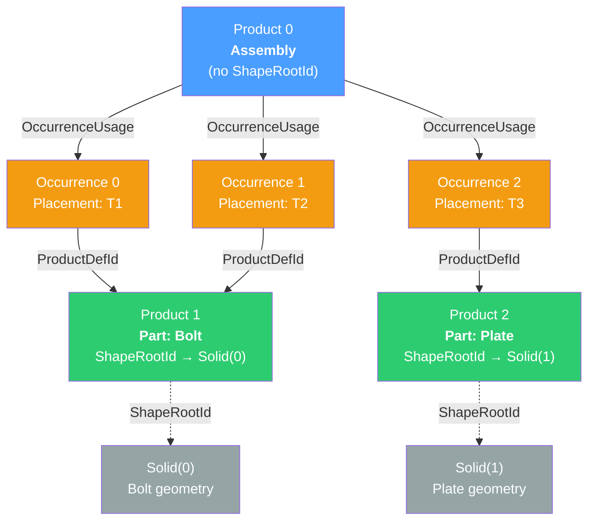
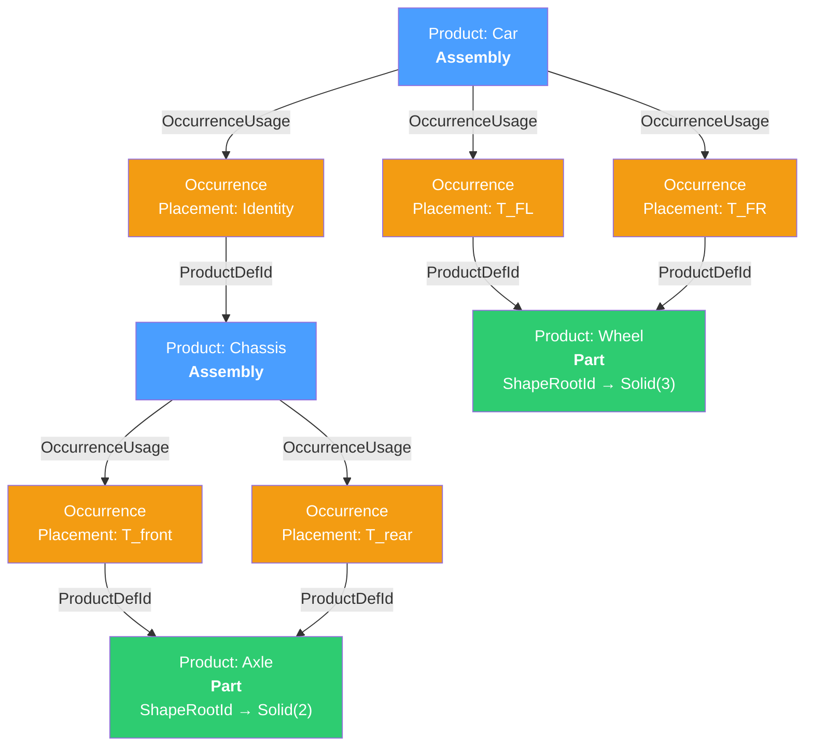
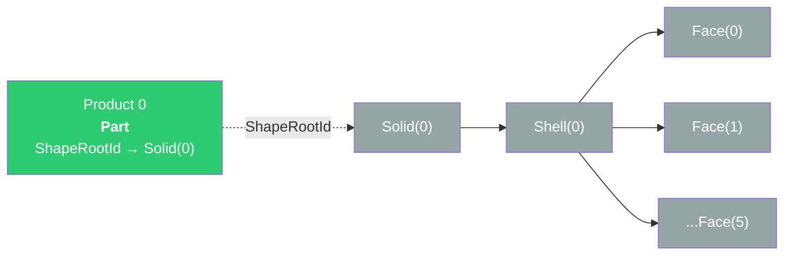
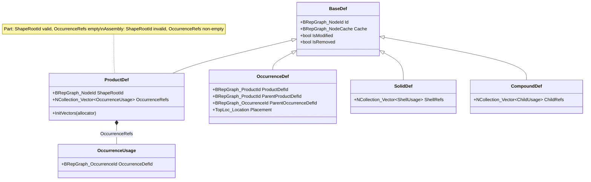
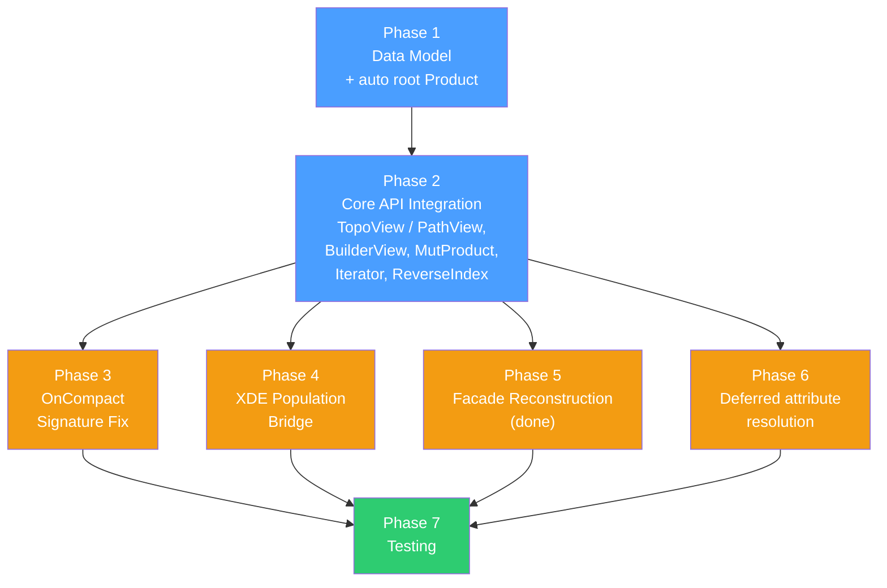
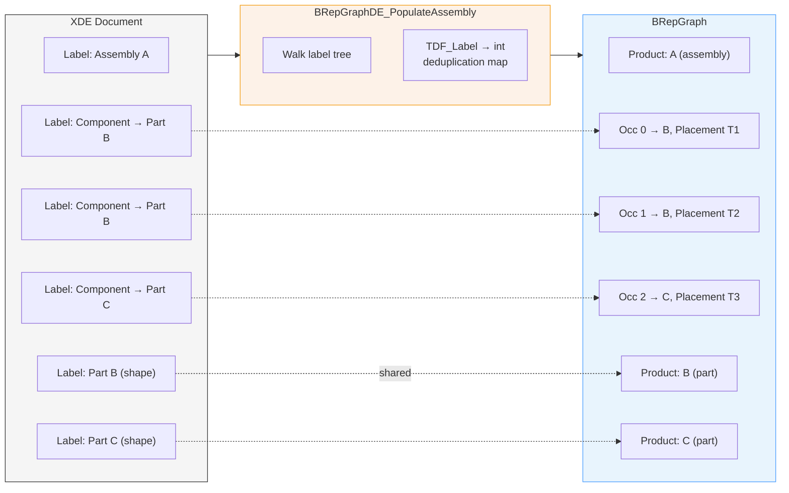
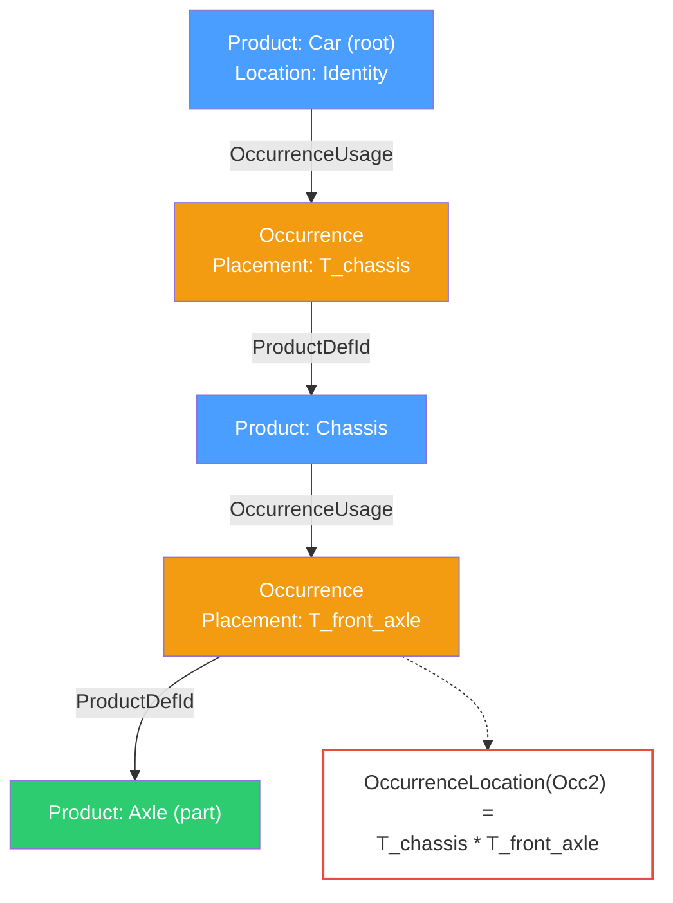

# BRepGraph Assembly Model — Visualizations

Mermaid diagrams illustrating the intrinsic assembly architecture.
See [TODO_Assembly.md](TODO_Assembly.md) for the full design specification.

---

## 1. Product/Occurrence DAG

A typical assembly: two parts (Bolt, Plate) with shared instances.

**DAG sharing**: Product 1 (Bolt) is referenced by two occurrences (O0, O1),
each with a different placement.  The bolt geometry (Solid 0) exists once.

---

## 2. Deep Nesting (Multi-Level Assembly)

**OccurrenceLocation** for OccAxle1: `T_identity * T_front` (composed root-to-leaf).

---

## 3. Single-Shape Graph (Degenerate Case)

Every graph has a root Product — even a simple `Build(aBox)`:

Zero occurrences.  Algorithms see the same uniform model.

---

## 4. API Distribution Across Views

```mermaid
graph TB
    subgraph BRepGraph
        direction TB
        MutProduct["MutProduct(idx)"]
        MutOccurrence["MutOccurrence(idx)"]
    end

    subgraph TopoPathView["TopoView / PathView (const)"]
        direction TB
        DV1["Product(idx) / Occurrence(idx)"]
        DV2["NbProducts() / NbOccurrences()"]
        DV3["RootProducts()"]
        DV4["IsAssembly(idx) / IsPart(idx)"]
        DV5["NbComponents(idx) / Component(idx, i)"]
    end

    subgraph BuilderView["BuilderView (mutation)"]
        direction TB
        BV1["AddProduct(shapeRoot)"]
        BV2["AddAssemblyProduct()"]
        BV3["AddOccurrence(parent, ref, placement)"]
        BV4["RemoveNode — cascade for Products"]
        BV5["RemoveSubgraph — deep removal"]
    end

    subgraph MutGraph["BRepGraph (RAII guards)"]
        direction TB
        MV1["MutProduct(idx)"]
        MV2["MutOccurrence(idx)"]
    end

    subgraph PathView["PathView (assembly context)"]
        direction TB
        SV1["GlobalLocation(path)"]
        SV2["OccurrenceLocation(occIdx)"]
    end

    subgraph ResolveLater["Deferred attribute resolution"]
        direction TB
        AQ1["ResolveLayerValue?(occ)"]
        AQ2["Leaf-part traversal via Explorer"]
        AQ3["Occurrence paths via PathView"]
    end

    style TopoPathView fill:#e8f4fd,stroke:#4a9eff
    style BuilderView fill:#fdf2e8,stroke:#f39c12
    style MutGraph fill:#e8fdf0,stroke:#2ecc71
    style PathView fill:#f0e8fd,stroke:#9b59b6
    style ResolveLater fill:#fde8e8,stroke:#e74c3c
    style BRepGraph fill:#f5f5f5,stroke:#333
```

---

## 5. Entity Struct Hierarchy

---

## 6. Compact Remap Flow (Phase 3)

Cross-references (`ProductDefId`, `ParentProductDefId`, `ShapeRootId`, `OccurrenceRefs`)
are remapped using `theRemapMap.Find()`.  Missing entries trigger an assertion.

---

## 7. Phase Dependency Graph

---

## 8. XDE-to-BRepGraph Population (Phase 4)

Part B appears once as a Product despite two component references — shared via
`TDF_Label → int` deduplication map.

---

## 9. Location Propagation

`PathView::OccurrenceLocation(occId)` walks `ParentOccurrenceDefId` chain upward,
composing `TopLoc_Location` values from root to leaf.
