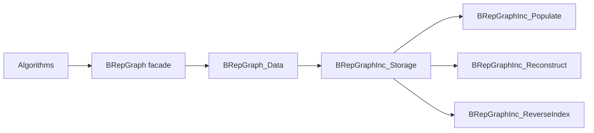
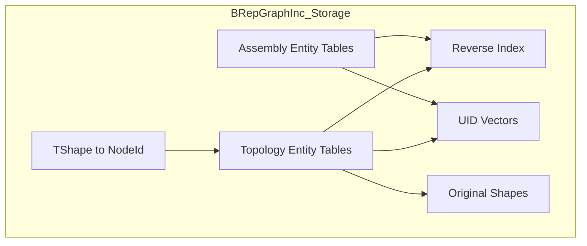
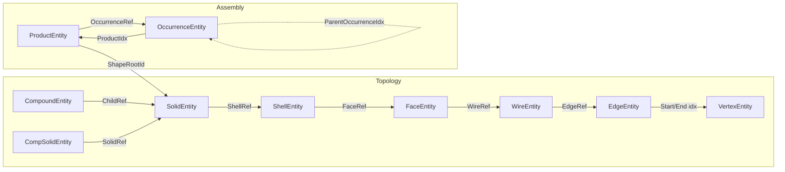
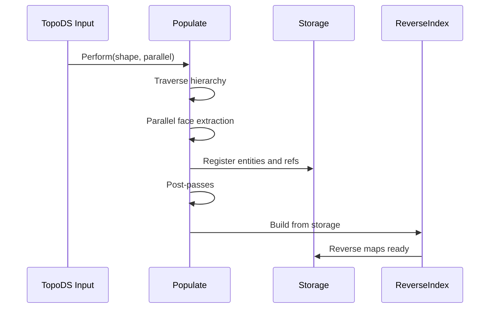
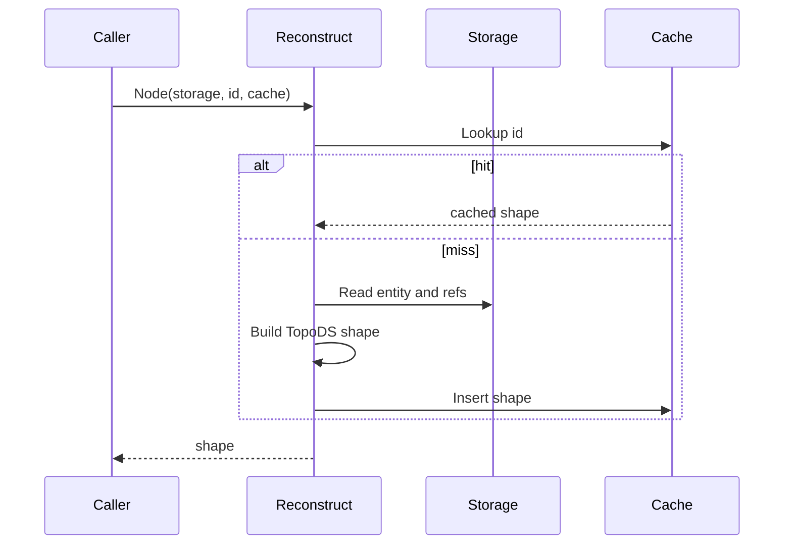
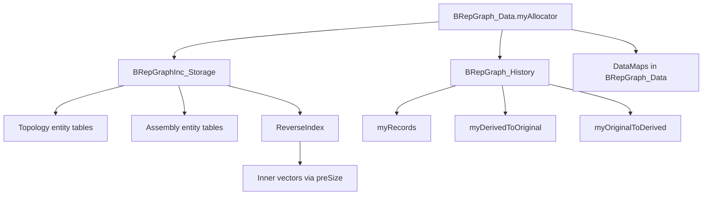

# BRepGraphInc Architecture

This document describes the backend architecture of BRepGraphInc in implementation terms.

## 1) Backend Position

BRepGraphInc is not a user-facing API. It is the runtime model that powers BRepGraph.

## 2) Storage Topology

Topology entity tables:

- VertexEntity
- EdgeEntity
- WireEntity
- FaceEntity
- ShellEntity
- SolidEntity
- CompoundEntity
- CompSolidEntity

Assembly entity tables:

- ProductEntity — reusable shape definition (part or assembly)
- OccurrenceEntity — placed instance of a product within a parent product

## 3) Incidence Semantics

Guideline:

- intrinsic data lives on entities,
- topology occurrence context (orientation/location) lives on refs,
- assembly placement lives on OccurrenceEntity (TopLoc_Location),
- ParentOccurrenceIdx forms a tree for unambiguous placement chain traversal in DAGs.

## 4) Build Flow

## 5) Reconstruction Flow

## 6) Reverse Index Contract

Reverse index maps support upward adjacency queries:

- edge -> wires
- edge -> faces
- vertex -> edges
- wire -> faces
- face -> shells
- shell -> solids
- product -> occurrences

Contract:

- any forward relation used by query code must have matching reverse rows.
- product->occurrences is rebuilt during `BuildReverseIndex` via `BuildProductOccurrences`.

## 7) Mutation Contract

After each mutator boundary, the following must hold:

1. entity state is internally valid,
2. reverse index matches current refs,
3. cache invalidation is applied for impacted nodes,
4. history coherence is preserved.

Recommended operation order:

1. edit entity/ref rows,
2. update reverse index incrementally,
3. invalidate caches,
4. append history record.

## 8) Allocator Propagation

All containers use the graph's `NCollection_IncAllocator` (bump-pointer allocator):

Contract:
- `BRepGraphInc_ReverseIndex::preSize()` and `BuildDelta()` construct inner vectors with the allocator
- `BRepGraph_History::SetAllocator()` must be called before any `Record`/`RecordBatch` calls
- All temporary vectors created inside `Record()`/`RecordBatch()` also use the allocator

## 9) Known Performance Priorities

Primary:

- geometric computation in SameParameter, ExtremaPC, edge matching,
- KDTree traversal cost (squareDistance, coordinate access),
- populate parallel extraction (BRepTools_WireExplorer).

Secondary in common workloads:

- edge-face context cardinality scans (often low row count),
- reverse-index dedup strategy in build/maintenance paths,
- populate post-pass costs.

## 10) Assembly Model

BRepGraphInc_Storage holds assembly entity tables alongside topology:

- **ProductEntity**: `ShapeRootId` (root topology node for parts; invalid for assemblies), `OccurrenceRefs` (child occurrences)
- **OccurrenceEntity**: `ProductIdx` (referenced product), `ParentProductIdx` (parent assembly product), `ParentOccurrenceIdx` (parent occurrence for tree-structured placement chains), `Placement` (TopLoc_Location)

Key invariants:

- `Build()` auto-creates one root Product pointing to the top-level topology node
- Products may be shared (DAG): multiple occurrences can reference the same product
- Each occurrence has a unique ParentOccurrenceIdx forming a tree (not DAG) for unambiguous GlobalPlacement
- Self-referencing occurrences (parent product == referenced product) are rejected at creation time
- Removed products cannot be referenced by new occurrences

## 11) Validation Targets

Debug-only validators should check:

- entity id/kind consistency,
- mapping consistency for TShape to NodeId,
- reverse-index coherence with current refs,
- removed-node filtering expectations,
- assembly: every occurrence references a valid, non-removed product.
