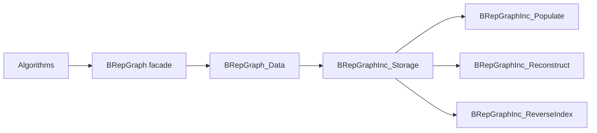
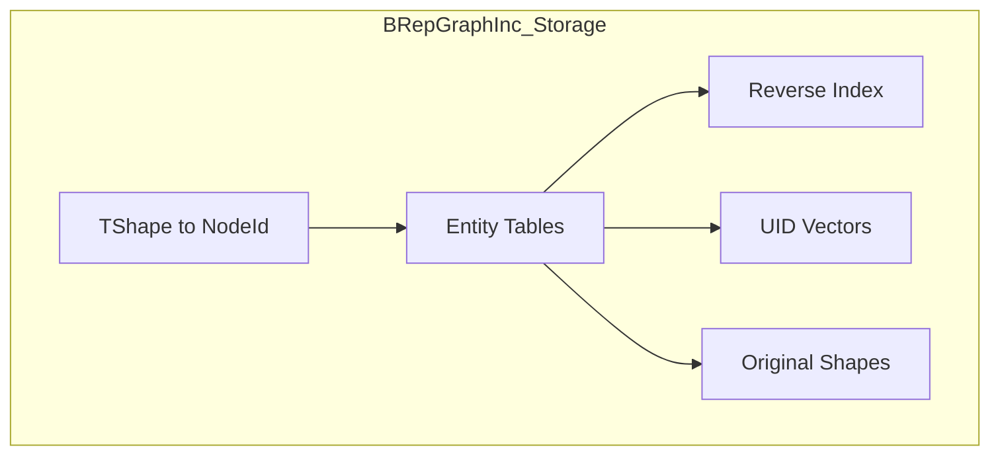
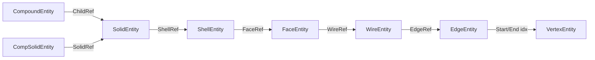
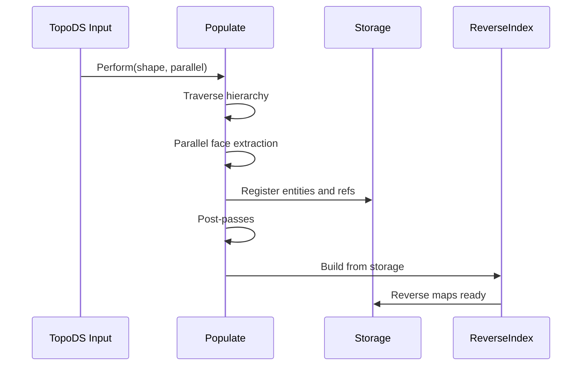
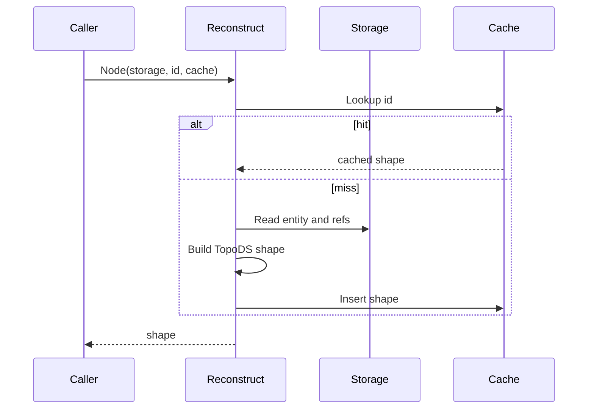

# BRepGraphInc Architecture

This document describes the backend architecture of BRepGraphInc in implementation terms.

## 1) Backend Position

BRepGraphInc is not a user-facing API. It is the runtime model that powers BRepGraph.

## 2) Storage Topology

Entity tables:

- VertexEntity
- EdgeEntity
- WireEntity
- FaceEntity
- ShellEntity
- SolidEntity
- CompoundEntity
- CompSolidEntity

## 3) Incidence Semantics

Guideline:

- intrinsic data lives on entities,
- occurrence context (orientation/location) lives on refs.

## 4) Build Flow

## 5) Reconstruction Flow

## 6) Reverse Index Contract

Reverse index maps support upward adjacency queries:

- edge -> wires
- edge -> faces
- vertex -> edges
- wire -> faces
- face -> shells
- shell -> solids

Contract:

- any forward relation used by query code must have matching reverse rows.

## 7) Mutation Contract

After each mutator boundary, the following must hold:

1. entity state is internally valid,
2. reverse index matches current refs,
3. cache invalidation is applied for impacted nodes,
4. history coherence is preserved.

Recommended operation order:

1. edit entity/ref rows,
2. update reverse index incrementally,
3. invalidate caches,
4. append history record.

## 8) Known Performance Priorities

Primary:

- reverse-index dedup strategy in build/maintenance paths,
- append-mode UID maintenance,
- populate post-pass costs.

Secondary in common workloads:

- edge-face context cardinality scans (often low row count).

## 9) Validation Targets

Debug-only validators should check:

- entity id/kind consistency,
- mapping consistency for TShape to NodeId,
- reverse-index coherence with current refs,
- removed-node filtering expectations.
