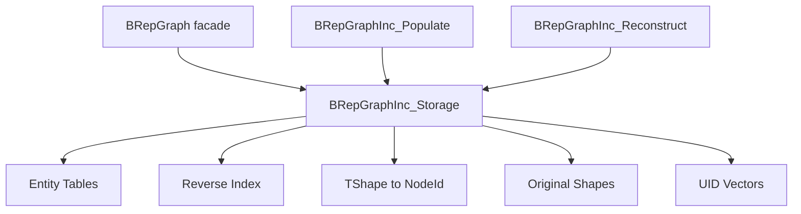
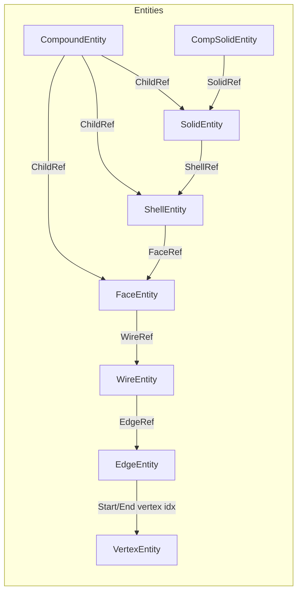
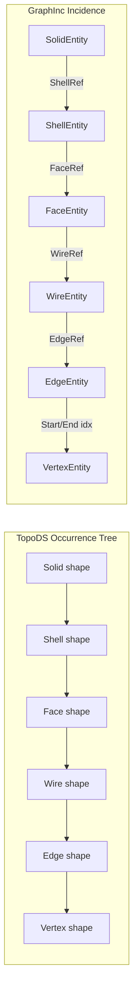
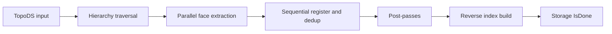
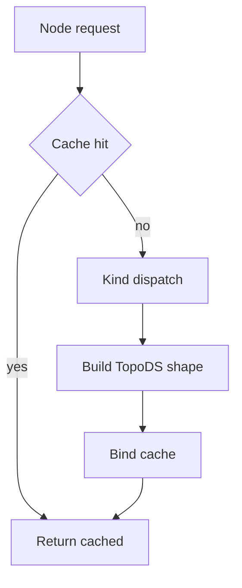

# BRepGraphInc

BRepGraphInc is the incidence-table backend used by BRepGraph.

It provides the runtime source of truth for topology entities, context references, reverse indices, reconstruction support, and identity mapping.

## What This Backend Owns

- topology entity tables
- context references with orientation and location
- reverse adjacency indices
- TShape to NodeId mapping
- original shape map
- per-kind UID vectors

## High-Level Architecture

## Entity and Ref Model

Notes:

- Entity tables are canonical topology.
- Parent-context data belongs to refs, not separate usage objects.
- Edge-face relation context is inline on EdgeEntity:
	- PCurves
	- PolygonsOnSurf
	- PolygonsOnTri

## TopoDS vs GraphInc (Box)

This quick diagram shows the conceptual difference for the same box topology.

Key difference:

- TopoDS expresses context through shape occurrences.
- GraphInc keeps canonical entities and stores context on refs.

For a full box-level graph with all 6 faces, 12 edges, and 8 vertices, see:

- BRepGraphInc_Box_Topology_Comparison.md

### Box Counts (Quick Reference)

| Item | Box Count | GraphInc Storage |
| --- | ---: | --- |
| Solid | 1 | `SolidEntity` table |
| Shell | 1 | `ShellEntity` table |
| Face | 6 | `FaceEntity` table |
| Outer Wire | 6 | `WireEntity` table |
| Edge | 12 | `EdgeEntity` table |
| Vertex | 8 | `VertexEntity` table |
| Face->Wire links | 6 | `FaceEntity.WireRefs` |
| Wire->Edge links | 24 | `WireEntity.EdgeRefs` |
| Edge endpoints | 24 | `EdgeEntity.StartVertexIdx/EndVertexIdx` |
| Edge->Face reverse rows | 24 logical refs, 12 unique edges each used by 2 faces | `ReverseIndex edge -> faces` |

Interpretation:

- Canonical topology lives in entity tables.
- Context and ordering live in refs.
- Fast upward traversal lives in reverse index maps.

## File Map

- BRepGraphInc_Entity.hxx: entity definitions
- BRepGraphInc_IncidenceRef.hxx: context ref definitions
- BRepGraphInc_Storage.hxx/.cxx: typed storage and ownership
- BRepGraphInc_Populate.hxx/.cxx: TopoDS to incidence build and append
- BRepGraphInc_ReverseIndex.hxx/.cxx: reverse adjacency services
- BRepGraphInc_Reconstruct.hxx/.cxx: incidence to TopoDS reconstruction

## Build Pipeline

Build post-passes (controlled by `BRepGraphInc_Populate::Options`):

- edge regularities (`ExtractRegularities`, default on)
- vertex point representations (`ExtractVertexPointReps`, default on)

Storage flags `HasRegularities()` and `HasVertexPointReps()` indicate which passes ran.

## Reconstruction Pipeline

Primary API:

- Node(storage, nodeId)
- Node(storage, nodeId, cache)
- FaceWithCache(storage, faceIdx, cache)

Use cache-enabled variants for shell and solid level reconstruction.

## Reverse Indices

Current reverse maps:

- edge -> wires
- edge -> faces
- vertex -> edges
- wire -> faces
- face -> shells
- shell -> solids

These are critical for adjacency-heavy algorithms like sewing and healing.

## Core Invariants

1. Entity ID invariant
- for each entity vector slot i: Id.Index == i and Id.Kind matches vector kind

2. Mapping invariant
- TShape to NodeId must resolve to an existing, type-correct entity

3. Reverse-index invariant
- required reverse rows must exist for forward refs used by query paths

4. Removal invariant
- IsRemoved entities must be filtered from normal traversals and adjacency queries

5. Mutation boundary invariant
- after each mutator operation: entities, reverse indices, cache invalidation, and history are coherent
- `ReverseIndex::Validate()` checks all 6 reverse maps against forward refs (used in debug assertions after SplitEdge/ReplaceEdgeInWire)

## Memory and Performance Notes

### Allocator Propagation

All containers in BRepGraphInc use the graph's `NCollection_IncAllocator` for O(1) bump-pointer allocation and bulk-free destruction:

- **Storage**: all entity tables, UID vectors, and DataMaps receive the allocator in the constructor
- **ReverseIndex**: `SetAllocator()` is called before `Build()`. Inner `NCollection_Vector<int>` in each IndexTable slot are constructed with the allocator via `preSize(table, size, alloc)`. `BuildDelta()` also propagates the allocator to newly extended slots.

This eliminates per-node malloc/free overhead and makes graph destruction O(1) regardless of entity count.

Contract: `SetAllocator()` must be called before `Build()`/`BuildDelta()` on ReverseIndex, and before any `Record()`/`RecordBatch()` on History.

### Other Performance Notes

- Edge-to-face reverse index build uses sort-dedup (stack-allocated for typical 1-4 PCurves per edge)
- `Append()` allocates UIDs incrementally (only for new entities, O(M) instead of O(N+M))
- Post-passes are optional via `BRepGraphInc_Populate::Options`

## Related Docs

- src/ModelingData/TKBRep/BRepGraph/README.md
