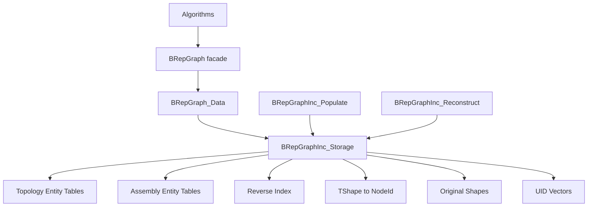
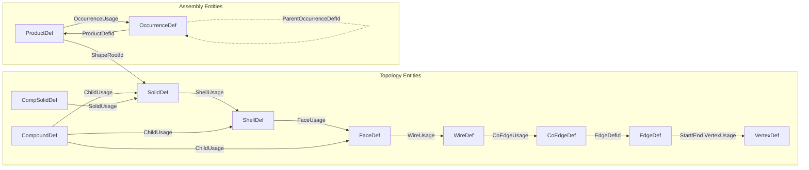
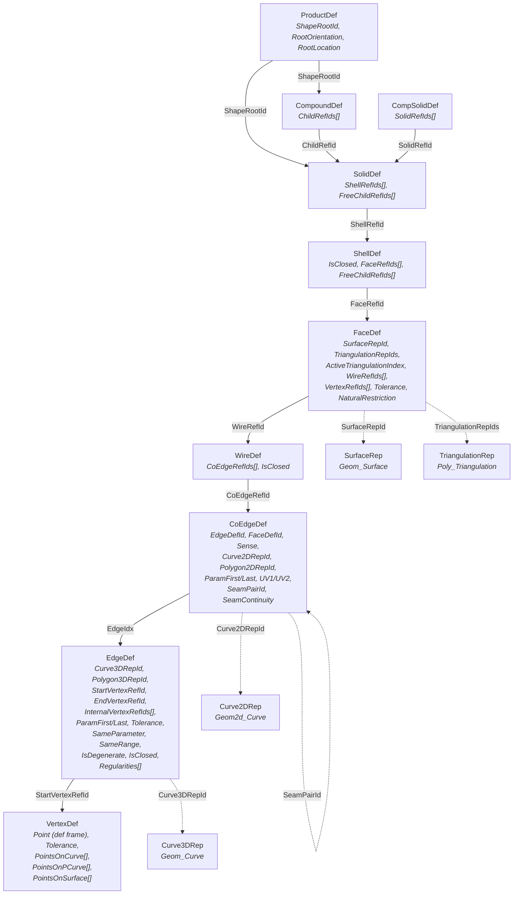
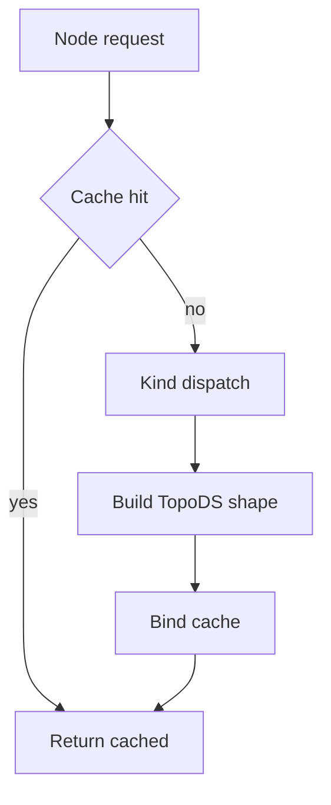

# BRepGraphInc

BRepGraphInc is the incidence-table backend used by BRepGraph.

It provides the runtime source of truth for topology entities, assembly entities, context references, reverse indices, reconstruction support, and identity mapping.

BRepGraphInc is not a user-facing API. It is the runtime model that powers BRepGraph.

## What This Backend Owns

- Topology entity tables (Vertex, Edge, CoEdge, Wire, Face, Shell, Solid, Compound, CompSolid)
- Assembly entity tables (Product, Occurrence)
- Representation entity tables (SurfaceRep, Curve3DRep, Curve2DRep, TriangulationRep, Polygon3DRep, Polygon2DRep, PolygonOnTriRep)
- Reference entry tables (ShellRef, FaceRef, WireRef, CoEdgeRef, VertexRef, SolidRef, ChildRef, OccurrenceRef) with BaseRef identity, orientation, and location
- Reverse adjacency indices (including product→occurrences)
- TShape to NodeId mapping
- Original shape map
- Per-kind UID vectors (10 entity kinds + 8 ref kinds)

## Architecture



## Entity and Ref Model



Notes:

- Intrinsic data lives on entities; context data (orientation/location) lives on Ref tables
- CoEdge owns PCurve data for each edge-face binding (Weiler half-edge pattern)
- ProductDef: `ShapeRootId` (topology root for parts; invalid for assemblies), `OccurrenceRefIds`
- OccurrenceDef: `ProductDefId`, `ParentProductDefId`, `ParentOccurrenceDefId` (tree-structured placement chain), `Placement`

## Entity Hierarchy



## Reference Entry Model

Reference entries are the typed incidence edges connecting parent entities to child definitions. Each ref kind has its own entry table and RefId space, managed by `RefStore<T>` in Storage.

### BaseRef

Common header for all reference entries:

- `RefId`: typed address (Kind + Index) into the ref entry vector
- `ParentId`: NodeId of the owning parent entity
- `MutationGen`: generation counter for change tracking
- `IsRemoved`: soft-delete flag

### Ref Types

Concrete ref entry types extend BaseRef with context data:

- `ShellRef`, `FaceRef`, `WireRef`, `CoEdgeRef`, `VertexRef`, `SolidRef`, `ChildRef`, `OccurrenceRef`
- Each adds: `DefId` (target entity index), `Orientation`, `LocalLocation`

### Entity RefId Vectors

Entities store typed RefId vectors instead of inline ref arrays:

- **SolidDef**: `ShellRefIds[]`, `FreeChildRefIds[]`
- **ShellDef**: `FaceRefIds[]`, `FreeChildRefIds[]`
- **FaceDef**: `WireRefIds[]`, `VertexRefIds[]`
- **WireDef**: `CoEdgeRefIds[]`
- **EdgeDef**: `StartVertexRefId`, `EndVertexRefId`, `InternalVertexRefIds[]`
- **CompoundDef**: `ChildRefIds[]`
- **CompSolidDef**: `SolidRefIds[]`
- **ProductDef**: `OccurrenceRefIds[]`

### RefStore

`RefStore<T>` in Storage groups per-kind ref entry vector + UID vector + active count. Provides `Get()`, `Change()`, `Append()`, `DecrementActive()` (for soft-delete tracking via `BaseRef.IsRemoved`) -- same pattern as `DefStore<T>`.

## Build Pipeline

```mermaid
flowchart LR
  I[TopoDS input] --> P1[Phase 1: Hierarchy traversal]
  P1 --> P2[Phase 2: Parallel face extraction]
  P2 --> P3[Phase 3: Sequential register and dedup]
  P3 --> P3a[Phase 3a: Compound face fixup]
  P3a --> P3b[Phase 3b: Edge regularities]
  P3b --> P3c[Phase 3c: Vertex point reps]
  P3c --> P4[Phase 4: Reverse index build]
  P4 --> D[Storage IsDone]
```



| Phase | Mode | What happens |
|-------|------|--------------|
| **Phase 1** | Sequential | Traverse hierarchy. Create container entities (Compound, CompSolid, Solid, Shell). Collect face contexts. |
| **Phase 2** | Parallel | Extract per-face geometry: surface, PCurves, triangulations, vertices, edges. |
| **Phase 3** | Sequential | Register faces, wires, edges, CoEdges with TShape deduplication. Link faces to shells. |
| **Phase 3a** | Sequential | Resolve deferred Compound→Face ChildUsage indices via TShape lookup. |
| **Phase 3b** | Optional | Edge regularities (controlled by `Options.ExtractRegularities`). |
| **Phase 3c** | Optional | Vertex point representations (controlled by `Options.ExtractVertexPointReps`). |
| **Phase 4** | Sequential | Build reverse indices for O(1) upward navigation. |

Entry point: `BRepGraphInc_Populate::Perform()`.

### Geometry: Definition-Frame Storage

All geometry is stored in **definition frame** — the TShape-internal location is baked into the geometry, while instance locations are preserved separately in Ref structures.

**Surface**: `S_merged = S0.Transformed(TFace.Location())`
**3D Curve**: `C_merged = C0.Transformed(TEdge.Location())`
**Vertex Point**: `BRep_TVertex::Pnt()` (raw, no Location applied)

Formula: `repLoc = theShapeLoc⁻¹ × theCombinedLoc; if repLoc ≠ Identity: theGeom.Transformed(repLoc)`

### PCurve Extraction

PCurves are extracted directly from `BRep_TEdge::Curves()`, bypassing `BRep_Tool::CurveOnSurface` which can generate phantom computed PCurves via `CurveOnPlane` and has `TopLoc_Location` structural equality issues.

Multi-pass matching in `extractStoredPCurves()`:
- **Pass 1**: exact (Surface, Location) match via `IsCurveOnSurface(S, L)`
- **Pass 2**: surface-handle-only fallback for TopLoc_Location structural equality bug
- **Pass 3**: original (pre-transform) surface handle match
- For seam edges: extracts both PCurves + continuity

### Instance Locations

| Ref Type | What it stores |
|---------------|---------------|
| `FaceRef.LocalLocation` | face.Location() relative to shell |
| `WireRef.LocalLocation` | wire.Location() relative to face |
| `CoEdgeRef.LocalLocation` | edge.Location() relative to wire |
| `ShellRef.LocalLocation` | shell.Location() relative to solid |
| `VertexRef.LocalLocation` | vertex.Location() relative to edge |

### Deduplication

- **TShape dedup**: each unique `TopoDS_TShape*` maps to one graph entity
- **Geometry rep dedup**: surfaces, curves, triangulations deduped by handle pointer in `RepDedup` maps

## Reconstruction Pipeline



Primary API:
- `Node(storage, nodeId)` — independent, local cache
- `Node(storage, nodeId, cache)` — shared cache for vertex/edge reuse
- `FaceWithCache(storage, faceIdx, cache)` — specialized face reconstruction

### Geometry Restoration

All geometry restored with `TopLoc_Location() = Identity` (TShape location already baked):

```cpp
aBB.MakeFace(aNewFace, S_merged, TopLoc_Location(), tol);
aBB.MakeEdge(aNewEdge, C_merged, TopLoc_Location(), tol);
aBB.MakeVertex(aNewVtx, rawPoint, tol);
```

### PCurve Attachment with Location Compensation

Edge temporarily carries composed wire+edge location for correct `BRep_Builder::UpdateEdge` storage key:

```cpp
anEdge.Location(aEdgeInFaceLoc);              // Temporarily apply
aBB.UpdateEdge(anEdge, aPC, aSurf, Identity); // Stores CR with loc⁻¹
anEdge.Location(Identity);                     // Reset after attachment
```

### Special Cases

- **Seam edges**: Two CoEdges with opposite Sense, linked by `SeamPairId`. Both PCurves attached via `UpdateEdge(E, PC1, PC2, S, L, tol)`.
- **Degenerate edges**: `MakeEdge()` + `Degenerated(true)`, no 3D curve.
- **IsClosed/NaturalRestriction**: Set AFTER sub-shapes are added (Add can reset flags).

## Reverse Indices

| Map | Purpose |
|-----|---------|
| edge → wires | Wire membership |
| edge → faces | Face adjacency (from CoEdge.FaceDefId) |
| edge → coedges | CoEdge lookup by parent edge |
| edge face count | Cached O(1) face count per edge |
| vertex → edges | Vertex incidence |
| coedge → wires | CoEdge-to-wire membership |
| wire → faces | Wire-to-face membership |
| face → shells | Face-to-shell membership |
| shell → solids | Shell-to-solid membership |
| solid → compounds | Compound parents of a solid |
| solid → compsolids | CompSolid parents of a solid |
| shell → compounds | Compound parents of a shell |
| face → compounds | Compound parents of a face |
| compound → compounds | Compound parents of a compound |
| compsolid → compounds | Compound parents of a compsolid |
| product → occurrences | Assembly references |

## Core Invariants

1. **Entity ID**: for each entity vector slot i: `Id.Index == i` and `Id.Kind` matches vector kind
2. **Mapping**: TShape to NodeId must resolve to existing, type-correct entity
3. **Reverse-index**: required reverse rows must exist for forward refs used by query paths
4. **Removal**: IsRemoved entities must be filtered from normal traversals
5. **Mutation boundary**: entities, reverse indices, cache invalidation, and history are coherent after each operation
6. **Assembly**: every Build produces at least one root Product; occurrence cross-references valid; self-referencing rejected; ParentOccurrenceDefId forms a tree

## Memory and Performance

### Typed-Id API and DefStore

All public Storage accessors use strongly-typed ids (`BRepGraph_VertexId`, `BRepGraph_EdgeId`, `BRepGraph_FaceId`, etc.) instead of raw `int` for compile-time safety. Internally, Storage uses two template patterns:

- **`DefStore<T>`**: groups entity vector + per-kind UID vector + active count. Provides `Get()`, `Change()`, `Append()`, `DecrementActive()`.
- **`RepStore<T>`**: groups representation vector + active count. Same accessor pattern, no UID vector.

### Allocator Propagation

All containers use the graph's `NCollection_IncAllocator` for O(1) bump-pointer allocation and bulk-free destruction:

- **Storage**: all entity tables, UID vectors, and DataMaps receive the allocator
- **ReverseIndex**: `SetAllocator()` called before `Build()`. Inner vectors constructed with allocator via `preSize()`.

Contract: `SetAllocator()` must be called before `Build()`/`BuildDelta()` on ReverseIndex.

### Other Performance Notes

- Edge-to-face reverse index uses sort-dedup (stack-allocated for typical 1-4 coedges per edge)
- `Append()` allocates UIDs incrementally (O(M) instead of O(N+M))
- Post-passes are optional via `BRepGraphInc_Populate::Options`
- `FaceCountOfEdge()` is O(1) via cached count vector

## TopoDS vs GraphInc Comparison (Box)

| Item | Count | GraphInc Storage |
|------|------:|-----------------|
| Solid | 1 | `SolidDef` table |
| Shell | 1 | `ShellDef` table |
| Face | 6 | `FaceDef` table |
| Wire | 6 | `WireDef` table |
| Edge | 12 | `EdgeDef` table |
| CoEdge | 24 | `CoEdgeDef` table |
| Vertex | 8 | `VertexDef` table |
| Product | 1 (auto root) | `ProductDef` table |

Key difference: TopoDS expresses context through shape occurrences. GraphInc keeps canonical entities and stores context on refs.

## File Map

| File | Purpose |
|------|---------|
| `BRepGraphInc_Definition.hxx` | Entity struct definitions |
| `BRepGraphInc_IncidenceRef.hxx` | Context reference definitions |
| `BRepGraphInc_Storage.hxx/.cxx` | Typed storage and ownership |
| `BRepGraphInc_Populate.hxx/.cxx` | TopoDS → incidence build and append |
| `BRepGraphInc_Reconstruct.hxx/.cxx` | Incidence → TopoDS reconstruction |
| `BRepGraphInc_ReverseIndex.hxx/.cxx` | Reverse adjacency services |
| `BRepGraphInc_WireExplorer.hxx` | Wire traversal in connection order |
