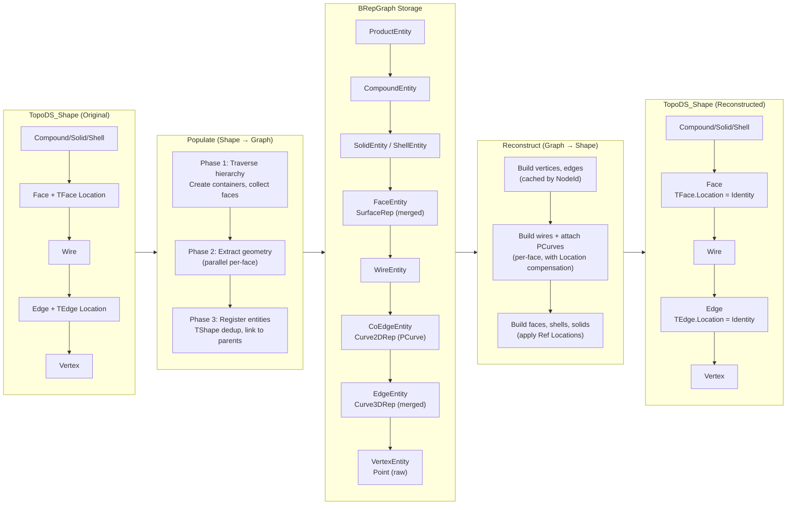
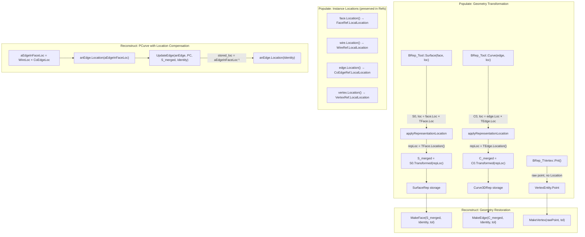
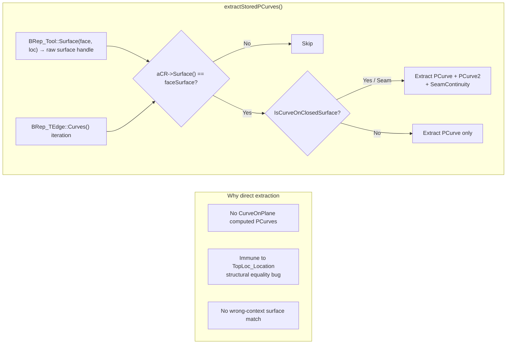
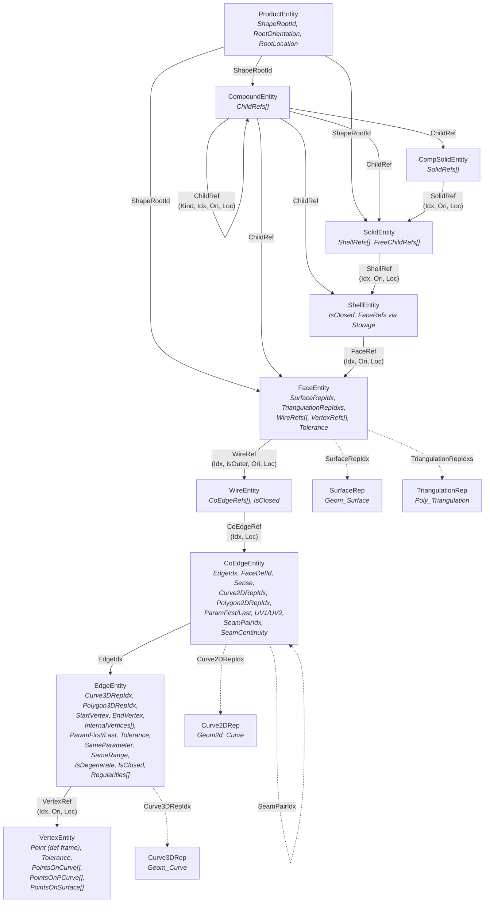

# Shape ↔ Graph Conversion: Data Flow Reference

This document describes how `TopoDS_Shape` is converted to graph entities (Populate)
and back (Reconstruct), with emphasis on Location, Orientation, and geometry handling.

---

## Overview



## Geometry Location Flow



## PCurve Extraction Flow



---

## 1. Populate: TopoDS_Shape → Graph

### 1.1 Three-Phase Pipeline

| Phase | Mode | What happens |
|-------|------|--------------|
| **Phase 1** | Sequential | Traverse shape hierarchy. Create container entities (Compound, CompSolid, Solid, Shell). Collect face contexts into a deferred list. |
| **Phase 2** | Parallel | Extract per-face geometry/topology: surface, PCurves, triangulations, vertices, edges. |
| **Phase 3** | Sequential | Register faces, wires, edges, CoEdges into storage with TShape deduplication. Link faces to shells. Resolve deferred compound child indices. |

Entry point: `BRepGraphInc_Populate::Perform()` in `BRepGraphInc_Populate.cxx`.

### 1.2 Geometry: Definition-Frame Storage

All geometry is stored in **definition frame** — the TShape-internal location is baked
into the geometry, while instance locations are preserved separately in Ref structures.

**Surface** (`extractFaceData`):
```
BRep_Tool::Surface(face, combinedLoc)  →  (S0, face.Location() * TFace.Location())
applyRepresentationLocation(S0, face.Location(), combinedLoc)
  repLoc = face.Location()⁻¹ × combinedLoc = TFace.Location()
  S_merged = S0.Transformed(TFace.Location())
```
Result: `BRep_TFace::Location()` baked into surface. Each face with a distinct
TFace location gets a unique `Geom_Surface` handle. This is intentional — PCurves
on `TopoDS` edges are keyed by `Geom_Surface` pointer, so different surface objects
produce cleanly separated PCurve entries.

**3D Curve** (`extractEdgeInFace`):
```
BRep_Tool::Curve(edge, combinedLoc, first, last)  →  (C0, edge.Location() * TEdge.Location())
applyRepresentationLocation(C0, edge.Location(), combinedLoc)
  repLoc = TEdge.Location()
  C_merged = C0.Transformed(TEdge.Location())
```
Result: `BRep_TEdge::Location()` baked into curve.

**Vertex Point** (`rawVertexPoint`):
```
BRep_TVertex::Pnt()  →  raw point without any Location applied
```
Stored directly in `VertexEntity.Point`. The vertex's instance Location is stored
separately in `VertexRef.LocalLocation`.

**`applyRepresentationLocation` formula** (template for Geom_Surface / Geom_Curve):
```
repLoc = theShapeLoc⁻¹ × theCombinedLoc
if repLoc ≠ Identity:
    return theGeom.Transformed(repLoc)
else:
    return theGeom  // unchanged, same handle
```

### 1.3 PCurve Extraction

PCurves are extracted directly from `BRep_TEdge::Curves()`, bypassing
`BRep_Tool::CurveOnSurface` which can fail due to `TopLoc_Location` structural
equality issues and can generate phantom computed PCurves via `CurveOnPlane`.

**`extractStoredPCurves()`** iterates edge CurveRepresentations:
- Matches by surface handle comparison (`aCR->Surface() == faceSurface`)
- For `BRep_CurveOnClosedSurface` (seam edges): extracts both PCurves + continuity
- For `BRep_CurveOnSurface`: extracts primary PCurve
- Always uses FORWARD-oriented edge for consistent PCurve pair ordering

### 1.4 Instance Locations and Orientations

Instance locations are stored on Ref structures, extracted via
`TopoDS_Iterator(parent, false, false)` (no location/orientation composition):

| Ref Type | What it stores |
|----------|---------------|
| `FaceRef.LocalLocation` | face.Location() relative to shell |
| `WireRef.LocalLocation` | wire.Location() relative to face |
| `CoEdgeRef.LocalLocation` | edge.Location() relative to wire |
| `ShellRef.LocalLocation` | shell.Location() relative to solid |
| `SolidRef.LocalLocation` | solid.Location() relative to compsolid |
| `ChildRef.LocalLocation` | child.Location() relative to compound |
| `VertexRef.LocalLocation` | vertex.Location() relative to edge |

Orientations are stored on the same Ref structures (e.g., `FaceRef.Orientation`,
`CoEdge.Sense`, `WireRef.Orientation`).

### 1.5 Deduplication

- **TShape dedup**: Each unique `TopoDS_TShape*` maps to one graph entity.
  `findExistingNode()` checks `Storage::FindNodeByTShape()`.
- **Geometry rep dedup**: Surfaces, curves, triangulations are deduped by
  **handle pointer** in `RepDedup` maps. Two distinct `Geom_Surface` objects
  (even if geometrically identical) get separate reps.

---

## 2. Reconstruct: Graph → TopoDS_Shape

### 2.1 Two Reconstruction Modes

| Mode | Function | Caching |
|------|----------|---------|
| `Node(theNode)` | Independent, creates local cache | No reuse across calls |
| `Node(theNode, theCache)` | Shared cache | Vertices/edges reused across faces |
| `FaceWithCache(theFaceIdx, theCache)` | Specialized face reconstruction | Per-face PCurve attachment on shared edge TShapes |

`FaceWithCache` is always used by `Node()` when reconstructing faces.

### 2.2 Geometry Restoration

All geometry is restored with `TopLoc_Location() = Identity` since the TShape-internal
location was already baked into the geometry during Populate:

```cpp
aBB.MakeFace(aNewFace, S_merged, TopLoc_Location(), tol);   // Surface
aBB.MakeEdge(aNewEdge, C_merged, TopLoc_Location(), tol);   // 3D Curve
aBB.MakeVertex(aNewVtx, rawPoint, tol);                      // Vertex
```

### 2.3 PCurve Attachment with Location Compensation

When attaching PCurves to edges during face reconstruction, the edge must temporarily
carry its composed face-hierarchy location. This is required because
`BRep_Builder::UpdateEdge` computes the CurveRepresentation storage key as:
```
stored_loc = L.Predivided(E.Location()) = L × E.Location()⁻¹
```

Without the edge location, all CurveRepresentations would be stored with `Identity`
location, making them unfindable when `BRep_Tool::CurveOnSurface` searches from a
context where the edge has its wire/face location.

**In `buildWireForFace(theWireIdx, theWireLocation)`:**
```cpp
// Compute composed edge location within face TShape hierarchy
const TopLoc_Location aEdgeInFaceLoc = theWireLocation * aCoEdgeRef.LocalLocation;

// Temporarily apply to bare cached edge
if (!aEdgeInFaceLoc.IsIdentity())
    anEdge.Location(aEdgeInFaceLoc);

// UpdateEdge stores CR with loc = Identity × aEdgeInFaceLoc⁻¹ = aEdgeInFaceLoc⁻¹
aBB.UpdateEdge(anEdge, aPC, aFaceSurface, TopLoc_Location(), tol);

// Reset after attachment
if (!aEdgeInFaceLoc.IsIdentity())
    anEdge.Location(TopLoc_Location());
```

**Why this works**: After fix, stored `loc = (WireLoc × CoEdgeLoc)⁻¹`.
Search from face TShape level: `loc_search = Identity × (WireLoc × CoEdgeLoc)⁻¹ = stored`. ✓

### 2.4 Instance Location and Orientation Restoration

Each entity level applies its Ref's Location and Orientation when adding to parent:

```cpp
// Edge → Wire
anEdge.Orientation(aCoEdge.Sense);
anEdge.Location(aCoEdgeRef.LocalLocation);
aBB.Add(aNewWire, anEdge);

// Wire → Face
aWire.Orientation(aWireRef.Orientation);
aWire.Location(aWireRef.LocalLocation);
aBB.Add(aNewFace, aWire);

// Face → Shell
aFace.Orientation(aFaceRef.Orientation);
aFace.Location(aFaceRef.LocalLocation);
aBB.Add(aNewShell, aFace);
```

### 2.5 Special Cases

**Seam edges**: Two CoEdges on the same face with opposite Sense, linked by
`SeamPairIdx`. Both PCurves are attached via `UpdateEdge(E, PC1, PC2, S, L, tol)`
creating a `BRep_CurveOnClosedSurface`. Seam continuity is restored by iterating
`ChangeCurves()` after the UpdateEdge call.

**Degenerate edges**: Created with `MakeEdge()` + `Degenerated(true)`, no 3D curve.

**IsClosed flag**: Stored on `EdgeEntity.IsClosed` and `ShellEntity.IsClosed`,
restored after construction since `BRep_Builder::Add` can reset it.

**NaturalRestriction**: Set AFTER wires are added to face (Add may reset the flag).

**Vertex point representations**: `PointOnCurve` and `PointOnSurface` entries are
restored after edges and faces are cached, using `BRep_Builder::UpdateVertex`.

---

## 3. Entity Hierarchy



---

## 4. Key Design Decisions

1. **TFace/TEdge Location baked into geometry**: Simplifies the graph model by
   eliminating internal TShape locations. Instance locations remain on Refs.

2. **PCurves extracted directly from BRep_TEdge**: Avoids `BRep_Tool::CurveOnSurface`
   pitfalls (computed PCurves via `CurveOnPlane`, `TopLoc_Location` structural
   equality bug).

3. **CoEdge entity**: Follows Weiler half-edge pattern.
   Each edge-face binding gets its own CoEdge with PCurve, polygon, and parameters.

4. **Handle-pointer deduplication for geometry reps**: Two geometrically identical
   objects with different handles get separate reps. This is correct because PCurve
   binding on `TopoDS` edges is keyed by surface handle pointer.

5. **Edge location compensation during PCurve attachment**: The reconstructed edge
   temporarily carries its composed wire+edge location so that
   `BRep_Builder::UpdateEdge` computes the correct CurveRepresentation storage key.
